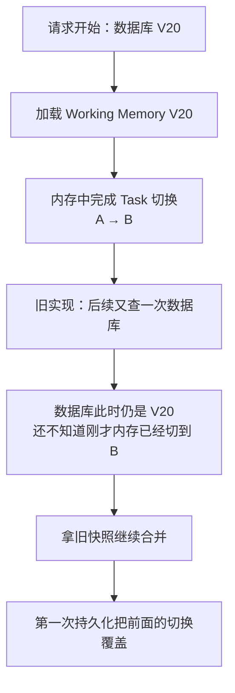
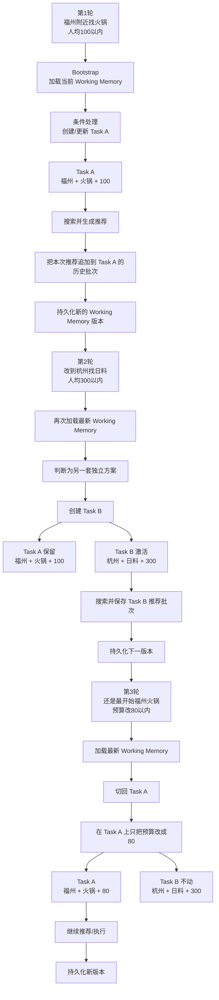

# 多轮对话状态与工作记忆

这条线先别从 `Working Memory` 这个名词开始。先看一个仓库里真实出现过的失败场景：

```text
第 1 轮：福州附近找火锅，人均 100 元以内
第 2 轮：改到杭州找日料，人均 300 元以内
第 3 轮：还是最开始福州火锅，不过预算改成 80 元以内
```

用户第 3 轮的意思其实很清楚：**回到第一套“福州火锅”方案，并把那套方案的预算从 100 改成 80。** 但早期整个会话只有一份全局状态，第 2 轮已经把它改成“杭州 / 日料 / 300”，第 3 轮再往回改时，就出现过“菜系回到火锅了，预算却还残留 300”的情况。

这类 Bug 最麻烦的地方在于，最后一句回答有时甚至还能看起来正常，但系统内部已经把两套需求混在一起了。下一轮继续搜索、查候选、做工具调用时才真正爆出来。于是这个项目后来才一步步把“聊天记录”“当前业务状态”“一套独立消费方案”“一次搜索执行结果”“本轮临时数据”拆开。

> 【核心提炼】Working Memory 不是为了让 Agent 显得有“记忆能力”，而是为了回答一个非常具体的问题：**聊了很多轮以后，程序现在到底应该相信哪一套状态。**

## 一、先把项目里的几种“记忆”分清，不然后面一定会混

假设用户第一轮说“福州火锅，人均 100”，之后又连续聊了很多内容。系统里其实同时存在几种完全不同的东西，它们解决的问题也不同。

第一种是**最近聊天文本**。代码里是 `ChatMemoryService`。它给模型看的就是最近用户和助手说了什么，目前 Redis 里最多保留 **8 条消息**，通常相当于大约 4 轮问答，TTL 是 30 分钟；Redis 没命中时，会从数据库里的 USER_INPUT / ASSISTANT_OUTPUT 事件恢复最近 8 条。它适合帮助模型理解“刚才聊了什么”，但它不是业务真值。

```java
private static final int MAX_MESSAGES = 8;
private static final long TTL_MINUTES = 30L;
```

第二种才是本文说的 **`ConversationWorkingMemory`**。它不是一段自然语言，而是一份结构化业务状态，例如当前操作哪套方案、这套方案的预算和菜系、设备位置、历史推荐批次、当前正在聊哪家店。它按 `chatId` 持久化到数据库，并且有版本号。哪怕最近聊天文本已经裁掉了早期消息，只要当前业务状态仍然有效，程序依然可以确定地读取它。

第三种是 **`DecisionSession`，也就是某一次搜索/决策执行的快照**。比如用户说“福州火锅，人均 100”，系统真正跑了一次搜索，这一次使用了什么 query、什么约束、最后结果是什么，会保存在 `tbl_ai_decision_session`。它适合审计“那一次到底执行了什么”，但不能代替当前会话状态，因为用户下一轮可能已经把预算改成 80。

第四种是**本轮请求里临时用的数据**。例如 `ChatProcessingContext` 只服务当前这一轮 Pipeline；工具执行时的 `AgentSessionContext` 也是从当前 Working Memory 拿出一份临时工作副本，里面会记“这次工具是基于哪个 Working Memory 版本启动的”。请求结束以后，它们都不是新的长期事实源。

可以这样记：

```text
最近聊天文本
→ “刚才说过什么”
→ 给模型理解上下文

ConversationWorkingMemory
→ “现在真正生效的业务状态是什么”
→ 给程序执行

DecisionSession
→ “某一次搜索当时到底用了什么、返回了什么”
→ 给审计和追踪

本轮临时 Context
→ “这一轮处理中间算到了什么”
→ 请求结束后不作为长期真值
```

这里还有一个很容易在面试里说错的地方。很多 Agent 资料把 Working Memory 直接等同于“模型当前上下文窗口里的短期记忆”；**DP-Plus 里这个类名不是这个意思。** `ConversationWorkingMemory` 是**按 chat 持久化的结构化业务状态**。而且当前项目也没有做“跨不同 chatId 的用户长期记忆系统”，例如把用户跨会话稳定偏好存进向量库再召回。面试时一定要把这三个概念分开，不要说成“我们已经有完整长短期记忆体系”。

> 【核心提炼】聊天文本解决“理解上下文”，Working Memory 解决“确定当前状态”，DecisionSession 解决“还原某次执行”。**DP-Plus 当前有会话级持久状态，但没有用户级跨会话长期记忆。**

## 二、为什么一份全局状态不够：A → B → A 直接把问题打出来了

最早工作记忆只有一套当前条件。用户一直沿着同一个需求修改时其实很好用：

```text
福州火锅 100
→ 预算改 80
→ 再加“安静”
```

这里只有一套方案，直接改当前状态没有问题。真正出事的是用户开始在多套方案之间来回切。

仓库的多轮鲁棒性评测里就有下面这条真实用例：

```text
第 1 轮：福州附近找火锅，人均 100 元以内
第 2 轮：改到杭州找日料，人均 300 元以内
第 3 轮：还是最开始福州火锅，不过预算改成 80 元以内
```

如果只有一份全局状态，它大致会经历：

```text
第1轮后：福州 / 火锅 / 100
第2轮后：杭州 / 日料 / 300
第3轮：试图从“杭州 / 日料 / 300”重建第一套方案
```

问题就在“重建”这一步。程序已经没有完整的 A 方案，只能根据第 3 轮的话和历史重新猜哪些字段应该回去。早期真实失败里就出现了：火锅恢复了，但 300 元预算没有恢复干净。继续补“换城市就清预算”“说最开始就恢复菜系”这种规则，只会越来越多，因为真正缺的是**两套方案本来就应该同时存在。**

所以后来引入了 Task。这里的 Task 不是什么线程，也不是一轮对话，它就是**一套可以独立保存、离开以后还能再回来的消费方案**。

```text
Task A
福州 / 火锅 / 100

Task B
杭州 / 日料 / 300
```

此时用户在 B 里说“还是最开始福州火锅，不过预算改成 80”，正确行为就不再是“从 B 猜回 A”，而是：

```text
找到历史 Task A
→ 把 activeTaskId 切回 A
→ A 的旧状态本来就是 福州 / 火锅 / 100
→ 只把 A 的预算改成 80
→ B 继续保持 杭州 / 日料 / 300
```

这也是当前 `ConversationWorkingMemory` 为什么会有 `activeTaskId + tasks[]`：

```text
ConversationWorkingMemory
├── activeTaskId                 当前正在操作哪套方案
├── tasks[]
│   ├── Task A
│   │   ├── criteria             福州 / 火锅 / 100
│   │   ├── searchLocation
│   │   ├── constraintSources
│   │   └── recommendationBatches[]
│   │
│   └── Task B
│       ├── criteria             杭州 / 日料 / 300
│       ├── searchLocation
│       ├── constraintSources
│       └── recommendationBatches[]
│
├── deviceLocation               用户设备现在在哪里
├── focusedShopId                当前正在聊哪家店
├── activeDecisionSessionId      当前正在执行哪一次决策
└── dialogPhase                  当前对话阶段
```

为什么 `deviceLocation` 不塞进 Task？因为用户手机当前在哪，是整个聊天共享的事实；用户从“福州火锅方案”切到“杭州日料方案”，手机 GPS 不会跟着变。反过来，某套方案的搜索目的地 `searchLocation`、预算、菜系显然只属于这套 Task。`focusedShopId` 目前放在会话层，切换 Task 时会被清空，因为“当前正在聊哪家店”属于此刻的对话焦点，不应该自动从另一套方案继承回来。

> 【核心提炼】状态设计不能只问“需要哪些字段”，还要问“**这个字段到底属于谁**”。A→B→A 暴露的根因不是少清了一个预算字段，而是之前根本没有表达 A、B 两套独立方案的能力。

## 三、Task 到底什么时候新建、什么时候继续改、什么时候切回去

有了 Task 以后又会出现新问题：用户每说一句话都新建 Task，肯定会爆；但什么都当成同一个 Task，又回到了最开始的全局覆盖问题。所以当前实现采用了比较保守的规则。

程序大体按下面三种行为处理：

```text
继续当前方案
例如：预算改 80、再近一点、不要安静
→ 继续改当前 Task

明显出现另一套独立方案
例如：福州火锅 → 杭州日料
→ 新建一个 Task

明确回到历史方案
例如：还是最开始那套、回到之前那个
→ 切换到历史 Task
```

对应到代码里就是 UPDATE / CREATE / SWITCH，但平时理解上面三句就够了。

当前 `transitionTask()` 的规则比“让 LLM 自由决定 Task”要窄很多。用户明确说“最开始”时，会切到最早的 Task；说“之前/上一个”时，会找最近一个非当前 Task。另一条路径是：如果本轮形成的“地点 + 菜系”能唯一匹配某个历史 Task，也可以自动切过去。

当前新建 Task 的门槛更保守：**行政目的地和菜系都发生变化时，才把它明显看成另一套独立需求。** 只改预算、偏好当然继续当前 Task；但只换菜系或者只换城市，目前通常也继续更新当前 Task，而不是自动保存两套方案。

这个设计是为了避免 Task 一句话一个、数量迅速膨胀，但它也有边界。例如：

```text
当前：福州火锅
用户：还是吃日料吧
```

当前更倾向于把“福州火锅”直接更新成“福州日料”，而不是并存两个 Task。如果用户其实想保留“福州火锅”以后再切回来，这套规则就拆得不够细。

另一个更典型的歧义是：

```text
当前：杭州日料
历史：福州火锅
用户：还是火锅吧
```

这句话只能确定“菜系想回火锅”，**不能确定城市也想回福州**。所以当前代码不应该因为历史里恰好有福州火锅，就擅自恢复整套福州方案。只有用户说“还是之前福州那套火锅吧”这种信息足够明确时，历史 Task 恢复才更合理。

因此 Task 边界本身也是产品规则，不是纯技术问题。以后如果要增强，应该先拿真实对话评测“什么时候用户认为自己是在开一个新方案、什么时候只是修改当前方案”，再调整，而不是单纯把规则做得越来越复杂。

> 【核心提炼】Task 的目标不是“保存越多越好”，而是**只在用户确实存在多套可返回方案时做隔离**。当前实现偏保守，优点是可控，代价是可能少拆一些本可以独立保存的方案。

## 四、Task V2 做出来以后为什么第一版还是错：同一轮竟然出现两份 Working Memory

Task 数据结构上线后，定向评测第一版仍然没有改善。这个阶段特别值得讲，因为它证明了：**数据模型设计正确，不代表真实调用链一定在用它。**

为了只验证 Task 这次改造，我们从完整多轮鲁棒性集中单独挑了 4 条用例。这 4 条不是整个 Agent 的准确率，它们只检查：A/B/C 是否真的成为独立 Task、切回 A 后 B 的地点和预算会不会串回来、恢复 A 后的新预算是否只改 A，以及普通的小修改会不会错误创建新 Task。

全局单状态的 Run 85，这 4 条是 2/4；Task V2 第一版 Run 87 还是 2/4。说明“类已经改了”并没有让真实状态正确。

最后 Trace 发现，问题不是前面没有创建 Task，而是**同一轮处理里出现了两份不同的 Working Memory**：

```text
请求开始
→ 从数据库加载旧状态 A
→ 内存里成功 CREATE / SWITCH，已经变成新状态
→ 后面的 reduceCriteria() 又去数据库读了一次
→ 第二次读到的还是尚未提交的旧状态 A
→ 后面用旧状态继续合并并落库
→ 前面的 Task 切换被覆盖
```

可以把事故画成：



修复后的原则非常简单：**一轮请求从开始到提交，只认开始加载进 Pipeline 的那一份 Working Memory。**

```text
Bootstrap 加载一次
→ Task 切换
→ 条件合并
→ 状态归并
→ 持久化
```

中途不能因为“我要拿最新状态”就再读一份数据库副本。修复以后，Task Scope 定向用例在 Run 89、Run 90 都达到 4/4；Task ID 轨迹也能验证 A、B、C 独立存在，回到 A 使用的是原 Task，B 的杭州状态没有泄漏进 A。

但同阶段完整 Run 89 仍然只有 **7/24** 完全通过。这两个数字不能混：4/4 只能说明**我们这次专门针对 Task 隔离检查的失败簇修好了**；7/24 说明整个多轮 Agent 当时仍有其他问题。这个区分非常重要，否则简历或面试里很容易把一个小范围验收说成“整体准确率 100%”。

> 【核心提炼】状态系统最危险的不只是“字段设计错”，还有**同一轮出现两个世界**。一次请求里只能有一份权威状态快照，所有节点围绕它计算，最后统一提交。

## 五、Working Memory 在整个 Pipeline 里到底怎么流

`ConversationWorkingMemory` 不是 Pipeline 中的某一个 Node，它更像**整条 Pipeline 共用的状态底板**。请求进入时加载一次，后面的节点读它；确实发生状态变化时，仍然修改这一份请求级对象，最后由状态服务持久化。

继续用仓库里的真实 A→B→A 用例看：



把它放回整个 Pipeline，可以理解成：

```text
Bootstrap
→ 把最新 Working Memory 装进本轮 ChatProcessingContext

Context / Routing
→ 读取当前 Task、当前焦点、历史推荐等状态帮助理解这一轮

CriteriaReduction
→ 如果这一轮真的要修改条件，就在同一份 Working Memory 上切 Task、合并新条件

PolicyGuard
→ 根据合并后的确定状态判断现在能不能执行

Execution
→ 真正搜索/调用工具
→ 成功后把新的推荐结果追加回当前 Task

ConversationStateService
→ 把最终状态写成下一个 Working Memory 版本
```

所以 Working Memory 的价值不是“给模型多塞一份 Prompt”，而是让从理解、决策到执行的所有阶段都能围绕同一份业务状态工作。

> 【核心提炼】Working Memory 横跨整个 Pipeline：**入口加载，中间读取/修改，执行后补充结果，最后版本化持久化。** 它不是一个单独的“记忆节点”。

## 六、推荐结果为什么按“批次”保存，以及这里现在又出现了新问题

用户说“第二家怎么样”时，系统不只需要知道“以前展示过哪些店”，还要知道**哪一批、当时第几个**。所以现在 Task 里真正长期保存的是 `RecommendationBatch[]`。

一批数据很简单：

```java
public class RecommendationBatch {
    private Long decisionSessionId;
    private List<RecommendationCandidateRef> candidates;
}
```

假设：

```text
Batch 1：A / B / C
Batch 2：D / E / F
```

有了批次边界，“第二家”默认可以指最新一批的 E，“最开始第二家”可以指最早那批的 B。如果只保存一个扁平 `shownShopIds=[A,B,C,D,E,F]`，顺序和批次关系全丢了，根本回答不了这种指代。

这里几个容易混的东西现在应该这样理解：

```text
RecommendationBatch[]
→ 真正保存的历史推荐事实

当前候选 candidate pool
→ 直接看当前 Task 最后一个 Batch
→ 不再单独持久化一份

shownShopIds
→ 需要时遍历当前 Task 保留的所有 Batch，把 shopId 去重
→ 只是查询结果，不是另一份长期状态

excludeShopIds
→ 某一次重新搜索时临时算出的“这次别再召回哪些店”
→ 只属于本次 DecisionRequest
```

所以我们最近讨论后的理解比旧文档更进一步：**`shownShopIds` 本身已经没有作为独立状态存在的必要，它完全可以由推荐批次算出来；真正需要治理的是 `RecommendationBatch[]` 本身会不会越堆越多。**

当前代码没有正式限制一个 Task 最多保存多少个 Batch。用户如果不断“换一批”，Batch 会继续增加；Task 本身也没有正式的总量裁剪。这样虽然理论上支持很久以后再问“最开始第二家”，但实际产品价值有限，还会增加 Working Memory 大小、历史指代范围以及后面的排除集合。

更合理的生产方向是先定义一个**在线可回溯窗口**。例如只让热 Working Memory 保留最近若干批，足够支持“上一批、刚才第二家、前几轮那家”；更老历史如果真的有审计价值，可以放到冷历史里。具体是 5 批还是 10 批不能拍脑袋，要看真实对话和评测。

同时必须处理一个产品细节：如果真正的 Batch 1 已经被裁掉，当前在线最老的是 Batch 16，那么用户说“最开始第二家”时，**不能偷偷把 Batch 16 当成‘最开始’**。要么明确告诉用户早期上下文已经不在在线窗口，要么按需查询冷历史。

还有 `excludeShopIds` 的排除力度问题。当前实现只要走到“继续重新找候选”的路径，倾向于把当前 Task 历史展示过的店都排掉。这对“换一批，别重复”合理，但“还是之前那家”“还是之前那套火锅”“只是把预算改低一点”其实是不同产品动作，不能都理解成“旧店永远不要”。这个问题在第二篇已经详细展开；放到 Working Memory 这一篇，只需要记住一句：**历史事实负责记录发生过什么，下一轮要不要排除历史店是执行策略，不能把两者混在一起。**

> 【核心提炼】推荐批次值得保存，是因为它保留了“哪一批、第几个”的历史事实；但历史不能无限塞进热状态。**保留历史和下一轮排除历史，是两个不同问题。**

## 七、聊天记录已经只留 8 条，为什么 Working Memory 还是可能越存越大

这也是很容易混淆的地方。最近聊天文本已经有 `MAX_MESSAGES=8`，并不代表整个 Agent 的“记忆增长问题”解决了，因为 Working Memory 是另一套数据。

当前单份 `ConversationWorkingMemory` 会因为两件事增长：一个会话里的 Task 可能越来越多，每个 Task 的 `recommendationBatches` 也可能越来越多。更关键的是，数据库 `tbl_ai_working_memory` 采用**版本追加**：每次持久状态发生变化，不是覆盖上一行，而是新增一个版本，并保存一份完整 `memoryJson`。

数据库结构大致是：

```text
chatId = c1

V20 -> 一份完整 memoryJson
V21 -> 又一份完整 memoryJson
V22 -> 又一份完整 memoryJson
...
```

这样做很好理解和回溯，但有一个明显代价。如果 Working Memory 本体随着轮次越来越大，而每个版本又完整复制一次，那么极端长会话下，累计存储会比单纯线性增长更快。从模型上可以近似理解成：

```text
第1次保存 1 份大小
第2次保存 2 份大小
第3次保存 3 份大小
...
总量 = 1 + 2 + 3 + ...
```

所以最坏情况下可以接近 O(n²)。这只是根据当前数据结构做出的工程推断，**不是已经发生过线上容量事故**。目前仓库也没有真正实现 Batch 裁剪、Task 裁剪、旧版本 TTL 或历史压缩。

这和近期 Agent 面试里经常问的“上下文太长怎么办”其实不是同一个问题。DP-Plus 的**聊天上下文**已经通过最近 8 条消息限制了输入长度；这里讨论的是**持久业务状态和版本历史**会不会增长。两种治理不能混为一谈。

生产化时可以把数据拆成两层：

```text
热状态
→ 当前 Task
→ 少量近期仍可能被引用的历史 Task
→ 每个 Task 最近若干推荐 Batch
→ 每一轮在线执行直接读取

冷历史 / 审计
→ 更老的 Task、Batch、版本、事件
→ 默认不进入每一轮处理
→ 真正需要追溯时再查
```

版本存储也可以进一步从“每次完整复制无限保存”改成“周期性完整快照 + 中间只保存必要变更/事件”，但这是后续生产化方向，当前代码没有实现。

> 【核心提炼】**聊天文本变短，不等于 Working Memory 变小。** 当前真正未解决的是 Task/Batch 和完整版本快照的长期增长，需要把在线热状态和审计历史拆开。

## 八、为什么 Working Memory 要有版本：防止两个请求互相覆盖

假设同一个 chat 几乎同时进来两个请求：

```text
请求 A：预算改成 80
请求 B：改到杭州
```

两边开始处理时，都读到了 Working Memory V20。如果完全没有版本检查，A 先写入预算 80，B 后写入杭州时很可能拿自己基于旧 V20 算出来的完整状态把 A 的修改一起覆盖掉。

现在 `WorkingMemoryVersionService.append()` 会先比较：**我开始计算时看到的是哪个版本，数据库现在还是不是那个版本。**

```java
AiWorkingMemory current = latest(chatId);
int actualVersion = current == null ? 0 : current.getVersion();
if (actualVersion != expectedVersion) {
    throw new VersionConflictException(...);
}

row.setVersion(expectedVersion + 1);
workingMemoryMapper.insert(row);
```

假设两边都基于 V20：

```text
请求 A：V20 → 计算预算80 → 成功提交 V21
请求 B：也是基于 V20 → 准备提交
                        ↓
数据库已经是 V21
                        ↓
版本不一致，拒绝 B 的旧提交
```

数据库还对 `(chat_id, version)` 有唯一约束，负责最终竞争保护。

这里为什么不看到冲突就自动 Retry？因为 B 的结果是**基于旧世界 V20 算出来的**。重新读 V21 以后直接把旧结果再套上去，相当于程序偷偷假设“这个旧操作在新状态上一定仍然成立”。例如 A 已经把任务切到另一套方案，B 的“预算改 80”到底还应该改哪一个 Task，就不能靠机械重试决定。当前选择是拒绝旧提交，让上层重新判断语义。

> 【核心提炼】版本号保护的不是数据库插入本身，而是：**基于旧状态算出来的结果，没有资格无条件覆盖更新后的新状态。**

## 九、慢工具还有第二道问题：它返回成功时，世界可能已经变了

版本校验只讲“最终持久化竞争”还不够，因为 Agent 里有 LLM、地图、评价检索等慢操作。假设一个工具基于 V20 开始运行：

```text
V20：用户正在看福州火锅
        ↓
工具开始查候选，花了几秒
        ↓
期间用户又发消息
V21：已经切到杭州日料
        ↓
旧工具终于返回福州火锅结果
```

这个工具技术上执行成功了，但它的结果已经过时。如果再把它的候选、焦点商户等写回当前 Working Memory，就会把 V21 污染回旧世界。

所以工具运行时的 `AgentSessionContext` 会记一项 `baseWorkingMemoryVersion`：**这次工具是基于哪个 Working Memory 版本启动的。** 写回前，状态服务再看数据库最新版本；如果已经变了，就记录 `STALE_RUNTIME_RESULT` 并拒绝这份旧运行结果更新当前状态。

```text
Tool 基于 V20 启动
        ↓
当前已经 V21
        ↓
Tool 返回 SUCCESS
        ↓
“执行成功” != “还能写当前状态”
        ↓
拒绝旧状态回写
```

这个设计和上一节是一件事的两个时间尺度：一个防止**两个提交同时抢同一版本**，一个防止**慢任务完成时上下文已经过期**。

> 【核心提炼】Agent 里“工具调用成功”只代表计算成功，**不代表这个结果现在还有资格改变会话状态。**

## 十、三个“回到以前”一定要分清：切 Task、读历史版本、恢复历史版本

项目里有三个动作表面都像“回到以前”，但实际完全不同。

第一种是用户说“**还是最开始福州那套火锅**”。这通常是**切回历史 Task**：A 和 B 仍然都存在于当前最新 Working Memory，只是把 `activeTaskId` 从 B 改回 A。它不是数据库回滚，也不会让整段会话回到旧版本。

第二种是 `load_history`。这个 Tool 只是**读取某个确定的 Working Memory 历史版本**，返回当时的 activeCriteria、候选、焦点等信息，并明确标注只读。它不会把这个版本重新设成当前状态。开发记录里曾经检查过一段运行数据，`load_history` 在对应 run 中实际调用次数为 0，所以它目前不是主流程核心能力，不能为了面试把它讲得很重。

第三种才是真正的**历史状态恢复**。`ConversationStateRestoreService` 会先读取用户明确指定的旧版本，再检查当前版本有没有被别人改过；确认可以恢复以后，并不是把数据库指针“倒退”到旧行，而是把旧业务状态复制出来，作为**一个新的最新版本**提交。例如当前已经 V30，用户确认恢复 V12，最终会生成 V31，V12 和 V30 都还在历史里。

```text
Task 切换
→ 在当前最新状态内部切换方案

load_history
→ 只读旧版本，当前状态不变

restore
→ 取旧版本的业务状态
→ 再写成一个新的最新版本
```

这个区别也解释了为什么 Task 和 Version 不能互相替代：Task 解决“一份当前状态里并存多套业务方案”，Version 解决“整个会话状态随时间怎么演进、怎么审计和处理并发”。

> 【核心提炼】“回到以前”不等于数据库回滚。**切 Task 是切业务方案，读历史是查看旧快照，Restore 是把旧业务状态重新提交成一个新版本。**

## 十一、这一条主线最后真正应该带走什么

第一，**聊天历史和业务状态必须分开。** 聊天记录适合帮助模型理解“说过什么”，不适合每轮重新猜“现在真正生效什么”。

第二，**状态设计先看生命周期和归属。** 设备位置属于会话，一套搜索条件属于 Task，一次执行结果属于 DecisionSession，本轮处理中间数据属于请求期。不同生命周期的东西混在一个大对象里，迟早会互相污染。

第三，**出现 A→B→A 时，先怀疑数据模型能不能表达多套方案，而不是继续补清字段规则。** Task 就是从这个失败里推出来的。

第四，**一轮请求只能有一份权威 Working Memory。** 中途再读数据库可能把“尚未提交但已经正确修改”的内存状态重新覆盖回旧版本。

第五，**尽量只保存一个事实源。** 推荐历史保存 Batch；当前候选、已展示商户从 Batch 派生；本轮排除列表只是执行参数。这样比同时维护几份集合更不容易漂移。

第六，**热状态不能无限背着所有历史。** 当前 Batch、Task、完整版本快照都会增长，后续应该用产品定义的可回溯窗口控制在线状态，把更老的数据转到审计/冷历史。

第七，**并发控制要保护“谁有资格提交”而不是简单给整条 Agent 链上大锁。** 当前版本冲突和慢结果检查都是围绕这个原则做的。

## 十二、结合牛客常见追问，面试时重点准备这些

近期 Agent 面经里，Memory 已经不太只问“短期记忆和长期记忆分别是什么”，而是继续追问：Context 和 Memory 有什么区别、上下文超长怎么办、用户修改旧偏好怎么失效、多轮/多会话怎么隔离、多个请求同时改状态怎么防冲突。DP-Plus 这条线真正有价值的地方，是这些题可以用真实失败和代码回答，而不是背框架定义。

### 1. 记忆边界

**Q1：为什么不直接把所有聊天历史塞给模型，还要做 Working Memory？**

核心答案：聊天历史记录的是“说过什么”，Working Memory 保存的是“现在真正生效什么”。A→B→A 时，历史里三个值都存在，但 SQL 和工具最终只能拿一个确定值，所以不能每轮重新让模型猜。

可能追问：上下文窗口无限大是不是就不需要 Working Memory？**不是。容量问题解决了，状态冲突问题仍然存在。**

**Q2：你们项目里的 Working Memory 就是常说的模型上下文窗口吗？**

核心答案：不是。最近聊天文本由 `ChatMemoryService` 管，目前只给模型最近 8 条消息；`ConversationWorkingMemory` 是数据库里按 chat 持久化的结构化业务状态。

可能追问：那你们有没有跨会话长期记忆？**当前没有用户级跨 chat 长期记忆，不要硬说有。**

**Q3：历史摘要能不能替代 Working Memory？**

核心答案：摘要可以压缩远历史，但预算、城市、当前 Task、焦点商户这些会直接驱动程序执行，需要精确读写，不能再让模型解释一遍摘要。

可能追问：原聊天还留不留？项目当前事件表仍保留消息事实，Recent Chat 只是在模型上下文里截取最近部分。

### 2. 多套方案和历史恢复

**Q4：为什么后来一定要 Task？**

核心答案：因为 Flat State 无法同时表达“福州火锅100”和“杭州日料300”。真实 A→B→A Case 出现过回 A 后仍残留 B 的 300，所以根因不是缺一个 clear 规则，而是缺多方案隔离。

可能追问：为什么每个修改不都开 Task？因为 Task 太细会迅速堆积，而且预算/距离/偏好本来就是同一方案内部修改。

**Q5：现在怎么判断新建 Task 还是修改当前 Task？**

核心答案：当前规则比较保守，明确历史表达先尝试切回旧 Task；行政目的地和菜系都明显变化时才倾向新建；预算、偏好等继续改当前 Task。

可能追问：只换城市或只换菜系怎么办？当前通常仍是更新当前 Task，这可能少拆一些真实独立方案，是已知 Trade-off。

**Q6：Task 和 Working Memory Version 有什么区别？**

核心答案：Task 是业务身份维度，让 A/B 方案同时存在；Version 是时间维度，记录整个会话 V20、V21、V22 怎么变化。

可能追问：用户“回到最开始那套”是不是恢复旧 Version？不是，通常只是切 `activeTaskId`。

### 3. 推荐历史和状态增长

**Q7：为什么保存 RecommendationBatch，不直接保存 candidatePool？**

核心答案：candidatePool 只能告诉你“现在有哪些店”，Batch 才能保留“哪一批、第几个”。“上一批第二家”“最开始第二家”都依赖这个边界。

可能追问：那 shownShopIds 还要不要存？不需要单独存，当前就是从 Batch 临时计算。

**Q8：Working Memory 会不会越来越大？**

核心答案：会，而且当前还没做完整生产治理。聊天文本已经限制最近 8 条，但 Task、RecommendationBatch 和版本表里的完整 JSON 快照仍会增长。

可能追问：准备怎么处理？在线只保留近期仍可能被引用的 Task/Batch，更老历史走冷存储/审计；版本也可以从无限完整快照演进到周期性完整快照 + 中间变更记录。具体窗口要通过产品语义和评测确定。

**Q9：如果以后只保留最近 5 批，用户说“最开始第二家”怎么办？**

核心答案：不能把当前最老的那批冒充成真正最开始。超出在线窗口后，要么明确上下文不足，要么按需读取冷历史。

可能追问：为什么不是永远保留？因为极老推荐的在线引用价值下降，但会持续增加状态、排除集合和版本存储成本。

### 4. 一致性和并发

**Q10：Task V2 数据结构已经对了，为什么第一版评测还是 2/4？**

核心答案：同一 Turn 里前面已经修改了内存 Working Memory，后面的 reducer 又从数据库读了一份旧快照，第一次 persist 时把前面的切换覆盖了。修复原则是一轮只使用一份权威状态。

可能追问：为什么“每步都重新读最新数据库”反而不对？因为本轮尚未提交的正确修改只存在内存里，数据库此时反而更旧。

**Q11：两个请求同时改 Working Memory 怎么办？**

核心答案：每次写入带 `expectedVersion`。如果都基于 V20，谁先提交 V21 谁成功，另一个发现数据库已经不是 V20 就拒绝提交。

可能追问：为什么不自动重试？因为旧状态上理解出来的动作不一定能安全套到新状态，尤其 Task 已经发生切换时。

**Q12：Tool 已经成功执行了，为什么还可能不让它写状态？**

核心答案：它可能基于 V20 启动，返回时会话已经 V21。执行成功只证明“对旧输入算成功了”，不证明结果仍适用于当前会话，所以用 `baseWorkingMemoryVersion` 做旧结果检查。

可能追问：最简单办法是不是整个 chat 加锁？可以，但 LLM/Tool 很慢，整条链锁住会把并发请求全部串行化。当前选择保护写入和结果提交边界。

**Q13：`load_history`、Task 切换和 Restore 有什么区别？**

核心答案：Task 切换是在当前 Working Memory 内切方案；`load_history` 只读某个历史版本；Restore 才把旧业务状态复制出来并提交成新的最新版本。

可能追问：Restore 是把版本号倒退吗？不是，例如当前 V30 恢复 V12，最终会生成 V31。

## 十三、简历怎么写

偏 AI 应用 / Agent 的版本：

> **多轮状态与工作记忆：**针对 A→B→A 需求切换中的状态串扰，设计会话级版本化 Working Memory，并以 Task 隔离多套消费方案的搜索条件与推荐历史；统一单轮权威状态快照，通过版本冲突和慢结果校验阻止旧状态回写，并建设定向多轮回归验证任务恢复与状态隔离。

偏 Java 后端的版本：

> **会话状态一致性：**构建版本化会话状态模型，按 Task 隔离多套消费决策并以推荐批次保存历史事实；通过请求内单一状态快照、乐观版本校验及异步结果版本检查控制并发写入，避免多轮切换和慢任务导致状态覆盖。

评测数字如果写进简历要非常克制：Task 作用域定向子集从 Flat State 的 2/4、Task V2 第一版的 2/4，修复同轮双快照问题后达到 4/4；同阶段完整多轮鲁棒性 Run 89 仍是 7/24。它证明的是**Task 隔离这个失败簇被修复**，不是整个 Agent 已经 100% 正确。

另外，当前还不应该把“Working Memory 已完成历史裁剪”“已经有用户级长期记忆”“已经解决无限增长”写进简历，因为这些都还不是 main 分支里的已实现事实。