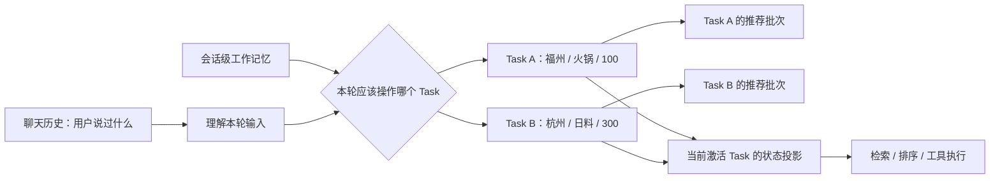

# 多轮对话状态与工作记忆

这条线真正值得讲的，不是“项目里用了 Working Memory”这个名词，而是我们**为什么最后不得不做出一套显式状态系统**。项目早期并没有一开始就设计好工作记忆，更接近“聊天历史 + 单次决策状态 + 一些会话字段”拼起来跑；随着多轮修改、反悔、切换方案、历史指代和并发工具结果逐渐出现，原来那些看起来合理的局部设计开始互相污染。最后形成的方案，是被一轮轮失败场景推出来的。

这条线最适合面试的地方也在这里：它不是“我学了一个 Agent Memory 概念然后套进项目”，而是**先遇到业务状态失真，再逐步把聊天历史、当前业务状态、任务作用域、历史事实和运行时状态拆开**。下面按真实认知演进来讲，而不是按类名或 Commit 流水账来讲。

## 一、这套状态系统是怎么一步步长出来的

**最开始的问题甚至还不是工作记忆，而是“状态到底放在哪里”。** 早期聊天记录负责给模型提供文本历史，`ai_chat_session` 只保存活动决策等少量会话字段；`DecisionSession` 可以理解成“一次消费决策执行的快照”，它保存这一次搜索使用的请求、约束和执行结果，用于审计和后续追问，但它天然只代表某一次执行，不适合作为整个聊天跨轮共享的当前状态。推荐完成后的候选商户、焦点商户等信息又分散在其他上下文中。单轮时这种拆法没有明显问题，因为一次请求从输入到推荐结束就结束了；但一旦用户第二轮继续说“预算改成 80”“还是刚才第二家”“位置就用刚刚那个”，系统就必须回答一个问题：**上一轮留下来的哪些信息仍然是当前真值？**

2026-08-16 的一次状态重构首先把位置槽位收进服务端会话状态。这个阶段已经出现了一个很重要的认知：浏览器这一轮传过来的坐标，不能只属于某个 `DecisionSession`，否则下一轮新开决策时坐标就丢了，系统会再次向用户索要位置。于是位置开始有明确的状态生命周期：`MISSING` 表示还没有位置，`AVAILABLE` 表示当前有可用设备定位，`DECLINED` 表示用户明确拒绝定位，`EXPIRED` 表示定位已经过期。客户端的定位、拒绝定位等事件也统一进入聊天编排链路。**这一步还不算完整工作记忆，但第一次明确了“聊天记录负责语言历史，业务状态必须有服务端真值”的边界。**

真正的会话级工作记忆是在 2026-08-24 进一步收敛出来的。当时的位置在会话槽位里，而候选商户、焦点商户和条件快照仍散落在决策上下文中。跨轮引用虽然勉强能工作，但新的推荐请求无法确定地回答“上一轮哪些条件应该继承、哪些应该覆盖”。因此项目新增 `ConversationWorkingMemory`，把跨轮仍然有业务意义的状态收进同一个会话级模型；`DecisionSession` 继续保留**单次执行的不可变快照和审计信息**，但不再承担跨轮业务真值。

这里出现了第一个核心分界：**Chat History 是语言证据，Working Memory 是当前业务真值。** 这不是单纯为了省 Token。假设模型上下文无限长，把所有历史全部塞进去，用户先说“福州火锅，人均 100”，再说“改成杭州日料，人均 300”，模型确实能看到两句话，但系统仍然要确定下一次检索到底应该使用哪一套条件。如果每轮都让模型重新从自然语言历史中猜“哪个值现在有效”，状态正确性就依赖一次新的概率推理；而检索、排序、工具参数又要求确定输入。工作记忆的意义，就是把“模型理解过的结果”进一步收敛成**可确定读取、可确定修改、可验证的当前状态**。

这个阶段的工作记忆仍然是一份 **Flat State，也就是扁平全局状态**。当时可以把它理解成“一个聊天会话只有一套当前条件和当前候选”：用户改预算就覆盖预算，换城市就覆盖城市，候选集跟着更新。对线性的对话，它很好用，例如“福州火锅 100 → 预算改 80 → 再加一个安静偏好”，每一轮都只是在同一套需求上继续细化。

真正把 Flat State 证伪的，是后来补出来的**多轮鲁棒性评测集**。这个评测集不是为了测“回答听起来像不像人”，而是专门验证多轮状态在真实链路里有没有被正确继承、覆盖、清除和重新绑定。2026-09-05，`conversation-robustness-v1` 从 9 条扩到 24 条；除了看本轮走了哪条处理分支、最终决策状态是否正确，还开始逐轮记录 Working Memory、候选池、焦点实体、推荐快照和工具绑定。也就是说，它重点测的是**中间状态轨迹是否正确**，而不是只看最后一句回答碰巧对不对。

这套评测里的一次执行记为一个 Run。Run 85 是 Flat Working Memory 的正式全量基线：24 条用例里只有 3 条完全通过。这个 3/24 不能简单理解成“整个 Agent 准确率只有 12.5%”，因为这里的“完全通过”要求一条多轮用例的多个断言同时满足；它真正说明的是，当我们开始严格检查中间状态时，Flat State 暴露出大量之前被最终答案掩盖的问题。其中最典型的一类，就是 **A→B→A 的幽灵继承**。

场景很简单：

```text
Turn 1：帮我在福州找人均 100 元以内的火锅
Turn 2：改到杭州西湖找人均 300 元以内的日料
Turn 3：还是按最开始福州那套火锅方案
```

如果整个会话只有一份扁平状态，Turn 2 会把福州/火锅/100 改成杭州/日料/300。到了 Turn 3，“回到最开始”不是普通字段覆盖，因为当前状态已经没有完整的 A 方案了。实际基线里就出现过：菜系回到了火锅，但预算仍残留 B 的 300；A→B→C→A 时问题更明显。继续补“换城市就清预算”“回到以前就恢复菜系”这类规则只能暂时堵洞，因为根因不是某个字段漏清，而是**数据模型无法表达“一个会话中同时存在多套独立方案”**。

这一步把我们的认识从“工作记忆就是当前状态”推进成了“**当前状态本身也有作用域**”。于是 Working Memory V2 引入了 Task。这里的 **Task 不是线程，也不是每一轮对话**，而是“一套可以独立维护、暂时离开、之后再切回来的消费决策方案”。例如 A=福州火锅 100，B=杭州日料 300，它们应该作为两个独立 Task 同时存在，而不是互相覆盖。

当前最重要的状态结构可以先这样记：

```text
ConversationWorkingMemory                  会话级工作记忆
├── schemaVersion                          数据结构版本，目前为 2
├── activeTaskId                           当前正在操作哪一套 Task
├── tasks[]                                一个会话中并存的多套消费决策
│   └── DecisionTaskState
│       ├── taskId                         Task 唯一标识
│       ├── title                          便于描述这套需求的标题
│       ├── criteria                       这套需求当前有效的搜索条件
│       ├── constraintSources              条件来源：用户明确输入/系统默认/系统推导
│       ├── searchLocation                 这套需求自己的搜索目的地
│       └── recommendationBatches[]        这套需求历史产生过的推荐批次
├── deviceLocation                         用户设备定位，属于整个会话
├── pendingLocationCandidates              地名解析后等待用户确认的候选地点
├── activeDecisionSessionId                当前活动的单次决策执行
├── lastDecisionSessionId                  最近一次单次决策执行
├── focusedShopId / focusedShopName        当前对话聚焦的商户
├── dialogPhase                            当前对话阶段
└── lastPolicyAction / lastPolicyReason    最近策略诊断信息，不属于 Task 业务条件
```

这里最重要的不是把字段背下来，而是理解**为什么要分会话级和 Task 级**。`deviceLocation` 表示“用户设备现在在哪”，用户从福州火锅切到杭州日料时，设备定位本身并不会因为切需求而改，所以它属于会话级；`searchLocation` 表示“这一套方案准备去哪搜”，A 可以搜福州，B 可以搜杭州，所以它必须跟着 Task 隔离。预算、菜系等 `criteria` 同理属于 Task。这个划分本质上是在按**生命周期和业务身份**确定状态作用域。



有了多个 Task 以后，每一轮输入首先要判断“这句话应该作用在哪一套需求上”。当前实现把 Task 的变化收敛成三种基本操作：**UPDATE（更新）**表示仍然是当前方案，只修改预算、距离、偏好等条件；**CREATE（新建）**表示用户明显提出了一套独立新需求，需要创建一个新的 Task；**SWITCH（切换）**表示用户说“回到最开始那套”“还是之前那个”，重新激活已经存在的历史 Task。A=福州火锅 100 时，“预算改成 80”是 UPDATE；随后“改到杭州吃日料，人均 300”可以形成 CREATE；之后“还是最开始福州那套”就是 SWITCH 回 A。后文提到的 Task transition，就是这三类任务状态变化的统称。

当前实现刻意把 Task transition 做得比较小：显式说“最开始/之前”时优先切回历史 Task；如果当前输入能唯一匹配一套历史需求，也可以切换；当目标地点和菜系同时形成明显独立需求时才创建新的 Task；预算、距离、偏好等通常只是当前 Task 的更新。这样做的 Trade-off 是规则不可能覆盖所有自然语言任务边界，但它比“让 LLM 每轮自由决定 Task ID”更可控，也避免 Task 数量无节制增长。

Task V2 做完以后，我们没有直接用完整 24 条评测判断它“好不好”，而是从完整多轮鲁棒性集中挑出 **4 条 Task Scope 定向用例**。这组小评测只验证这次改造最核心的能力：A/B/C 是否真的形成独立 Task、切回 A 时是否使用原来的 Task 而不是重新拼一份、B 的地点和预算是否会泄漏到 A、恢复 A 后新增约束是否只作用于 A，以及普通地点/预算微调是否会错误创建新 Task。**它不是整个 Agent 的总分，而是用来隔离验证“Task 作用域”这一项能力。**

在 Flat State 的 Run 85 里，这 4 条 Task Scope 用例只有 2/4；Task V2 第一版的 Run 87 仍然是 2/4。也就是说，**数据结构虽然已经改成多 Task，但真实链路并没有因此自动正确**。逐轮状态轨迹显示 `taskCount` 一直是 1、`activeTaskId` 没有真正保持切换。因为前面已经定义了 CREATE/SWITCH，这时我们可以明确怀疑：到底是任务切换规则没执行，还是执行以后又被覆盖了？

Trace 最后证明前半段 Task transition 实际已经成功：CREATE/SWITCH 已经修改了 Pipeline 里的 Working Memory。真正的问题出在后面的 `reduceCriteria()`：它又从持久层重新加载了 transition 之前的旧 Working Memory。这里的“Snapshot（快照）”可以理解成**某一时刻的一份完整 Working Memory 副本**。同一个请求里于是同时出现了两份状态——内存中已经切换 Task 的新快照，以及数据库里尚未提交、仍停留在切换前的旧快照。Reducer 使用了后者，第一次持久化时又把前面的 Task transition 覆盖掉。

这个事故形成了目前这条线最重要的工程不变量之一：**一次 Turn 只能有一份权威 Working Memory 快照。** 正确流程应该是“请求开始加载一次 → Task 切换 → 条件合并 → 状态归并 → 持久化”，中间节点只能围绕这一份请求级快照工作，不能因为“想拿最新状态”就随手再查一次数据库。修复后，Task Scope 定向用例在 Run 89、Run 90 都达到 4/4；Task ID 轨迹能验证 A、B、C 是独立状态，回到 A 使用的是原 Task，B 的西湖地点不会泄漏，切回 A 后预算 80 只作用于 A，普通 refinement 仍保持一个 Task。

同时，Run 89 的**完整 24 条多轮鲁棒性评测**只有 7/24 完全通过。这两个数字必须分开理解：4/4 说明我们定向修复的 **Task 作用域失败簇已经通过验收**；7/24 说明整个多轮 Agent 仍然存在 Compound Intent、Location Clarification、历史指代绑定等其他独立问题。因此这里不能宣传成“Task V2 让整体准确率从 2/4 提升到 4/4”，更不能拿 4/4 当整个 Agent 的通过率。

Task 作用域收口后，候选状态也进一步调整。这里又出现了一个重要数据结构 `RecommendationBatch`，它表示**某一次推荐产生的有序候选批次**。当前结构里，一个 Batch 主要保存 `decisionSessionId` 和 `candidates[]`；每个候选引用里保留 `shopId`、`shopName`、人均价格、距离、菜系和用于指代的标签。为什么要有 Batch？因为用户不仅会问“现在有哪些店”，还会问“上一批第二家”“最开始那家”。如果每次换一批都覆盖当前 `candidatePool`，上一批的顺序就丢了；如果只保留一个 `shownShopIds` 集合，又只能知道“出现过哪些店”，不知道“当时第几家是谁”。

因此当前实现把**历史批次**作为更稳定的事实源：最新候选从最后一个 `RecommendationBatch` 派生，历史展示过的商户从所有 Batch 做并集，来源决策会话从最新 Batch 派生。这样不是单纯减少字段，而是在减少“同一事实的多个可写副本”。当前投影可以变化，历史批次作为事实边界保留下来，因此“刚才第二家”“最开始那一批”才有稳定解析基础。

到这里，状态模型已经解决了“同一会话里谁是真值、多个业务方案如何隔离、一次请求如何保证看到同一份状态”。但还剩最后一类问题：**并发请求和慢工具结果会不会把已经更新的新状态覆盖回去。** 这和 LLM 本身无关，是典型的状态一致性问题。

为了理解这里的版本控制，还要先看持久化结构。真正落库的 `AiWorkingMemory` 并不是把每个业务字段拆成数据库列，而是一条版本记录：`chatId` 标识聊天会话，`userId` 标识所属用户，`version` 是单调递增版本号，`memoryJson` 保存完整的 `ConversationWorkingMemory`，`createdAt` 记录生成时间。数据库对同一 `chatId` 的版本做唯一性保护，因此同一个会话不会成功写出两个相同版本。

项目没有把整个 Agent 请求串行化，也没有给一个 `chatId` 从 Rewrite、Routing、LLM、Tool 到生成回答全程上分布式锁。原因是这些阶段大部分是只读或计算型操作，全部串行会直接放大长尾延迟。真正需要保护的是**持久状态写入边界**。`WorkingMemoryVersionService.append()` 写入前检查 `expectedVersion`：如果调用方是基于 V20 计算出来的状态，那么只有数据库当前仍然是 V20 时才允许写入 V21；如果别人已经先写成 V21，就说明当前请求基于旧世界，直接抛 `VersionConflictException`。数据库的 `(chat_id, version)` 唯一约束再承担最终竞争保护。

核心实现其实很短：

```java
AiWorkingMemory current = latest(chatId);
int actualVersion = current == null ? 0 : current.getVersion();
if (actualVersion != expectedVersion) {
    throw new VersionConflictException(chatId, expectedVersion, actualVersion, operationType);
}

row.setVersion(expectedVersion + 1);
workingMemoryMapper.insert(row);
```

为什么不自动 Retry？因为这里的冲突不是简单数据库写失败。假设两个请求都基于 V20 做推理，A 先提交成 V21，B 再发现冲突。如果 B 自动重新读取 V21 然后把旧的 Delta 再套一次，相当于默认“基于旧状态算出来的结果，可以无条件重新应用到新状态”。这个业务语义并不成立。因此当前策略是**拒绝旧提交，让上层明确重新判断，而不是为了提高成功率悄悄覆盖。**

Tool/Agent 慢结果还有另一层保护。这里涉及一个运行时对象 `AgentSessionContext`，它不是新的业务真值，而是**一次 Agent/Tool 执行期间使用的临时状态投影**。其中最关键的是 `baseWorkingMemoryVersion`，表示“这次运行是基于哪个工作记忆版本启动的”；同时还会携带候选池快照、焦点商户、推荐批次和本轮解析出的指代结果，供工具执行使用。

例如工具基于 V20 启动搜索，执行期间用户又发了一轮消息，把会话推进到 V21。工具最后即使成功返回，也只能说明“它对 V20 的输入计算成功”，不能证明它仍适用于 V21。于是写回前系统重新读取最新版本；如果 `baseWorkingMemoryVersion` 已经落后，就记录 `STALE_RUNTIME_RESULT` 并拒绝它更新当前 Working Memory。这里最重要的判断是：**计算成功，不等于结果仍然有资格提交。**

历史恢复同样遵守版本原则。历史 Working Memory 是只读快照，恢复某个旧版本时并不会把历史行改成“当前”，也不会把版本号倒退，而是读取旧业务状态，再基于当前版本追加一个新版本。这样时间线始终单调向前，也能审计“当前状态是从哪个历史版本恢复出来的”。恢复时只恢复业务状态，类似最近策略诊断这类运行时信息不会机械回滚。

把目前的状态模型压缩成一句话，就是：**聊天历史保存语言证据，会话级工作记忆保存当前业务真值；工作记忆内部再按会话级和 Task 级隔离不同生命周期的状态，推荐批次保留历史事实；一次请求只允许一份权威快照，持久修改用版本校验保护，长耗时 Tool 回写前还要确认自己没有过期。**

## 二、从这条线真正应该带走什么 Agent 开发经验

第一条也是最重要的一条：**不要把 Chat History 当业务状态数据库。** 聊天历史回答的是“用户曾经说过什么”，当前状态回答的是“系统现在应该按什么条件执行”。这两件事在简单聊天里可以混在一起，但只要业务出现反悔、修改、恢复、分支任务、确定性工具参数，就应该考虑显式状态。上下文窗口变大并不能消灭这个问题，因为它只是让模型看到更多历史，不会自动帮系统建立唯一、可验证的当前真值。

第二条是：**状态设计先问 Scope，也就是作用域，再问字段。** 我们一开始只考虑“工作记忆里应该放哪些字段”，后来 A→B→A 才暴露真正的问题是这些字段属于谁。设备位置属于整个会话；某套推荐的预算、菜系、搜索地点属于 Task；Tool 执行中的临时候选和中间绑定属于运行时。不同生命周期的状态塞进同一个 Flat Object，早晚会出现幽灵继承。这个经验可以迁移到旅游 Agent 的多套行程、招聘 Agent 的多个岗位搜索方案、购物 Agent 的多组商品比较任务，甚至 Coding Agent 的多个并行修复目标。

第三条是：**尽量只保留一个可写事实源，其余都做派生投影。** `candidatePool`、`shownShopIds`、`sourceDecisionSessionId` 如果都独立写，就必须保证所有写路径永远同步；后面用 `RecommendationBatch` 作为历史事实，最新候选、已展示集合、来源 Session 从它派生，本质是在减少一致性维护面。Agent 系统状态很多时候不是“字段少就简单”，而是“同一个事实只有一个权威来源才简单”。

第四条是：**一次业务处理过程里的状态视图也必须一致。** Task V2 的双快照 Bug 很典型：数据库里最终只有一套状态，类设计看起来也没有明显错误，但 Pipeline 中途重新读取旧状态，就足以把前面的内存修改覆盖掉。以后设计长链路 Agent Pipeline 时，要明确每一轮的权威快照从哪里加载、何时修改、何时提交，中间节点是读同一对象还是重新查库，不能只看最终数据库模型。

第五条是：**并发控制应该保护“有副作用的提交边界”，而不是条件反射地锁住整个 Agent。** LLM 和 Tool 都可能很慢，全链路串行最容易实现，但吞吐和 P95/P99 会很难看。允许只读计算并行，在最终状态提交时用版本校验解决 Lost Update，同时给长耗时 Tool 增加旧结果校验，是更适合 Agent 的折中。当然它的代价也明确：冲突请求可能失败，复杂场景需要上层重新决策，而不是自动 Retry。

这几条经验组合起来，可以形成一套比较稳定的判断框架：当一个 Agent 只是一次性问答时，没有必要设计复杂工作记忆；当它开始具备**多轮可变条件、多个并存任务、长耗时工具、状态恢复或确定性后续动作**时，显式状态、作用域、版本和派生失效才逐渐变成必要工程能力。不是所有 Agent 都需要 DP-Plus 这一整套，但出现这些业务特征时，就应该开始警惕“把 History 全塞给模型”这种最简单方案的上限。

## 三、这条线放到简历上应该怎么写

如果只写一条，我更建议把卖点集中在“**显式状态 + Task 作用域 + 一致性保护**”，不要把所有内部名词都暴露出来。当前更稳的一版可以写成：

> **多轮状态管理：**设计版本化工作记忆，将聊天历史与当前业务状态解耦；针对多轮 A→B→A 需求切换中的状态串扰，引入 Task 作用域隔离搜索条件与推荐批次，并统一单轮权威状态快照，通过版本冲突与慢结果校验避免旧状态覆盖当前会话。

如果投 Java 后端、希望工程味更强，可以写成：

> **Agent 状态一致性：**构建会话级版本化状态模型，按 Task 隔离多套消费决策条件并保留推荐批次历史；通过请求内单一快照、乐观版本校验及慢结果版本检查控制并发状态写入，避免多轮反悔与异步工具结果导致状态污染。

数据上不要包装成一个整体百分比。严谨的说法是：完整多轮鲁棒性基线 Run 85 为 24 条中 3 条完全通过；其中专门验证 Task 作用域的 4 条定向用例，在 Flat State 和 Task V2 第一版时都是 2/4，修复同轮双快照问题后 Run 90 达到 4/4；同阶段完整 Run 89 仍只有 7/24。因此我们只宣称**Task 作用域这一已知失败簇被定向验证修复**，不宣称整个 Agent 的总体准确率因此达到 100%。

## 四、面试问题：先理解为什么问，再准备怎么答

**Q1：为什么不直接把所有聊天历史都塞进上下文，而是单独搞一套工作记忆？**

这是这条线最核心的问题。面试官表面上像是在问 Context Window，实际更可能是在看你是否区分了**语言上下文**和**业务状态**。如果只回答“历史太长会超过 Token 上限”，就把问题讲窄了；即使上下文无限大，多轮反悔时依然存在旧状态和新状态同时出现、工具到底该用哪个值的问题。

> 最开始我们其实也主要依赖聊天历史，因为短对话里这样最简单。但做到多轮以后发现，聊天历史记录的是“用户曾经说过什么”，不等于“用户现在还想要什么”。比如用户先说福州火锅、人均 100，下一轮改成杭州日料、人均 300，历史里四个条件都会存在。如果每一轮都让模型重新从历史判断哪个有效，后面的检索和工具参数就会依赖一次概率推理。
>
> 所以后来我们把两件事拆开：聊天历史继续负责语义上下文和原始证据，工作记忆保存当前有效的结构化业务状态。模型可以参与理解本轮输入，但最终检索、排序和工具执行读取的是确定状态，而不是重新猜历史。这个设计还有一个额外收益，就是后面可以做明确的覆盖、清除、Task 隔离和版本校验，这些都不是单纯增加上下文窗口能解决的。

**Q2：那我把早期聊天历史做摘要，不就可以替代工作记忆了吗？**

这个追问必须懂，因为“滑动窗口 + 摘要”确实是上下文管理的常见方案，但它解决的问题与工作记忆不完全一样。摘要主要解决 Token 和相关性，工作记忆解决业务状态的确定读写。

> 摘要我会用，但不会拿它替代工作记忆。摘要本质还是自然语言压缩，适合回答“前面大概讨论过什么”，但像预算现在到底是 100 还是 300、当前激活的是哪套方案、最新一批候选是谁，这些状态会直接参与程序执行，我希望它们能被确定读取、精确覆盖、做版本检查，而不是再让模型从摘要里解释一次。
>
> 所以比较合理的关系是：原始聊天历史负责证据，摘要负责压缩较远历史，工作记忆负责当前业务真值。它们是不同层，不是三选一。

**Q3：你们 Working Memory 里到底有哪些重要字段？为什么这么分？**

这道题以后不能靠临场回忆 DTO。前面已经把结构展开过，面试时重点不是把所有字段机械背一遍，而是按**会话级状态和 Task 级状态**回答。

> 我们现在的 Working Memory 顶层主要放会话级状态，比如 `activeTaskId`、设备定位、待确认地点、当前和最近一次决策 Session、当前聚焦商户、对话阶段；真正属于某套消费需求的条件会放在 `DecisionTaskState` 里，包括 `criteria`、`searchLocation`、`constraintSources` 和 `recommendationBatches`。
>
> 这么分的原因是生命周期不同。设备定位属于整个聊天会话，不应该用户换一套吃饭方案就丢掉；但“这套方案去哪搜、预算多少、吃什么”明显属于某个 Task。A 是福州火锅，B 是杭州日料，如果这些字段都放全局就会互相污染。
>
> 另外历史候选不再维护多份独立真值，而是以 RecommendationBatch 为事实源，最新候选、历史展示集合再从 Batch 派生，减少状态同步问题。

**Q4：Flat Working Memory 为什么不够？一个会话维护一份当前状态不是最简单吗？**

这道题直接对应 A→B→A 的真实失败，是很适合讲开发故事的一题。

> Flat State 对线性 refinement 很好用，比如“福州火锅 100 → 预算改 80 → 再加个安静”，因为本质上一直是一套需求。但我们后来加 A→B→A 多轮用例后发现，一个会话里用户可能同时维护多套独立方案。A 是福州火锅 100，B 是杭州日料 300，如果只有一份全局 criteria，切到 B 就会把 A 覆盖掉；用户再说“回到最开始”，只能从聊天历史重新拼 A，很容易出现预算还残留 B 的 300，这就是我们实际测到的幽灵继承。
>
> 所以最后没有继续堆 clear 规则，而是改了表示模型：会话下面挂多个 Task，每个 Task 自己保存条件和推荐历史，`activeTaskId` 只表示现在操作哪一套。这样“回到 A”是切换业务身份，不是把 B 改造成一个长得像 A 的状态。

**Q5：Task 的 CREATE、UPDATE、SWITCH 分别是什么？为什么不全交给模型判断？**

这题和 Task 数据结构是一起的。Task 解决“多套需求能同时存在”，Task transition 解决“这一轮到底应该修改哪一套”。

> 我们把任务变化收敛成三类：UPDATE 是继续修改当前方案，比如改预算；CREATE 是出现明显独立新需求时创建新 Task，比如从福州火锅切到杭州日料；SWITCH 是用户明确回到之前已经存在的方案。
>
> 当前没有完全交给模型自由生成 Task ID，因为任务边界一旦误判，就会直接影响持久状态。我们用比较窄的确定性规则判断明显切换，Trade-off 是覆盖不了所有自然语言表达，但状态行为更可预测，也不会因为模型轻微波动不断创建新 Task。

**Q6：Task 和 Working Memory Version 有什么区别？既然已经保存历史版本，为什么还要 Task？**

两者看起来都能“回到以前”，但维度完全不同。

> Version 是时间维，描述整个会话在某一时刻长什么样；Task 是业务身份维，描述同一个会话里同时存在的多套方案。A→B→A 如果靠 Version 做，相当于把整个会话回滚到过去，会连带回滚其他本来应该保留的当前信息，而且 A 和 B 也没办法同时存在。
>
> Task 是同时保留 A、B 两套业务状态，切换只是改变 `activeTaskId`。历史 Version 主要用于审计、并发冲突检测和显式恢复，所以两者不能互相替代。

**Q7：为什么后来又搞 RecommendationBatch？直接保存当前 candidatePool 不行吗？**

这个问题考的是**当前投影和历史事实**的区别。

> 只保存 candidatePool 可以回答“现在有哪些候选”，但用户会说“上一批第二家”“最开始那家”。如果换一批后直接覆盖 candidatePool，上一批的边界和顺序就丢了；如果只维护一个 shownShopIds 集合，又只能知道出现过哪些店，无法知道当时第几家是谁。
>
> 所以后来 Task 里保留 RecommendationBatch，每一批保存自己的候选顺序和 `decisionSessionId`。当前 candidatePool 从最新 Batch 派生，shownShopIds 从所有 Batch 做并集。这个设计把历史事实保留下来，同时避免 candidatePool、shownShopIds 等都变成独立可写真值。

**Q8：你说 Task V2 第一版只有 2/4，这个 2/4 到底测的是什么？**

这个问题专门防止“只会报 Run 数字，不知道评测在测什么”。Task Scope 子集只有 4 条，是因为它不是完整评测，而是从 24 条多轮鲁棒性用例里挑出来做定向验收。

> 这 4 条主要看 Task 是否真正隔离：A/B/C 是否形成独立 Task、切回 A 是否回到原 Task、B 的地点和预算会不会污染 A、恢复 A 后新条件是否只作用 A，以及普通 refinement 会不会误创建新 Task。
>
> Flat State 的这组能力是 2/4，Task V2 第一版 Run 87 还是 2/4，所以当时我们没有说“数据结构改了就成功”。后来查出同一 Turn 双快照覆盖问题，修复后 Run 90 这组变成 4/4。它只能证明 Task Scope 这一簇修好了，不能证明整个 Agent 100% 正确，因为同阶段完整 24 条 Run 89 仍只有 7/24。

**Q9：Task V2 数据结构都已经改对了，为什么第一版评测还是失败？**

这题非常适合证明你真的做过 Pipeline，而不是只会画数据模型。

> 当时最开始也怀疑 Task 切换规则有问题，但 trace 显示 CREATE/SWITCH 已经成功。真正的问题是同一个 Turn 出现了两份 Working Memory：前半段在 Pipeline context 里已经切了 Task，后面的 reducer 又从数据库重新加载切换前的旧状态，结果第一次 persist 时把前面的修改覆盖了。
>
> 最后我们定了一个不变量：一次 Turn 从状态加载、Task transition、merge、reduce 到 persist 必须使用同一份权威快照，中间不能随意重新 load。这个问题让我意识到，状态模型正确不代表状态链路就正确，Pipeline 里的 state view 也必须唯一。

**Q10：并发请求为什么不用 Redis 分布式锁或者数据库行锁，直接把同一 chatId 串行化不是更简单吗？**

这是状态一致性往 Java 后端方向最自然的追问。重点不是说锁不好，而是说明我们保护的边界和 Trade-off。

> 全链路加锁当然最简单，但 Agent 一次请求里有 LLM、检索和 Tool，耗时可能很长。如果一个 chatId 从请求进入到模型返回全程串行，锁持有时间会非常长，而且很多阶段其实只是只读计算。
>
> 我们最后保护的是持久状态提交：请求可以并行做 Rewrite、Routing、LLM 和只读 Tool，提交 Working Memory 时用 `expectedVersion` 做乐观校验，数据库 `(chat_id, version)` 唯一约束兜底。这样正常无冲突场景不需要长时间持锁；代价是冲突请求会被拒绝，需要上层决定怎么处理，而不是保证每个请求都自动成功。

**Q11：发生版本冲突以后，为什么不自动 Retry？**

这个问题看起来像普通 CAS 八股，但和 Agent 特别相关，因为一次请求的结果通常是基于旧上下文“算出来”的，而不是一个可以无脑重放的 SQL。

> 如果只是 `count + 1` 这种简单更新，CAS 失败后重新读再算通常没问题。但 Agent 的 Delta、候选集和工具结果都是基于某个旧状态推理出来的。比如 B 基于 V20 判断应该推荐一批店，A 已经把状态更新到 V21；这时 B 自动读 V21 再把旧结果提交，相当于默认旧推理对新状态仍然成立。
>
> 我们不想隐式做这种重新套用，所以当前冲突直接失败，不自动覆盖。要不要重试应该重新经过业务判断，而不是数据库层机械重放。

**Q12：Tool 已经成功返回结果了，为什么还可能不让它写回 Working Memory？**

这里考的是长耗时结果与状态版本的关系。

> Tool 启动时，运行时上下文会记录 `baseWorkingMemoryVersion`。如果它基于 V20 开始搜索，但工具执行期间用户又发了一条消息，把会话推进到 V21，那么这个结果即使搜索本身成功，也已经不一定适用于当前需求。
>
> 所以写回前会重新看最新版本；版本不一致就记为 `STALE_RUNTIME_RESULT`，拒绝它更新候选和焦点。核心判断是：计算成功只代表结果对旧输入有效，不代表它还有资格修改当前状态。

**Q13：如果用户明确要求“恢复到之前的状态”，你们是直接把数据库版本回滚吗？**

这个问题不需要讲太长，但它能把 Version 的语义补完整。

> 不会修改历史版本，也不会把版本号倒退。历史快照是只读事实；恢复时先读取指定历史版本的业务状态，再以当前版本为 `expectedVersion` 追加一个新版本。这样时间线仍然是单调向前的，能够审计“当前状态是从哪个历史版本恢复出来的”，同时避免把旧运行时诊断信息一起机械回滚。

最后有几类知识和这条线有关，但不值得在本文继续展开成大段八股：**CAS 与 ABA**可以重点理解版本号为什么比单值比较更稳；**数据库 MVCC、悲观锁、乐观锁**重点理解为什么这里选择短提交边界而不是长事务；**Event Sourcing**可以比较“版本化快照 + 状态事件”和完整事件溯源的差异，我们当前不是严格 Event Sourcing；**LangGraph Checkpoint / Memory**可以了解框架如何实现状态持久化，但不要反过来拿框架名解释项目设计；**KV Cache、滑动窗口、摘要与长期记忆**属于上下文工程，和本文最重要的边界是：它们主要解决“模型本轮看什么”，Working Memory 主要解决“系统当前相信什么、接下来按什么执行”。