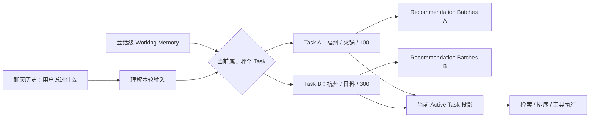

# 多轮对话状态与工作记忆

这条线真正值得讲的，不是“项目里用了 Working Memory”这个名词，而是我们**为什么最后不得不做出一套显式状态系统**。项目早期其实并没有一开始就设计好工作记忆，更接近“聊天历史 + 单次决策状态 + 一些会话字段”拼起来跑；随着多轮修改、反悔、切换方案、历史指代和并发工具结果逐渐出现，原来那些看起来合理的局部设计开始互相污染。最后形成的方案，是被一轮轮失败 Case 推出来的。

这也是这条线最适合面试的地方：它不是“我学了一个 Agent Memory 概念然后套进项目”，而是**先遇到业务状态失真，再逐步把聊天历史、当前业务状态、任务作用域、历史事实和运行时状态拆开**。下面按真实认知演进来讲，而不是按类名或 Commit 流水账来讲。

## 一、这套状态系统是怎么一步步长出来的

**最开始的问题甚至还不是 Working Memory，而是“状态到底放在哪里”。** 早期聊天记录负责给模型提供文本历史，`ai_chat_session` 只保存活动决策等少量会话字段，`ai_decision_session.request_context_json` 保存单次决策的请求快照，推荐完成后的候选商户和焦点又在另外的上下文里。单轮时这种拆法没什么问题，因为一次请求从输入到推荐结束就结束了；但一旦用户第二轮继续说“预算改成 80”“还是刚才第二家”“位置就用刚刚那个”，系统就必须回答一个问题：**上一轮留下来的哪些信息仍然是当前真值？**

2026-08-16 的一次状态重构首先把位置槽位收进服务端会话状态。这个阶段已经出现了一个很重要的认知：浏览器这一轮传过来的坐标，不能只属于某个 `DecisionSession`，否则下一轮新开决策时坐标就丢了，系统会再次向用户索要位置。于是位置开始有明确的 `MISSING / AVAILABLE / DECLINED / EXPIRED` 生命周期，客户端事件也统一进入聊天编排链路。**这一步还不算完整 Working Memory，但第一次明确了“聊天记录负责语言历史，业务状态必须有服务端真值”的边界。**

真正的会话级工作记忆是在 2026-08-24 进一步收敛出来的。当时的位置在会话槽位里，而候选商户、焦点商户和条件快照仍散落在决策上下文中。跨轮引用虽然勉强能工作，但新的推荐请求无法确定地回答“上一轮哪些条件应该继承、哪些应该覆盖”。因此项目新增 `ConversationWorkingMemory`，把跨轮仍然有业务意义的状态收进同一个会话级模型：位置、待确认地点、当前条件、候选结果、焦点商户、对话阶段、来源决策等。`DecisionSession` 继续保留**一次执行的不可变快照和审计信息**，但不再承担跨轮业务真值。

这里出现了第一个核心分界：**Chat History 是语言证据，Working Memory 是当前业务真值。** 这不是单纯为了省 Token。假设模型上下文无限长，把所有历史全部塞进去，用户先说“福州火锅，人均 100”，再说“改成杭州日料，人均 300”，模型确实能看到两句话，但系统仍然要确定下一次检索到底应该使用哪一套条件。如果每轮都让模型重新从自然语言历史中猜“哪个值现在有效”，状态正确性就依赖一次新的概率推理；而检索、排序、工具参数又要求确定输入。工作记忆的意义，就是把“模型理解过的结果”进一步收敛成**可确定读取、可确定修改、可验证的当前状态**。

但这时的工作记忆还是一个 **Flat State，也就是一份扁平的全局当前状态**。这个设计最开始非常自然：一个聊天会话里维护一份 `activeCriteria`，用户改预算就覆盖预算，换城市就覆盖城市，候选集跟着更新。对线性的对话，它非常好用：A → A' → A''，每一轮都只是在同一需求上继续细化。

真正把 Flat State 证伪的，是后来专门补出来的多轮鲁棒性用例。2026-09-05，`conversation-robustness-v1` 从原来的 9 条扩到 24 条，不再只看最终 Route 和 Status，而是开始逐轮断言 Working Memory、候选池、焦点实体和工具绑定。Flat Working Memory 的正式基线 Run 85 在 24 条用例里只有 3 条完全通过；其中最典型的失败不是模型不会理解中文，而是 **A→B→A 的 Ghost Inheritance，也就是“幽灵继承”**。

场景很简单：

```text
Turn 1：帮我在福州找人均 100 元以内的火锅
Turn 2：改到杭州西湖找人均 300 元以内的日料
Turn 3：还是按最开始福州那套火锅方案
```

如果整个会话只有一份扁平状态，Turn 2 会把福州/火锅/100 改成杭州/日料/300。到了 Turn 3，“回到最开始”不是普通的字段覆盖，因为当前状态已经没有完整的 A 方案了。实际基线里就出现过：菜系回到了火锅，但预算仍残留 B 的 300；A→B→C→A 时问题更明显。继续补 `if 换城市 clear budget`、`if 回到以前 restore cuisine` 这类规则只能暂时堵洞，因为根因不是某个字段漏清，而是**数据模型无法表达“一个会话中同时存在多套独立方案”**。

这一步把我们的认识从“工作记忆就是当前状态”推进成了“**当前状态本身也有作用域**”。于是 Working Memory V2 引入了轻量的 Task 作用域：会话里保留 `activeTaskId` 和多个 `DecisionTaskState`，每个 Task 自己保存 `criteria`、`searchLocation`、`constraintSources`，后面又把 `recommendationBatches` 也收进去。这样 A 和 B 不再互相覆盖，而是两套可独立恢复的业务状态。



这里有一个容易讲错的地方：**Task 不是“每轮创建一个对象”，也不是让模型自由决定什么时候新建任务。** 当前实现刻意把 Task transition 做得比较小：显式说“最开始/之前”时优先切回历史 Task；如果当前输入能唯一匹配一套历史需求，也可以切换；当目标地点和菜系同时形成明显独立需求时才创建新的 Task；预算、距离、偏好等通常只是当前 Task 的 refinement。这样做的 Trade-off 是规则不可能覆盖所有自然语言任务边界，但它比“LLM 每轮自己决定 Task ID”更可控，也避免 Task 数量无节制增长。

Task V2 第一版上线后，我们又踩了一个比“模型识别错”更有价值的坑。Run 87 的 Scope 子集仍然只有 2/4，通过逐轮 trace 发现 `taskCount` 一直是 1、`activeTaskId` 没有真正保持切换。开始很容易怀疑 CREATE/SWITCH 规则没命中，但 trace 显示前半段 transition 已经成功修改了 Pipeline 里的 Working Memory。真正的问题出在后面的 `reduceCriteria()`：它又从持久层重新加载了 transition 之前的旧 Working Memory，于是同一个请求里同时存在两份状态——**内存里已经切换 Task 的新 Snapshot，和数据库里尚未提交的旧 Snapshot**。Reducer 使用后者，第一次持久化时又把前面的 Task transition 覆盖掉。

这个事故形成了目前这条线最重要的工程不变量之一：**一次 Turn 只能有一份权威 Working Memory Snapshot。** 正确流程应该是：`bootstrap load once → task transition → constraint merge → reduce → persist`，中间节点只能围绕这一份请求级 Snapshot 工作，不能因为“想拿最新状态”就随手再查一次数据库。修复后，Run 89 的完整 robustness 为 7/24；更关键的是专门用于 Task Scope 的子集从 Run 87 的 2/4 变成 Run 90 的 4/4，并且 Task ID 轨迹能验证 A、B、C 是独立状态，回到 A 使用的是原 Task，而不是从 B/C 上重新拼一份类似 A 的状态。这里不能把 7/24 和 4/4 混成一个“整体准确率大涨”的结论，因为它们不是同一评测范围；能严谨说明的是：**Task Scope 这一个已知失败簇被定向评测验证修复，但整个多轮鲁棒性仍有其他问题。**

Task Scope 收口后，候选状态也进一步调整。早期存在独立的 `candidatePool`、`shownShopIds`、`sourceDecisionSessionId`，很容易出现多个字段描述同一事实但更新时机不同。现在一个 Task 保存按轮产生的 `RecommendationBatch`：**最新一批候选**从最后一个 Batch 派生，**历史展示过的商户**从所有 Batch 做并集，**来源决策会话**从最新 Batch 派生。这样不是简单减少字段，而是在减少“同一事实的多个可写副本”。当前投影可以变化，历史批次作为事实边界保留下来，因此“刚才第二家”“最开始那一批”才有机会被稳定解析。

到这里，状态模型已经解决了“同一会话里谁是真值、多个业务方案如何隔离、一次请求如何保证看到同一份状态”。但还剩最后一类问题：**并发和慢结果会不会把已经更新的新状态覆盖回去。** 这和 LLM 无关，是典型的状态一致性问题。

项目没有把整个 Agent 请求串行化，也没有给一个 `chatId` 从 Rewrite、Routing、LLM、Tool 到生成回答全程上分布式锁。原因是这些阶段大部分是只读或计算型操作，全部串行会直接放大长尾延迟。真正需要保护的是 **Durable State Mutation，也就是持久状态提交边界**。`WorkingMemoryVersionService.append()` 写入前检查 `expectedVersion`，新版本固定为 `expectedVersion + 1`，数据库的 `(chat_id, version)` 唯一约束再承担最终竞争保护；如果版本不一致，抛 `VersionConflictException`，不会静默覆盖，也不会自动 Retry。

核心实现其实很短：

```java
AiWorkingMemory current = latest(chatId);
int actualVersion = current == null ? 0 : current.getVersion();
if (actualVersion != expectedVersion) {
    throw new VersionConflictException(chatId, expectedVersion, actualVersion, operationType);
}

row.setVersion(expectedVersion + 1);
workingMemoryMapper.insert(row);
```

为什么不自动 Retry？因为这里的冲突不是简单的数据库写失败。假设两个请求都基于 V20 做推理，A 先提交成 V21，B 再发现冲突。如果 B 自动重新读取 V21 然后把旧的 Delta 再套一次，相当于默认认为“基于旧世界算出来的结果可以无条件 rebase 到新世界”，这个业务语义并不成立。因此当前策略是**拒绝旧提交，让上层明确处理冲突，而不是为了提高成功率悄悄覆盖。**

Tool/Agent 慢结果还有另一层保护。运行时上下文创建时会记录 `baseWorkingMemoryVersion`；工具执行结束准备把候选池、焦点商户等结果回写时，系统重新读取最新版本。如果工具基于 V20 启动，但期间用户又发了一轮消息把状态推进到 V21，那么这个 Tool Result 即使计算本身成功，也已经属于旧世界。当前实现会记录 `STALE_RUNTIME_RESULT` 并拒绝它修改 Working Memory。**“结果计算成功”不等于“结果仍然有资格提交”**，这是长耗时 Agent 工具特别容易忽略的一点。

历史恢复同样遵守版本原则。历史 Working Memory 是只读 Snapshot，恢复某个旧版本时并不会把历史行改成“当前”，而是读取旧业务状态，再基于当前版本追加一个新版本；恢复范围也只针对业务状态，运行时诊断信息不会机械回滚。这个设计的核心不是“能撤销”，而是保证时间线可追溯：**历史是事实，新状态永远通过新版本产生。**

把目前的状态模型压缩成一句话，就是：**聊天历史保存语言证据，会话级工作记忆保存当前业务真值；工作记忆内部再按 conversation scope 和 task scope 隔离，多轮派生结果通过 Recommendation Batch 保留历史边界；一次请求只允许一个权威 Snapshot，持久修改用版本检查保护，异步/慢结果回写前还要验证自己是否已经过期。**

## 二、从这条线真正应该带走什么 Agent 开发经验

第一条也是最重要的一条：**不要把 Chat History 当业务状态数据库。** 聊天历史回答的是“用户曾经说过什么”，当前状态回答的是“系统现在应该按什么条件执行”。这两件事在简单聊天里可以混在一起，但只要业务出现反悔、修改、恢复、分支任务、确定性工具参数，就应该考虑显式状态。上下文窗口变大并不能消灭这个问题，因为它只是让模型看到更多历史，不会自动帮系统建立唯一、可验证的当前真值。

第二条是：**状态设计先问 Scope，再问字段。** 我们一开始只考虑“工作记忆里应该放哪些字段”，后来 A→B→A 才暴露真正的问题是这些字段属于谁。设备位置天然更接近 conversation scope；某套推荐的预算、菜系、搜索地点属于 task scope；Tool 执行中的候选临时结果属于 runtime scope。不同生命周期的状态放进同一个 Flat Object，早晚会出现幽灵继承。这个经验可以迁移到旅游 Agent 的“多套行程”、招聘 Agent 的“多个岗位搜索方案”、购物 Agent 的“多组商品比较任务”，甚至 Coding Agent 的“多个并行修复目标”。

第三条是：**尽量只保留一个可写事实源，其余都做派生投影。** `candidatePool`、`shownShopIds`、`sourceDecisionSessionId` 如果都独立写，就必须保证所有写路径永远同步；后面用 `RecommendationBatch` 作为历史事实，最新候选、已展示集合、来源 Session 从它派生，本质是在减少一致性维护面。Agent 系统状态很多时候不是“字段少就简单”，而是“同一个事实只有一个 authority 才简单”。

第四条是：**一次业务处理过程里的状态视图也必须一致。** Task V2 的双 Snapshot Bug 很典型：数据库里确实只有一个最终状态，类设计也没有明显错误，但 Pipeline 中途重新读取旧状态，就足以把前面的内存修改覆盖掉。以后设计长链路 Agent Pipeline 时，要明确每一轮的 authoritative snapshot 从哪里加载、何时修改、何时提交，中间节点是读同一对象还是重新查库，不能只看最终数据库模型。

第五条是：**并发控制应该保护“有副作用的提交边界”，而不是条件反射地锁住整个 Agent。** LLM 和 Tool 都可能很慢，全链路串行最容易实现，但吞吐和 P95/P99 会很难看。允许只读计算并行，在最终状态提交时用版本校验解决 Lost Update，同时给长耗时 Tool 增加 stale-result guard，是更适合 Agent 的折中。当然它的代价也明确：冲突请求可能失败，复杂场景需要上层重新决策，而不是自动 Retry。

这几条经验组合起来，其实形成了一套比较稳定的判断框架：当一个 Agent 只是一次性问答时，没有必要设计复杂工作记忆；当它开始具备**多轮可变条件、多个并存任务、长耗时工具、状态恢复或确定性后续动作**时，显式状态、作用域、版本和派生失效才逐渐变成必要工程能力。不是所有 Agent 都需要 DP-Plus 这一整套，但出现这些业务特征时，就应该开始警惕“把 history 全塞给模型”这种最简单方案的上限。

## 三、这条线放到简历上应该怎么写

如果只写一条，我更建议把卖点集中在“**显式状态 + Task 作用域 + 一致性保护**”，不要把所有内部名词都暴露出来。当前更稳的一版可以写成：

> **多轮状态管理：**设计版本化工作记忆，将聊天历史与当前业务状态解耦；针对多轮 A→B→A 需求切换中的状态串扰，引入 Task 作用域隔离搜索条件与推荐批次，并统一单轮权威状态快照，通过版本冲突与慢结果校验避免旧状态覆盖当前会话。

如果投 Java 后端、希望工程味更强，可以写成：

> **Agent 状态一致性：**构建会话级版本化状态模型，按 Task 隔离多套消费决策条件并保留推荐批次历史；通过请求内单一 Snapshot、乐观版本校验及 Stale Result Guard 控制并发状态写入，避免多轮反悔与异步工具结果导致状态污染。

这两版都没有写“准确率提升多少”，因为现有数据不适合包装成一个整体百分比。我们有严格可复现的 Flat baseline 和 Task Scope 子集验证，但完整 robustness 仍有其他失败簇。面试时可以主动说：Flat 基线 Run 85 为 24 条中 3 条完全通过；Task V2 初版的 Scope 子集仍是 2/4，修复双 Snapshot 后定向 Scope Run 90 达到 4/4；完整 Run 89 是 7/24，所以**我们只宣称修复了 Task Scope 这一簇，不把它包装成整个 Agent 的总体准确率提升**。这种说法反而更经得住追问。

## 四、面试问题：先理解为什么问，再准备怎么答

**Q1：为什么不直接把所有聊天历史都塞进上下文，而是单独搞一套工作记忆？**

这是这条线最核心的问题。面试官表面上像是在问 Context Window，实际更可能是在看你是否区分了**语言上下文**和**业务状态**。如果只回答“历史太长会超过 Token 上限”，就把问题讲窄了；即使上下文无限大，多轮反悔时依然存在旧状态和新状态同时出现、工具到底该用哪个值的问题。

> 最开始我们其实也主要依赖聊天历史，因为短对话里这样最简单。但做到多轮以后发现，聊天历史记录的是“用户曾经说过什么”，不等于“用户现在还想要什么”。比如用户先说福州火锅、人均 100，下一轮改成杭州日料、人均 300，历史里四个条件都会存在。如果每一轮都让模型重新从历史判断哪个有效，后面的检索和工具参数就会依赖一次概率推理。
>
> 所以后来我们把两件事拆开：聊天历史继续负责语义上下文和原始证据，工作记忆保存当前有效的结构化业务状态。模型可以参与理解本轮输入，但最终检索、排序和工具执行读取的是确定状态，而不是重新猜历史。这个设计还有一个额外收益是后面能做明确的覆盖、清除、作用域隔离和版本校验，这些都不是单纯增加 Context Window 能解决的。

**Q2：那我把早期聊天历史做摘要，不就可以替代工作记忆了吗？**

这个追问必须懂，因为“滑动窗口 + 摘要”确实是上下文管理的常见方案，但它解决的问题与工作记忆不完全一样。摘要主要解决 Token 和相关性，工作记忆解决业务状态的确定读写。

> 摘要我会用，但不会拿它替代工作记忆。摘要本质还是自然语言压缩，适合回答“前面大概讨论过什么”，但像预算现在到底是 100 还是 300、当前激活的是哪套方案、最新一批候选是谁，这些状态会直接参与程序执行，我希望它们能被确定读取、精确覆盖、做版本检查，而不是再让模型从摘要里解释一次。
>
> 所以比较合理的关系是：原始聊天历史负责证据，摘要负责压缩较远历史，工作记忆负责当前业务真值。它们是不同层，不是三选一。

**Q3：Working Memory 里是不是越多越好？哪些东西应该放，哪些不应该放？**

这里容易背成“短期记忆存最近对话，长期记忆存用户偏好”，但结合项目更容易回答。我们的判断标准不是“最近不最近”，而是**这个状态是不是下一轮业务正确执行所依赖的真值，以及它的生命周期属于哪个 Scope**。

> 我现在会先按生命周期分。会话级保存跨当前聊天任务都有效的状态，比如设备位置、当前激活 Task、对话阶段；Task 级保存某一套推荐方案自己的条件、搜索地点和推荐批次；Tool 执行中的临时结果先放 runtime context，不会什么都持久化。聊天原文还是留在消息历史里，不重复塞成一份业务状态。
>
> 另外我会尽量避免保存多个表示同一事实的可写字段。比如现在不是单独维护 candidatePool、shownShopIds、sourceSession 三套事实，而是保留 RecommendationBatch，最新候选和历史展示集合从 Batch 派生。这样能减少同步更新带来的状态漂移。

**Q4：为什么 Flat Working Memory 不够？一个会话维护一份当前状态不是最简单吗？**

这道题直接对应 A→B→A 的真实失败，是很适合讲开发故事的一题。

> Flat State 对线性 refinement 很好用，比如“福州火锅 100 → 预算改 80 → 再加个安静”，因为本质上一直是一套需求。但我们后来加 A→B→A 多轮用例后发现，一个会话里用户可能同时维护多套独立方案。A 是福州火锅 100，B 是杭州日料 300，如果只有一份全局 criteria，切到 B 就会把 A 覆盖掉；用户再说“回到最开始”，只能从聊天历史重新拼 A，很容易出现预算还残留 B 的 300，这就是我们实际测到的 Ghost Inheritance。
>
> 所以最后没有继续堆 clear 规则，而是改了表示模型：会话下面挂多个 Task，每个 Task 自己保存条件和推荐历史，activeTaskId 只表示现在操作哪一套。这样“回到 A”是切换业务身份，不是把 B 改造成一个长得像 A 的状态。

**Q5：Task 和 Working Memory Version 有什么区别？既然已经保存历史版本，为什么还要 Task？**

这是一个很有价值的架构追问。两者看起来都能“回到以前”，但维度完全不同。

> Version 是时间维，描述的是整个会话在某一个时刻长什么样；Task 是业务身份维，描述的是同一个会话里同时存在的多套方案。A→B→A 如果靠 Version 做，相当于把整个会话回滚到过去，会连带回滚其他本来应该保留的当前信息，而且后续 A 和 B 也没办法同时存在。
>
> Task 则是同时保留 A、B 两套业务状态，切换只是改变 activeTaskId。历史 Version 主要用于审计、冲突检测和显式恢复，所以这两个概念不能互相替代。

**Q6：为什么后来又搞 RecommendationBatch？直接保存当前 candidatePool 不行吗？**

这个问题其实在考**当前投影和历史事实**的区别。

> 只保存 candidatePool 可以回答“现在有哪些候选”，但用户会说“上一批第二家”“最开始那家”。如果换一批后直接覆盖 candidatePool，上一批的边界和顺序就丢了；如果只维护一个 shownShopIds 集合，又只能知道出现过哪些店，无法知道当时第几家是谁。
>
> 所以后来 Task 里保留 RecommendationBatch，每一批保存自己的候选顺序和 decisionSessionId。当前 candidatePool 从最新 Batch 派生，shownShopIds 从所有 Batch 做并集。这个设计把历史事实保留下来，同时避免 candidatePool、shownShopIds 等都变成独立可写真值。

**Q7：你们 Task V2 都已经设计对了，为什么第一版评测还是失败？**

这题非常适合证明你真的做过 Pipeline，而不是只会画数据模型。

> 当时最开始也怀疑 Task 切换规则有问题，但 trace 显示 transition 已经成功。真正的问题是同一个 Turn 出现了两份 Working Memory：前半段在 Pipeline context 里已经切了 Task，后面的 reducer 又从数据库重新加载 transition 前的旧状态，结果第一次 persist 时把前面的修改覆盖了。
>
> 最后我们定了一个不变量：一次 Turn 从 bootstrap、task transition、merge、reduce 到 persist 必须使用同一份 authoritative snapshot，中间不能随意重新 load。这个问题让我意识到，状态模型正确不代表状态链路就正确，Pipeline 里的 state view 也必须唯一。

**Q8：并发请求为什么不用 Redis 分布式锁或者数据库行锁，直接把同一 chatId 串行化不是更简单吗？**

这是状态一致性往 Java 后端方向最自然的追问。重点不是说锁不好，而是说明我们保护的边界和 Trade-off。

> 全链路加锁当然最简单，但 Agent 一次请求里有 LLM、检索和 Tool，耗时可能很长。如果一个 chatId 从请求进入到模型返回全程串行，锁持有时间会非常长，而且很多阶段其实只是只读计算。
>
> 我们最后保护的是 Durable State Mutation：请求可以并行做 Rewrite、Routing、LLM 和只读 Tool，提交 Working Memory 时用 expectedVersion 做乐观校验，数据库 `(chat_id, version)` 唯一约束兜底。这样正常无冲突场景不需要长时间持锁；代价是冲突请求会被拒绝，需要上层决定怎么处理，而不是保证每个请求都自动成功。

**Q9：发生版本冲突以后，为什么不自动 Retry？**

这个问题看起来像普通 CAS 八股，但和 Agent 特别相关，因为一次请求的结果通常是基于旧上下文“算出来”的，而不是一个可以无脑重放的 SQL。

> 如果只是 `count + 1` 这种简单更新，CAS 失败后重新读再算通常没问题。但 Agent 的 Delta、候选集和工具结果都是基于某个旧状态推理出来的。比如 B 基于 V20 判断应该推荐一批店，A 已经把状态更新到 V21；这时 B 自动读 V21 再把旧结果提交，相当于默认旧推理对新状态仍然成立。
>
> 我们不想隐式做这种 rebase，所以当前冲突直接失败，不自动覆盖。要不要重试应该重新经过业务判断，而不是数据库层机械重放。

**Q10：Tool 已经成功返回结果了，为什么还可能不让它写回 Working Memory？**

这里考的是长耗时异步结果与状态版本的关系。

> Tool 启动时会带一个 `baseWorkingMemoryVersion`。如果它基于 V20 开始搜索，但工具执行期间用户又发了一条消息，把会话推进到 V21，那么这个结果即使搜索本身成功，也已经不一定适用于当前需求。
>
> 所以写回前会重新看最新版本；版本不一致就记为 `STALE_RUNTIME_RESULT`，拒绝它更新候选和焦点。核心判断是：计算成功只代表结果对旧输入有效，不代表它还有资格修改当前状态。

**Q11：如果用户明确要求“恢复到之前的状态”，你们是直接把数据库版本回滚吗？**

这个问题不需要讲太长，但它能把 Version 的语义补完整。

> 不会修改历史版本，也不会把版本号倒退。历史 Snapshot 是只读事实；恢复时先读取指定历史版本的业务状态，再以当前版本为 expectedVersion 追加一个新版本。这样时间线仍然是单调向前的，能够审计“当前状态是从哪个历史版本恢复出来的”，同时避免把旧运行时诊断信息一起机械回滚。

最后有几类知识和这条线有关，但不值得在本文继续展开成大段八股：**CAS 与 ABA**可以重点理解版本号为什么比单值比较更稳；**数据库 MVCC / 悲观锁 / 乐观锁**重点理解为什么这里选择短提交边界而不是长事务；**Event Sourcing**可以比较“版本化 Snapshot + 状态事件”和完整事件溯源的差异，我们当前不是严格 Event Sourcing；**LangGraph Checkpoint / Memory**可以了解框架如何实现状态持久化，但不要反过来拿框架名解释项目设计；**KV Cache、滑动窗口、摘要与长期记忆**属于上下文工程，和本文最重要的边界是：它们主要解决“模型本轮看什么”，Working Memory 主要解决“系统当前相信什么、接下来按什么执行”。
