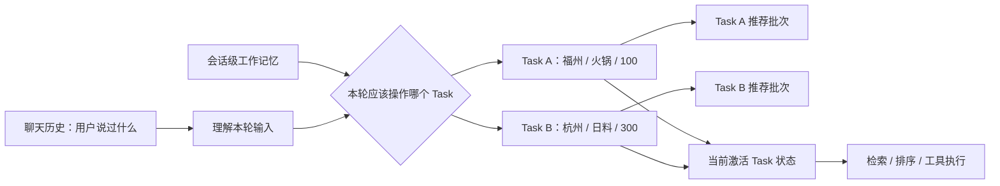

# 多轮对话状态与工作记忆

这条线真正值得讲的，不是“项目里用了 Working Memory”这个名词，而是我们**为什么最后不得不做出一套显式状态系统**。项目早期并没有一开始就设计好工作记忆，更接近“聊天历史 + 单次决策状态 + 一些会话字段”拼起来跑；随着多轮修改、反悔、切换方案、历史指代和并发工具结果逐渐出现，原来那些看起来合理的局部设计开始互相污染。最后形成的方案，是被一轮轮失败场景推出来的。

这条线最适合面试的地方也在这里：它不是“先学了一个 Agent Memory 概念，再把它套进项目”，而是**先遇到业务状态失真，再逐步把聊天历史、当前业务状态、任务作用域、历史事实和运行时状态拆开**。下面按真实认知演进来讲，而不是按类名或 Commit 流水账来讲。

## 一、这套状态系统是怎么一步步长出来的

**最开始的问题甚至还不是工作记忆，而是“状态到底放在哪里”。** 早期聊天记录负责给模型提供文本历史，`ai_chat_session` 只保存活动决策等少量会话字段；`DecisionSession` 可以理解成“一次消费决策执行的快照”，它保存这一次搜索使用的请求、约束和执行结果，用于审计和后续追问，但它天然只代表某一次执行，不适合作为整个聊天跨轮共享的当前状态。推荐完成后的候选商户、焦点商户等信息又分散在其他上下文中。单轮时这种拆法没有明显问题，因为一次请求从输入到推荐结束就结束了；但一旦用户第二轮继续说“预算改成 80”“还是刚才第二家”“位置就用刚刚那个”，系统就必须回答一个问题：**上一轮留下来的哪些信息仍然是当前真值？**

2026-08-16 的一次状态重构首先把位置槽位收进服务端会话状态。这个阶段已经出现了一个重要认知：浏览器这一轮传过来的坐标不能只属于某个 `DecisionSession`，否则下一轮新开决策时坐标就丢了，系统会再次向用户索要位置。于是位置开始有明确的生命周期：`MISSING` 表示还没有位置，`AVAILABLE` 表示当前有可用设备定位，`DECLINED` 表示用户明确拒绝定位，`EXPIRED` 表示定位已经过期。客户端的定位、拒绝定位等事件也统一进入聊天编排链路。**这一步还不算完整工作记忆，但第一次明确了“聊天记录负责语言历史，业务状态必须有服务端真值”的边界。**

真正的会话级工作记忆是在 2026-08-24 进一步收敛出来的。当时的位置在会话槽位里，而候选商户、焦点商户和条件快照仍散落在决策上下文中。跨轮引用虽然勉强能工作，但新的推荐请求无法确定地回答“上一轮哪些条件应该继承、哪些应该覆盖”。因此项目新增 `ConversationWorkingMemory`，把跨轮仍然有业务意义的状态收进同一个会话级模型；`DecisionSession` 继续保留**单次执行的不可变快照和审计信息**，但不再承担跨轮业务真值。

这里出现了第一个核心分界：**Chat History 是语言证据，Working Memory 是当前业务真值。** 这不是单纯为了省 Token。假设模型上下文无限长，把所有历史全部塞进去，用户先说“福州火锅，人均 100”，再说“改成杭州日料，人均 300”，模型确实能看到两句话，但系统仍然要确定下一次检索到底应该使用哪一套条件。如果每轮都让模型重新从自然语言历史中猜“哪个值现在有效”，状态正确性就依赖一次新的概率推理；而检索、排序、工具参数又要求确定输入。工作记忆的意义，就是把“模型理解过的结果”进一步收敛成**可确定读取、可确定修改、可验证的当前状态**。

这个阶段的工作记忆仍然是一份 **Flat State，也就是扁平全局状态**。当时可以把它理解成“一个聊天会话只有一套当前条件和当前候选”：用户改预算就覆盖预算，换城市就覆盖城市，候选集跟着更新。对线性的对话，它很好用，例如“福州火锅 100 → 预算改 80 → 再加一个安静偏好”，每一轮都只是在同一套需求上继续细化。

真正把 Flat State 证伪的，是后来补出来的**多轮鲁棒性评测集**。这个评测集不是为了测“回答听起来像不像人”，而是专门验证多轮状态在真实链路里有没有被正确继承、覆盖、清除和重新绑定。2026-09-05，`conversation-robustness-v1` 从 9 条扩到 24 条；除了看本轮走了哪条处理分支、最终决策状态是否正确，还开始逐轮记录 Working Memory、候选池、焦点实体、推荐快照和工具绑定。也就是说，它重点测的是**中间状态轨迹是否正确**，而不是只看最后一句回答碰巧对不对。

这套评测里的一次执行记为一个 Run。Run 85 是 Flat Working Memory 的正式全量基线：24 条用例里只有 3 条完全通过。这个 3/24 不能简单理解成“整个 Agent 准确率只有 12.5%”，因为这里的“完全通过”要求一条多轮用例的多个断言同时满足；它真正说明的是，当我们开始严格检查中间状态时，Flat State 暴露出大量之前被最终答案掩盖的问题。其中最典型的一类，就是 **A→B→A 的幽灵继承**。

```text
Turn 1：帮我在福州找人均 100 元以内的火锅
Turn 2：改到杭州西湖找人均 300 元以内的日料
Turn 3：还是按最开始福州那套火锅方案
```

如果整个会话只有一份扁平状态，Turn 2 会把福州/火锅/100 改成杭州/日料/300。到了 Turn 3，“回到最开始”不是普通字段覆盖，因为当前状态已经没有完整的 A 方案了。实际基线里就出现过：菜系回到了火锅，但预算仍残留 B 的 300；A→B→C→A 时问题更明显。继续补“换城市就清预算”“回到以前就恢复菜系”这类规则只能暂时堵洞，因为根因不是某个字段漏清，而是**数据模型无法表达“一个会话中同时存在多套独立方案”**。

这一步把我们的认识从“工作记忆就是当前状态”推进成了“**当前状态本身也有作用域**”。于是 Working Memory V2 引入了 Task。这里的 **Task 不是线程，也不是每一轮对话**，而是“一套可以独立维护、暂时离开、之后再切回来的消费决策方案”。例如 A=福州火锅 100，B=杭州日料 300，它们应该作为两个独立 Task 同时存在，而不是互相覆盖。

当前最重要的状态结构可以先这样记：

```text
ConversationWorkingMemory                  会话级工作记忆
├── schemaVersion                          数据结构版本，目前为 2
├── activeTaskId                           当前正在操作哪一套 Task
├── tasks[]                                一个会话中并存的多套消费决策
│   └── DecisionTaskState
│       ├── taskId                         Task 唯一标识
│       ├── title                          这套需求的描述标题
│       ├── criteria                       这套需求当前有效的搜索条件
│       ├── constraintSources              条件来源：用户明确输入/系统默认/系统推导
│       ├── searchLocation                 这套需求自己的搜索目的地
│       └── recommendationBatches[]        这套需求历史产生过的推荐批次
├── deviceLocation                         用户设备定位，属于整个会话
├── pendingLocationCandidates              地名解析后等待确认的候选地点
├── activeDecisionSessionId                当前活动的单次决策执行
├── lastDecisionSessionId                  最近一次单次决策执行
├── focusedShopId / focusedShopName        当前对话聚焦的商户
├── dialogPhase                            当前对话阶段
└── lastPolicyAction / lastPolicyReason    最近策略诊断信息
```

这里最重要的不是把字段背下来，而是理解**为什么要分会话级和 Task 级**。`deviceLocation` 表示“用户设备现在在哪”，用户从福州火锅切到杭州日料时，设备定位本身不会因为切需求而变化，所以它属于会话级；`searchLocation` 表示“这一套方案准备去哪搜”，A 可以搜福州，B 可以搜杭州，所以必须跟着 Task 隔离。预算、菜系等 `criteria` 同理属于 Task。这个划分本质上是在按**生命周期和业务身份**确定状态作用域。



有了多个 Task 以后，每一轮输入首先要判断“这句话应该作用在哪一套需求上”。当前实现把 Task 的变化收敛成三种基本操作：**UPDATE（更新）**表示仍然是当前方案，只修改预算、距离、偏好等条件；**CREATE（新建）**表示用户明显提出了一套独立新需求，需要创建一个新的 Task；**SWITCH（切换）**表示用户说“回到最开始那套”“还是之前那个”，重新激活已经存在的历史 Task。A=福州火锅 100 时，“预算改成 80”是 UPDATE；随后“改到杭州吃日料，人均 300”可以形成 CREATE；之后“还是最开始福州那套”就是 SWITCH 回 A。后文提到的 Task transition，就是这三类任务状态变化的统称。

当前实现刻意把 Task transition 做得比较小：显式说“最开始/之前”时优先切回历史 Task；如果当前输入能唯一匹配一套历史需求，也可以切换；当目标地点和菜系同时形成明显独立需求时才创建新的 Task；预算、距离、偏好等通常只是当前 Task 的更新。这样做的 Trade-off 是规则不可能覆盖所有自然语言任务边界，但它比“让 LLM 每轮自由决定 Task ID”更可控，也避免 Task 数量无节制增长。

Task V2 做完以后，我们没有直接用完整 24 条评测判断它“好不好”，而是从完整多轮鲁棒性集中挑出 **4 条 Task Scope 定向用例**。这组小评测只验证这次改造最核心的能力：A/B/C 是否真的形成独立 Task、切回 A 时是否使用原来的 Task、B 的地点和预算是否会泄漏到 A、恢复 A 后新增约束是否只作用于 A，以及普通地点/预算微调是否会错误创建新 Task。**它不是整个 Agent 的总分，而是用来隔离验证“Task 作用域”这一项能力。**

在 Flat State 的 Run 85 里，这 4 条 Task Scope 用例只有 2/4；Task V2 第一版的 Run 87 仍然是 2/4。也就是说，**数据结构虽然已经改成多 Task，但真实链路并没有因此自动正确**。逐轮状态轨迹显示 `taskCount` 一直是 1、`activeTaskId` 没有真正保持切换。Trace 最后证明前半段 Task transition 已经成功：CREATE/SWITCH 确实修改了 Pipeline 里的 Working Memory。真正的问题出在后面的 `reduceCriteria()`：它又从持久层重新加载了 transition 之前的旧 Working Memory。

这里的 Snapshot（快照）可以理解成**某一时刻的一份完整 Working Memory 副本**。同一个请求里于是同时出现了两份状态——内存中已经切换 Task 的新快照，以及数据库里尚未提交、仍停留在切换前的旧快照。Reducer 使用后者，第一次持久化时又把前面的 Task transition 覆盖掉。

这个事故形成了目前这条线最重要的工程不变量之一：**一次 Turn 只能有一份权威 Working Memory 快照。** 正确流程应该是“请求开始加载一次 → Task 切换 → 条件合并 → 状态归并 → 持久化”，中间节点只能围绕这一份请求级快照工作，不能因为“想拿最新状态”就随手再查一次数据库。修复后，Task Scope 定向用例在 Run 89、Run 90 都达到 4/4；Task ID 轨迹能验证 A、B、C 是独立状态，回到 A 使用的是原 Task，B 的西湖地点不会泄漏，切回 A 后新增预算只作用于 A，普通 refinement 仍保持一个 Task。

同时，Run 89 的**完整 24 条多轮鲁棒性评测**只有 7/24 完全通过。这两个数字必须分开理解：4/4 说明我们定向修复的 **Task 作用域失败簇已经通过验收**；7/24 说明整个多轮 Agent 仍然存在复合意图、位置澄清、历史指代绑定等其他独立问题。因此这里不能宣传成“Task V2 让整体准确率从 2/4 提升到 4/4”，更不能拿 4/4 当整个 Agent 的通过率。

Task 作用域收口后，候选状态也进一步调整。这里有四个名字很容易混：`RecommendationBatch`、candidate pool、`shownShopIds`、`excludeShopIds`。**它们不是四份并列持久状态，而是处在不同层级。**

`RecommendationBatch` 是当前真正保留在 Task 里的历史事实，一批代表某次推荐产生的**有序候选集合**，核心包含 `decisionSessionId` 和 `candidates[]`；候选引用中保存 `shopId`、商户名、人均价格、距离、菜系和指代标签。candidate pool 现在已经不再作为 Working Memory 里的独立字段持久化，它只是**当前候选视图**，由 active Task 的最后一个 Batch 派生；`shownShopIds` 同样不是持久字段，而是把 active Task 所有历史 Batch 的商户 ID 做并集后得到的**历史展示视图**；来源决策 Session 也从最新 Batch 派生。

`excludeShopIds` 又不一样。它属于 `DecisionRequest`，是**本次搜索请求的临时排除参数**，不会写进 Working Memory。用户说“换一批”“更便宜点”这类 refinement 时，编排层会根据历史状态算出这次不希望再次召回的商户 ID，再传给检索层，MySQL 查询通过 `NOT IN` 排除这些店。当前实际实现是：优先使用 active Task 的 `shownShopIds`，也就是已经展示过的全部历史商户；如果没有历史展示集合，才回退到最新 candidate pool。因此可以把四者关系记成：

```text
RecommendationBatch[]        持久历史事实
        ├── last Batch  ───→ candidate pool      当前候选视图，不独立持久化
        ├── all Batches ───→ shownShopIds         历史展示视图，不独立持久化
        └── refinement 时 ─→ excludeShopIds       本次请求参数，不持久化
                                      ↓
                              SQL NOT IN (...) 
```

这里还有一个值得知道的**当前实现边界**：`DecisionRequest` 对 `excludeShopIds` 的字段注释仍写着“排除紧邻上一批推荐”，但编排层实际优先排除的是 active Task **全部已展示商户**。功能上这能避免用户换一批时反复看到旧店，但注释与真实行为已经存在轻微契约漂移，后续应该统一命名/注释，否则维护者容易误解其生命周期。

为什么最终不把 candidate pool、shownShopIds、excludeShopIds 都直接存在 Working Memory？因为这会重新制造“同一事实多个可写副本”的问题。**历史 Batch 是事实，其他集合尽量是投影或一次性执行参数。** 这样用户换一批以后，我们既保留“上一批第二家是谁”的历史顺序，又不需要同时维护多套必须同步更新的 ID 列表。

不过 RecommendationBatch 被保留下来以后，会自然出现另一个问题：**Working Memory 会不会越存越大？会，而且当前实现还没有真正完成生产级治理。** 这个问题要分两层看。第一层是单份 `ConversationWorkingMemory` 自身会增长：会话中的 Task 数量可能增加，每个 Task 的 `recommendationBatches` 也会增加。第二层更值得警惕：`tbl_ai_working_memory` 采用版本追加模式，每次持久状态变化都会新增一行，并把**完整的 `memoryJson` 快照**再保存一次，而不是只保存本轮变更。

因此从复杂度上推断，如果一段超长会话里工作记忆本体随着轮次近似线性增长，同时每次更新又保存一份完整快照，那么累计存储量在最坏情况下可能接近 **O(n²)** 增长。这是根据当前数据模型得出的工程推断，不是现在线上已经测出的容量事故。目前仓库里也没有找到正式的 Batch 裁剪、旧版本 TTL、归档或 Snapshot Compaction，所以这应该诚实视为 **Known Limitation**，不能回答成“我们已经通过某个机制解决了”。

生产化时更合理的思路不是粗暴“只留最近 N 轮”，而是先确定产品语义。用户是否需要无限期支持“最开始那批”？是否需要恢复任意历史版本？如果这些能力只要求短窗口，就可以让热 Working Memory 只保留最近若干活跃 Task 和 Batch，把更早的 Batch/版本转入冷存储；如果需要长期审计，可以保留事件或归档快照，但不必让每次在线推理都携带全部历史。版本层还可以采用“周期性完整 Checkpoint + 中间 Delta/Event”的方式降低重复存储，读取时从最近 Checkpoint 重放有限事件。**核心原则是把“当前执行需要的热状态”和“为了审计/恢复保留的历史事实”拆开，而不是让一个 JSON 同时无限承担两种职责。**

到这里，状态模型已经解决了“同一会话里谁是真值、多个业务方案如何隔离、当前与历史候选如何表达”，但还剩最后一类问题：**并发请求和慢工具结果会不会把已经更新的新状态覆盖回去。**

为了理解版本控制，要先看持久化结构。真正落库的 `AiWorkingMemory` 并不是把每个业务字段拆成数据库列，而是一条版本记录：`chatId` 标识聊天会话，`userId` 标识所属用户，`version` 是单调递增版本号，`memoryJson` 保存完整 `ConversationWorkingMemory`，`createdAt` 记录生成时间。数据库对同一 `chatId` 的版本做唯一性保护，因此同一个会话不会成功写出两个相同版本。

项目没有把整个 Agent 请求串行化，也没有给一个 `chatId` 从 Rewrite、Routing、LLM、Tool 到生成回答全程上分布式锁。原因是这些阶段大部分是只读或计算型操作，全部串行会直接放大长尾延迟。真正需要保护的是**持久状态写入边界**。`WorkingMemoryVersionService.append()` 写入前检查 `expectedVersion`：如果调用方基于 V20 计算，那么只有数据库当前仍然是 V20 时才允许写入 V21；如果别人已经先写成 V21，就说明当前请求基于旧世界，直接抛 `VersionConflictException`。数据库的 `(chat_id, version)` 唯一约束再承担最终竞争保护。

```java
AiWorkingMemory current = latest(chatId);
int actualVersion = current == null ? 0 : current.getVersion();
if (actualVersion != expectedVersion) {
    throw new VersionConflictException(chatId, expectedVersion, actualVersion, operationType);
}
row.setVersion(expectedVersion + 1);
workingMemoryMapper.insert(row);
```

为什么不自动 Retry？因为这里的冲突不是简单数据库写失败。假设两个请求都基于 V20 做推理，A 先提交成 V21，B 再发现冲突。如果 B 自动重新读取 V21 然后把旧 Delta 再套一次，相当于默认“基于旧状态算出来的结果，可以无条件重新应用到新状态”。这个业务语义并不成立。因此当前策略是**拒绝旧提交，让上层明确重新判断，而不是为了提高成功率悄悄覆盖。**

Tool/Agent 慢结果还有另一层保护。这里涉及运行时对象 `AgentSessionContext`，它不是新的业务真值，而是**一次 Agent/Tool 执行期间使用的临时状态投影**。其中最关键的是 `baseWorkingMemoryVersion`，表示“这次运行是基于哪个工作记忆版本启动的”；同时还会携带候选池快照、焦点商户、推荐批次和本轮解析出的指代结果，供工具执行使用。

例如工具基于 V20 启动搜索，执行期间用户又发了一轮消息，把会话推进到 V21。工具最后即使成功返回，也只能说明“它对 V20 的输入计算成功”，不能证明它仍适用于 V21。于是写回前系统重新读取最新版本；如果 `baseWorkingMemoryVersion` 已经落后，就记录 `STALE_RUNTIME_RESULT` 并拒绝它更新当前 Working Memory。这里最重要的判断是：**计算成功，不等于结果仍然有资格提交。**

最后还有一个和下一篇“约束提取与合并”直接相连的边界：**Working Memory 保存的是最终 Canonical State，但模型这一轮抽出来的内容不能直接覆盖它。** 最早如果每轮都要求模型重新抽取一份“完整约束”，会遇到一个无法回避的问题：模型没输出预算，到底表示“用户这轮没提预算，所以继承旧值”，还是“用户说不限预算，所以应该清掉旧值”？这两种语义都可能表现成空值。

因此现在进入状态写入的不是“拿新对象覆盖旧对象”，而是“**本轮变更 → 确定性合并 → 新 Canonical State**”。当前 `ConstraintExtractor` 返回的类型仍然叫 `DecisionConstraints`，并没有单独定义一个纯粹的 `CriteriaDelta` 类型，但它在语义上被当成**稀疏 Delta 载体**：本轮明确设置的值放在普通字段中，显式清除放在 `clearedFields`，移除偏好放在 `removedPreferences`，相对价格/距离用一次性的 `budgetDirection`、`radiusDirection` 表示，负向菜系用 `excludedCuisines` 表示。随后 `ConversationCriteriaMerger` 基于 previous + delta 做继承、覆盖、追加、清除，再产生新的完整 `DecisionConstraints`。

严格地说，**它还不是真正类型化的 Delta**，因为“完整状态”和“本轮变更”复用了同一个 `DecisionConstraints` 类型，未提及字段仍靠空字符串、-1、false、空集合等哨兵值表达，操作语义则额外挂在 `clearedFields` 等字段上。这比“每轮提取完整状态然后覆盖”可靠得多，但类型设计仍有进一步收敛空间。更纯粹的模型会把 SET、CLEAR、APPEND、REMOVE、EXCLUDE、RELATIVE 直接建成显式操作，再由 reducer 应用到 Canonical State。下一篇会完整讲这条演进。

把目前的状态模型压缩成一句话，就是：**聊天历史保存语言证据，会话级工作记忆保存当前业务真值；工作记忆内部再按会话级和 Task 级隔离不同生命周期的状态，推荐批次保留历史事实；candidate pool、shownShopIds 等尽量从事实派生，excludeShopIds 只作为请求级执行参数；一次请求只允许一份权威快照，持久修改用版本校验保护，而工作记忆无限增长仍是当前待生产化治理的边界。**

## 二、从这条线真正应该带走什么 Agent 开发经验

第一条也是最重要的一条：**不要把 Chat History 当业务状态数据库。** 聊天历史回答的是“用户曾经说过什么”，当前状态回答的是“系统现在应该按什么条件执行”。这两件事在简单聊天里可以混在一起，但只要业务出现反悔、修改、恢复、分支任务、确定性工具参数，就应该考虑显式状态。上下文窗口变大并不能消灭这个问题，因为它只是让模型看到更多历史，不会自动帮系统建立唯一、可验证的当前真值。

第二条是：**状态设计先问作用域，再问字段。** 我们一开始只考虑“工作记忆里应该放哪些字段”，后来 A→B→A 才暴露真正的问题是这些字段属于谁。设备位置属于整个会话；某套推荐的预算、菜系、搜索地点属于 Task；Tool 执行中的临时候选和中间绑定属于运行时。不同生命周期的状态塞进同一个 Flat Object，早晚会出现幽灵继承。

第三条是：**尽量只保留一个可写事实源，其余做派生投影或一次性执行参数。** `RecommendationBatch` 是历史事实，candidate pool、shownShopIds、source session 从它派生；`excludeShopIds` 是本轮搜索参数。这比四份集合都持久化更容易保持一致。

第四条是：**一次业务处理过程里的状态视图也必须一致。** Task V2 的双快照 Bug 很典型：数据库模型正确不代表 Pipeline 状态就正确。长链路 Agent 必须明确每一轮的权威快照从哪里加载、何时修改、何时提交，中间节点不能随意重新读出另一份旧世界。

第五条是：**并发控制应该保护有副作用的提交边界，而不是条件反射地锁住整个 Agent。** LLM 和 Tool 都可能很慢，全链路串行虽然简单，但会放大 P95/P99。允许只读计算并行，在最终持久状态提交时做版本校验，再给长耗时 Tool 加旧结果检查，是更合适的折中。

第六条是：**热状态和历史审计不能无限混在同一个对象里。** 小规模项目里“完整 JSON 快照 + 全历史 Batch”很方便，能快速获得恢复和审计能力；但规模上来后必须明确 retention、归档和 compaction，否则状态本体和版本历史会同时增长。是否删除历史不是纯技术问题，先由产品确定“需要恢复多久、历史指代支持多久”。

## 三、这条线放到简历上应该怎么写

更偏 AI 应用的一版可以写：

> **多轮状态管理：**设计版本化工作记忆，将聊天历史与当前业务状态解耦；针对 A→B→A 需求切换中的状态串扰，引入 Task 作用域隔离搜索条件与推荐批次，并统一单轮权威状态快照，通过版本冲突与慢结果校验避免旧状态覆盖当前会话。

更偏 Java 后端的一版可以写：

> **Agent 状态一致性：**构建会话级版本化状态模型，按 Task 隔离多套消费决策条件并保留推荐批次历史；通过请求内单一快照、乐观版本校验及慢结果版本检查控制并发状态写入，避免多轮反悔与异步工具结果导致状态污染。

数据上不要包装成一个整体百分比。严谨的说法是：完整多轮鲁棒性基线 Run 85 为 24 条中 3 条完全通过；其中专门验证 Task 作用域的 4 条定向用例，在 Flat State 和 Task V2 第一版时都是 2/4，修复同轮双快照问题后 Run 90 达到 4/4；同阶段完整 Run 89 仍只有 7/24。因此只能宣称**Task 作用域这一已知失败簇被定向验证修复**，不能宣称整个 Agent 达到 100% 正确。

## 四、面试问题：先理解为什么问，再准备怎么答

**Q1：为什么不直接把所有聊天历史都塞进上下文，而是单独搞一套工作记忆？**

这个问题实际在看你是否区分了**语言上下文**和**业务状态**。只回答“上下文太长”太浅，因为即使上下文无限大，多轮反悔仍然存在多个互相冲突的历史值，而工具最终必须拿到唯一确定输入。

> 最开始我们确实主要依赖聊天历史，因为短对话最简单。但多轮以后发现，聊天历史记录的是“用户曾经说过什么”，不等于“用户现在还想要什么”。如果每一轮都让模型重新从历史判断哪个值有效，后面的检索和工具参数就会依赖一次新的概率推理。
>
> 所以后来把两件事拆开：聊天历史继续负责语义上下文和原始证据，工作记忆保存当前有效的结构化业务状态。模型可以参与理解本轮输入，但最终执行读取的是确定状态。这样才有明确的覆盖、清除、Task 隔离和版本校验。

**Q2：做聊天历史摘要，不就可以替代工作记忆了吗？**

摘要主要解决 Token 和相关性，工作记忆解决确定性业务状态，它们不是同一个问题。

> 摘要本质还是自然语言压缩，适合回答“前面大概讨论过什么”；但预算到底是 100 还是 300、现在激活哪套方案、最新候选是谁，这些状态会直接参与程序执行，我希望它们能被精确读写和校验，而不是让模型再解释一次摘要。
>
> 所以更合理的是原始历史负责证据，摘要负责压缩远历史，Working Memory 负责当前业务真值，而不是三选一。

**Q3：Working Memory 里有哪些重要字段？为什么这样分？**

> 顶层主要放会话级状态，例如 `activeTaskId`、设备定位、待确认地点、当前/最近决策 Session、当前聚焦商户和对话阶段；真正属于某套消费需求的条件放在 `DecisionTaskState`，包括 `criteria`、`searchLocation`、`constraintSources` 和 `recommendationBatches`。
>
> 这么分是因为生命周期不同。设备定位属于整个聊天，不应该换一套吃饭方案就丢；而搜索目的地、预算、菜系显然属于某个 Task。A 是福州火锅，B 是杭州日料，如果全部放顶层就会互相污染。

**Q4：Flat Working Memory 为什么不够？**

> Flat State 对“火锅 100 → 改 80 → 加安静”这种线性 refinement 很合适，但一个会话里用户可能同时维护 A、B 两套独立方案。只有一份全局 criteria 时，切到 B 会把 A 覆盖掉；再回 A 只能从历史重建，就出现过 B 的 300 元预算残留到 A 的幽灵继承。
>
> 所以后来不是继续堆 clear 规则，而是改表示模型：会话下面挂多个 Task，每个 Task 保存自己的条件和推荐历史，`activeTaskId` 只表示当前操作哪一套。

**Q5：Task 的 CREATE、UPDATE、SWITCH 是什么？为什么不全交给模型？**

> UPDATE 是继续修改当前方案，CREATE 是出现明显独立需求时创建新 Task，SWITCH 是重新激活已存在的历史 Task。当前没有让模型自由生成 Task ID，因为任务边界误判会直接污染持久状态，所以明显边界优先由窄规则确定。代价是覆盖不了所有自然语言，但行为更可预测。

**Q6：Task 和 Working Memory Version 有什么区别？**

> Version 是时间维，描述整个会话某一时刻长什么样；Task 是业务身份维，描述同一会话里同时存在的多套方案。A→B→A 如果靠 Version 做，本质是回滚整个会话；Task 则可以让 A、B 同时存在，只切换 `activeTaskId`。历史 Version 主要服务审计、并发检查和显式恢复，两者不能互相替代。

**Q7：RecommendationBatch、candidate pool、shownShopIds、excludeShopIds 到底有什么区别？当前哪些还保存着？**

这道题很容易因为名字都带“商户集合”而混在一起，实际区别是**历史事实、派生视图和请求参数**。

> 现在真正持久化在 Working Memory 里的主要是 Task 下的 `RecommendationBatch[]`。一个 Batch 记录某次推荐的有序候选和 `decisionSessionId`，它是历史事实。
>
> candidate pool 不再独立持久化，而是从最后一个 Batch 派生，表示当前候选；shownShopIds 也不持久化，是所有历史 Batch 的 shopId 并集，表示这个 Task 已经给用户展示过哪些店；`excludeShopIds` 更不是状态，它只是本次 `DecisionRequest` 的搜索参数，refinement 时由历史已展示集合计算出来，检索 SQL 用 `NOT IN` 排除，搜索结束以后没有必要保存。
>
> 当前实现还有一个小契约漂移：字段注释写的是“上一批排除”，但实际编排层优先排除整个 active Task 已展示过的商户。这个不影响我对几个集合职责的理解，但生产代码最好把注释或命名统一掉。

**Q8：为什么不直接只保存 candidatePool？**

> 只保存当前候选只能回答“现在有哪些店”，用户如果说“上一批第二家”就失去批次边界和顺序。只保存 shownShopIds 又只能知道哪些店出现过，不知道它当时排第几。因此最终保留 Batch 作为事实，当前候选和历史展示集合从它派生。

**Q9：Task Scope 的 2/4、4/4 到底测什么？**

> 它不是整个 Agent 的准确率，而是从完整 24 条多轮鲁棒性集中挑出的 4 条定向用例，只验证 Task 隔离：A/B/C 是否形成独立 Task、切回 A 是否使用原 Task、B 是否污染 A、普通 refinement 是否错误创建新 Task。Task V2 第一版仍 2/4，说明只改数据结构还不够；修掉同 Turn 双快照以后变成 4/4，只能证明这一失败簇修好了。

**Q10：数据结构已经改成 Task V2，为什么第一版还是失败？**

> Trace 显示 CREATE/SWITCH 已经成功，真正的问题是后面的 reducer 又从数据库重新加载了切换前的 Working Memory，于是同一个 Turn 出现新旧两份快照，第一次 persist 时把前面的切换覆盖了。
>
> 所以后来定了一个不变量：一轮从状态加载、Task transition、merge、reduce 到 persist 必须使用同一份权威快照。状态模型正确不代表状态链路就正确。

**Q11：Working Memory 一直累加，会不会存储爆炸？现在怎么解决的？**

这里一定要区分**当前事实**和**推荐的生产方案**，不能把还没做的东西说成已经上线。

> 会有这个风险，而且当前项目还没有完整解决。现在一方面 `ConversationWorkingMemory` 里的 Task 和 RecommendationBatch 会随着会话增长；另一方面版本表每次状态变化都追加一份完整 `memoryJson` 快照。如果会话本体持续变大，又每次完整复制，累计存储在极端长会话下可能接近二次增长。
>
> 当前仓库里我没有做正式的 retention/compaction，所以这是 Known Limitation。生产化我会先拆热状态和历史审计：在线 Working Memory 只保留当前和近期仍可能被引用的 Task/Batch，旧 Batch 和旧 Version 归档；如果要求长期恢复，则使用周期性完整 Checkpoint 加中间事件/Delta，避免每次都永久复制越来越大的完整 JSON。
>
> 这里不能简单“只留最近 N 条”，因为会破坏“最开始那批”和历史恢复能力，保留窗口应该先由产品语义决定。

**Q12：并发请求为什么不用 Redis 分布式锁或数据库行锁，把一个 chatId 全程串行化？**

> Agent 一次请求里有 LLM、检索和 Tool，耗时可能很长；如果整个链路持锁，大量只读计算也被串行，会明显放大长尾延迟。我们保护的是持久状态提交边界：前面计算可以并行，写 Working Memory 时用 `expectedVersion` 做乐观校验，数据库唯一约束兜底。
>
> Trade-off 是冲突请求可能失败，需要上层重新判断，而不是每个请求都自动成功。

**Q13：发生版本冲突为什么不自动 Retry？**

> Agent 的候选集、Delta 和 Tool Result 通常是基于某个旧状态推理出来的。A 已把 V20 更新成 V21 后，B 如果自动读 V21 再把基于 V20 的旧结果套进去，相当于默认旧推理对新世界仍然成立。这个 rebase 语义不一定成立，所以当前直接拒绝，不在数据库层机械重放。

**Q14：Tool 都成功返回了，为什么还可能不让它写回 Working Memory？**

> Tool 启动时运行时上下文记录 `baseWorkingMemoryVersion`。如果它基于 V20 搜索，执行期间用户已经把状态推进到 V21，那么搜索成功只说明结果对 V20 有效，不代表还适用于 V21。写回前版本不一致就记录 `STALE_RUNTIME_RESULT` 并拒绝更新当前候选和焦点。

**Q15：为什么不直接每轮重新提取一份完整约束？现在所谓 Delta 是真正的 Delta 吗？**

这题会在下一篇完整展开，但和 Working Memory 的写入边界直接相关。

> 如果每轮提取“完整状态”，模型没输出预算时无法区分“用户没提，所以应该继承”和“用户明确说不限预算，所以应该清除”。而且事实追问里模型即使抽到“日料”这个词，也不代表这一轮有权修改 cuisine。
>
> 所以现在是先判断本轮有没有状态变更语义，允许变更时再把 `ConstraintExtractor` 输出当成稀疏 Delta，经过 `ConversationCriteriaMerger` 和上一轮状态合并后才形成新的 Canonical State。设置值、显式清除、偏好移除、相对价格/距离分别有不同的表达。
>
> 但从类型设计上说，它还不是一个纯粹的 `CriteriaDelta`，因为完整状态和 Delta 仍复用 `DecisionConstraints`。所以更准确的说法是“**语义上的 Delta、结构上的混合载体**”。如果继续重构，我会把 SET/CLEAR/APPEND/REMOVE/RELATIVE 变成显式操作类型，让 absent 不再依赖空串、-1 等哨兵值。

**Q16：用户明确要求恢复到历史状态，是直接把数据库版本回滚吗？**

> 不会修改历史版本，也不会让版本号倒退。历史快照是只读事实；恢复时读取指定历史版本的业务状态，再以当前版本为 `expectedVersion` 追加一个新版本。这样时间线单调向前，也能审计当前状态从哪个历史版本恢复出来。

最后有几类知识和这条线有关，但不值得在本文继续展开成大段八股：**CAS 与 ABA**重点理解版本号为什么比单值比较更稳；**数据库 MVCC、悲观锁、乐观锁**重点理解为什么这里选择短提交边界而不是长事务；**Event Sourcing**可以比较“版本化快照 + 状态事件”和完整事件溯源的差异，当前实现不是严格 Event Sourcing；**Checkpoint / Compaction / Retention**重点理解长会话状态如何冷热分层；**KV Cache、滑动窗口、摘要与长期记忆**属于上下文工程，它们主要解决“模型本轮看什么”，Working Memory 主要解决“系统当前相信什么、接下来按什么执行”。