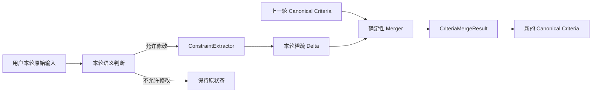

# 用户约束建模、提取与状态合并

这条线如果只总结成“我们用 LLM 做约束提取”，其实会把项目里最有价值的部分丢掉。真正困难的不是让模型从“想吃火锅，人均 100”里抽出 `cuisine=火锅`、`budgetPerPerson=100`，而是到了多轮对话以后，系统必须同时回答几个更难的问题：**用户这一轮到底是在新增条件、覆盖旧条件、显式取消条件，还是只是在问一个事实？模型抽出来的字段有没有资格写入状态？哪些语义应该交给模型判断，哪些必须由确定性代码兜底？最终怎么把“本轮变化”安全地归并成下一轮可执行的业务状态？**

这条线和上一篇“工作记忆”紧密相连，但职责不同。上一篇解决的是“当前业务状态放在哪里、不同 Task 怎么隔离”；这一篇解决的是“**用户一句自然语言，怎样变成对 Working Memory 的正确状态变更**”。如果把上一篇比作数据库，那么这一篇更像一套写入协议：不是任何解析结果都能直接覆盖数据库，而是先判断写不写、再表达改什么、最后由确定性归并器生成新的当前状态。

## 一、这条线是怎么一步步做出来的

最早的思路其实很自然：**让模型把用户当前表达解析成一份结构化 `DecisionConstraints`，后面直接拿这些字段做检索。** 对单轮请求，这个方案非常顺：用户说“在福州找人均 100 的日料”，模型返回城市、菜系、预算，后面 SQL 和向量检索继续执行。为了降低自由文本输出的不稳定性，提取阶段本身已经采用类似 Function Calling 的结构化 Schema，让模型返回固定字段，而不是让它生成一段自然语言再自己用正则解析。

但项目继续往真实对话走以后，第一批问题不是“模型完全抽不出来”，而是**Schema 本身开始失控**。一开始看到“约会”“安静”“不排队”这些业务需求，很容易分别增加 `occasion`、`quiet`、`avoidQueue`；为了区分软硬条件，又出现过 `hardConstraints`、`softPreferences`。短期看每加一个字段都很合理，因为代码里判断很直接；长期看却意味着每出现一种新场景，就要问“要不要再加一个字段”。

2026-09-03 做过一次 17 字段盘点，暴露出的核心问题是：**字段不是越细越好，字段应该对应稳定、有限、具有明确消费语义的业务维度。** “预算”“距离”“城市”这种维度数量有限，而且会直接进入确定性过滤，非常适合结构化字段；“约会”“适合聊天”“商务聚餐”“一个人吃”“氛围好”这种偏好是开放集，如果每一种都建字段，Schema 会不断膨胀，而且生产者和消费者很容易失配——模型能抽出一个标签，不代表后面的排序或过滤真的会消费它。

因此后面删掉了 `occasion`、`quiet`、`avoidQueue`、`hardConstraints`、`softPreferences` 等职责混乱的字段，把开放式语义统一收敛到 `preferences[]`，系统解释则放到 `systemNotes[]`。这里形成了第一个可迁移原则：**Schema 不是用户说了什么就建什么，而要从“这个语义的基数是否有限、是否需要确定性执行、下游是否真的消费”反推字段。**

当前 `DecisionConstraints` 可以按职责理解，而不是机械背 20 个字段：

```text
DecisionConstraints
├── 地理目标
│   ├── targetProvince / targetCity / targetDistrict / targetArea
│   └── locationIntent
│
├── 食物与实体目标
│   ├── cuisine                    菜系/品类
│   ├── excludedCuisines[]         明确排除的菜系
│   └── keyword                    用户点名的店名、招牌菜等实体
│
├── 数值与范围约束
│   ├── budgetPerPerson
│   ├── radiusKm / nearby
│   └── arrivalTime
│
├── 相对反馈（一次性变更信号）
│   ├── budgetDirection            更便宜/更贵
│   └── radiusDirection            更近/更远
│
├── 开放式偏好
│   └── preferences[]              安静、约会、不排队、清淡……
│
├── 显式状态操作
│   ├── clearedFields[]            明确取消某个字段
│   └── removedPreferences[]       明确移除某个偏好
│
├── 辅助状态
│   ├── missingInformation[]
│   ├── lockedConstraints[]
│   └── systemNotes[]
│
└── 请求期提示，不进入持久状态
    ├── entityTypeHint
    └── sourceHints
```

这个结构里有两个很容易混淆的边界。第一，`preferences` 是**用户需求的一部分**，会影响后续推荐；`systemNotes` 是系统为了展示和审计保存的解释，例如“附近按默认 3km 解释”，不能把系统推导说明伪装成用户偏好。第二，`sourceHints`、`entityTypeHint` 被标记为请求期信息，不进入 Working Memory；它们帮助当前轮次完成解释或归并，但不是长期业务真值。

Schema 收敛以后又遇到第二类问题：**同一个概念，在提取侧和消费侧如果没有统一规范化，结构化反而会制造假确定性。** 典型例子是菜系。用户可能说“日本料理”，商户画像里存“日料,寿司”；如果用户侧做一套别名映射，商户侧又用另一套字符串比较，语义上明明相同，硬过滤却可能判断不匹配。于是后面抽出共享 `CuisineCanonicalizer`，让提取、合并、硬过滤等链路使用同一套 canonical identity。偏好标签后来也用 `PreferenceCanonicalizer` 做类似收敛。

这个坑的核心不是“写了一个工具类”，而是**规范化也必须有单一权威来源**。只要一个字段会跨多个模块流转，生产者和消费者就不能各维护一套“差不多”的同义词规则。否则系统看起来全是结构化字段，实际每层对字段含义理解不同。

第三类问题来自**字段职责重叠**。例如 cuisine 表示菜系/品类，keyword 表示用户明确点名的实体或具体食物。早期边界不清时，同一句“想吃沙县小吃”可能有时落到 cuisine，有时落到 keyword；如果一个字段参与确定性过滤、另一个主要参与语义检索，那么一次提取漂移就可能把后面的执行语义完全改变。因此后面在 Prompt、Canonicalizer 和消费链路上持续收紧“类别”和“具体实体”的边界。这里真正应该记住的是：**结构化输出的 Schema 不只是为了让 JSON 好解析，它实际上定义了后续业务执行语义。字段重叠会把模型的小误差放大成系统级行为差异。**

到这里仍然有一个更根本的问题没有解决：**每轮到底应该提取完整状态，还是只提取本轮变化？**

假设上一轮状态是：

```text
cuisine = 火锅
budgetPerPerson = 100
preferences = [安静]
```

这一轮用户只说：“预算改成 80。” 如果模型每次都输出一份“完整当前状态”，它必须重新从上下文里推断 cuisine=火锅、preferences=[安静]；这相当于每轮都让模型重新计算全部历史状态，不仅浪费，而且任何一次遗漏都可能把旧条件误清掉。更麻烦的是下面两句话：

```text
A：预算改成 80
B：预算不限了
```

对本轮抽取来说，A 很容易表示成 `budgetPerPerson=80`；B 如果只是把 `budgetPerPerson` 留空，就和“这一轮根本没提预算”完全一样。**Absent（未提及）和 Clear（明确取消）不是同一个操作。**

这个问题最终把方案推向了 Delta，也就是“本轮变更”。当前思想是：上一轮已经存在一份 Canonical State，这一轮不再要求模型重建整个世界，只描述用户明确改变了什么；然后由确定性的 `ConversationCriteriaMerger` 把 previous + delta 合成下一份完整状态。



2026-09-03 “看看有没有别的吃的”这个 Case 很典型。用户不是在给出一个新的 cuisine，而是在**明确放弃旧菜系**。如果只看字段值，新菜系为空，很容易被理解成“没有新信息，所以继承旧 cuisine”；于是旧菜系一直留在 Working Memory。后面新增 `clearedFields[]`，让提取层明确表达“这轮要求清掉 cuisine/keyword”，Merger 再负责执行清除。类似地，“不要安静了”不是 `preferences=[]`，而是 `removedPreferences=[安静]`；否则无法区分“本轮没提任何偏好”和“用户明确撤销安静”。

这一步形成了第二个重要原则：**值和操作分开表达。** 普通字段回答“设置成什么”，`clearedFields` / `removedPreferences` 回答“明确删除什么”；未提及则代表“不操作”。这是多轮状态系统里比 Prompt 技巧更重要的建模问题。

不过这里必须严谨说明：**当前实现是“语义上的 Delta”，但还不是类型层面纯粹的 Delta。** `ConstraintExtractor` 返回的 Java 类型仍然是 `DecisionConstraints`，与最终完整状态共用同一个类。本轮新值填在普通字段，清除放在 `clearedFields`，偏好移除放在 `removedPreferences`，相对反馈放在 `budgetDirection/radiusDirection`。所以它本质上是“完整状态 DTO 被当成稀疏变更载体使用”，而不是一个严格的 `CriteriaDelta<SET/CLEAR/APPEND/REMOVE>` 类型。

为什么没有立刻继续重构？因为当前方案已经把最关键的语义区分出来，而且已有大量代码和评测围绕 `DecisionConstraints`。继续引入一套完全独立的 Mutation AST 会让类型更漂亮，但也增加迁移和维护成本。在现阶段，更重要的是保证**状态不会因为 absent/clear 混淆而错写**。如果项目继续长期演进，我会倾向把 SET、CLEAR、APPEND、REMOVE、EXCLUDE、RELATIVE 做成显式操作，让“空字符串、-1、false”不再承担“本轮没提”的哨兵语义。

Delta 解决了“改什么”，但后来又发现另一个更危险的问题：**抽到了一个字段，不代表这一轮有权改状态。**

真实问题出现在引用/事实追问里。用户说“这个日料怎么样？”“第二家人均多少？”这类句子确实包含“日料”“人均”等词，ConstraintExtractor 很可能能够抽到 cuisine 或预算相关信息。但用户实际上是在问商户事实，不是在修改搜索条件。如果系统逻辑是“Extractor 只要抽到非空字段，就 `APPLY_DELTA`”，事实查询就会偷偷污染 Working Memory。

这也是 2026-09-07 引入 `TurnUnderstandingService`、`TurnCommandSet` 和 `TurnPlan` 的原因。它们不是替代 ConstraintExtractor，而是在它前面增加一层**状态修改权限判断**。`TurnUnderstandingService` 只判断这一轮的控制语义，例如：是否请求修改条件、是否只是商户引用、是否是决策上下文查询、是否明确排除某类条件。最终 `TurnPlan.criteriaIntent` 只有两个核心状态：`NONE` 和 `APPLY_DELTA`。只有当这一轮真的具有状态变更语义时，后面的 Delta 才有资格进入合并链路。

当前整体职责可以这样理解：

```text
TurnUnderstandingService
    负责：这一轮“能不能改状态”
    不负责：最终字段值是什么

ConstraintExtractor
    负责：如果允许修改，“具体改什么”
    输出：稀疏 DecisionConstraints + mutation fields

ConversationCriteriaMerger
    负责：previous + delta 应该得到什么新状态
    特点：确定性执行，不再让模型猜继承关系

ConversationStateService
    负责：把归并结果写入当前 Task 的 Canonical Working Memory
```

这个拆分解决了一个很重要的 Agent 工程边界：**Mention ≠ Mutation，理解到一个实体 ≠ 获得修改持久状态的权限。** 后来引用态的 mutation 判断还进一步收紧成 fail-closed：普通“预算、人均、有没有、推荐”这些词不再自动视为变更，必须出现“改成、换成、不要、不限、排除、更便宜、更近”等明确操作，或者已经解析出带 mutation anchor 的引用，才允许 `APPLY_DELTA`。

这里还出现过一个很值得讲的“多重语义源”问题。早期同一轮输入会被 Context Rewrite、Routing、ConstraintExtractor、Reference Resolver 等模块分别理解；每一层都可能根据自己的字符串规则得到一点结论。真实多轮 Case 中出现过 Rewrite 把“当前位置 + 排除菜系”这样的复合信息改写掉，或者商户描述里的“日料”被后续模块当成新的 cuisine 条件。最终收敛原则是：**Original Message 始终是本轮语义源，Context Rewrite 只负责补全省略和引用，不再成为下游整轮业务事实。** 这和上一篇“Working Memory 只有一个状态真值”其实是同一种思路：状态要单一权威，语义输入也不能让多个改写版本各自成为真相。

位置字段又进一步验证了“模型负责理解，确定性模块负责事实权威”的边界。行政区名如果完全让 LLM 填 `targetProvince/targetCity/targetDistrict`，会遇到简称、同名区县、层级补全等问题。后面把 `AdministrativeRegionResolver` 从 ConstraintExtractor 中解耦出来：模型输出的行政字段最多作为候选 Hint，必须经过确定性行政区解析验证后才能进入 canonical state。**概率模型可以提出候选，领域事实应尽量交给可验证的数据源或规则 authority。**

相对反馈则说明 Delta 不一定总能直接写成一个绝对值。用户说“第一家太贵了，便宜一点”，真正语义不是“预算=某个固定数字”，而是相对当前锚点降低。项目后来增加 `budgetDirection`、`radiusDirection`，用 -1/0/1 表示本轮的相对方向，再由 Merger 根据被评价商户、当前焦点、已展示集合或默认价格带计算新的绝对预算/半径。计算完成后方向字段立即归零，因为它们是**一次性命令信号，不是长期状态**。如果不归零，下一轮即使用户什么都没说，也可能再次执行“再便宜 15%”，形成重复变更。

现在看 `ConversationCriteriaMerger`，它的意义已经不只是“把两个对象 copy 一下”。它从 previous 开始，依次处理显式 clear、需求替换、地点作用域切换、普通字段覆盖、负向菜系、偏好追加/移除、相对预算/距离等，最后输出 `CriteriaMergeResult`。这个结果除了新的完整 `constraints`，还显式记录 `inherited`、`replaced`、`appended`、`cleared`、`invalidated` 和 `sourceUpdates`。这些字段不是为了业务炫技，而是为了回答“**这一轮状态到底为什么变成这样**”：哪些是继承的，哪些是用户刚改的，哪些被清除了，哪些派生结果因此失效。

```text
上一轮：福州 / 火锅 / 100 / [安静]
用户：预算改 80，不用安静了

Extractor（本轮 Delta）：
  budgetPerPerson = 80
  removedPreferences = [安静]

Merger：
  inherited = [福州, 火锅, ...]
  replaced = [budgetPerPerson:100->80]
  cleared = [preferences:安静]

最终 Canonical State：
  福州 / 火锅 / 80 / []
```

这套设计的核心不是“LLM + 规则混合”这么简单，而是把不确定性放在适合它的位置：**模型负责开放语言到结构化语义的候选解析；本轮是否允许修改、行政事实是否合法、历史状态如何继承、清除/覆盖怎么执行，都尽量收敛为可测试的确定性逻辑。**

评测也反映了这条认知变化。2026-08-30 曾针对 ConstraintExtractor 的地理实体边界做过 Prompt v1/v2 A/B：已知基线中的 `targetCity` 正确率从 16/17（94.1%）到 17/17（100%），但独立 Holdout 仍是 7/8（87.5%），没有提升。这个实验的目的不是评价整个 Agent，而是验证“继续补 Prompt 示例能不能改善行政实体边界”。结果说明：**训练式补例能修已知样本，但没有证明泛化同步提高**，所以当时按预设停止规则没有继续堆 Prompt。这也为后面把行政区事实交给确定性 Resolver 提供了工程动机。

字段职责重构后，`conversation-v1` Run 71 为 18/20，与重构前持平。这个数字能说明的是：删掉一批专用字段、改成开放式 `preferences` 后，现有会话评测没有出现明显功能回归；它不能证明新的偏好模型在所有开放表达上都更好。类似地，2026-09-07 的 Turn Semantics 第一阶段只跑了相关单测和少量定向 HTTP E2E，当时完整 robustness/v1/holdout 明确没有执行，因此只能说“已知 mutation/fact 边界 Case 被验证”，不能把它包装成全量回归通过。

## 二、从这条线真正应该带走什么 Agent 开发经验

第一条：**不要让模型每轮重新生成完整业务状态，优先把已有状态看成基线，本轮只产生变更。** 多轮系统最怕把“未提及”误解成“删除”，或者让模型不断重新推断已经确定的历史条件。Delta 能把概率推理限制在本轮新增信息上，确定性 Merger 再负责继承旧状态。

第二条：**Absent、Clear、Remove、Replace 必须是不同语义。** `null` 或空串不能同时代表“用户没提”和“用户要求取消”。只要业务允许反悔，就应该有显式 Mutation Operation。DP-Plus 目前通过 `clearedFields`、`removedPreferences` 等补足了这一点，但更长期的类型设计可以进一步把操作建成一等对象。

第三条：**状态提取和状态写权限要分开。** Extractor 能识别一句话里的“日料”，不代表用户要修改 cuisine；一个事实问句甚至可以包含很多业务字段。真正写 Working Memory 前，需要独立判断这一轮是不是 Mutation。这个原则可以迁移到客服工单 Agent、表单 Agent、财务 Agent、Coding Agent：模型“看见”一个值，和系统“允许它修改”某个持久字段，是两件事。

第四条：**Schema 要按业务基数、执行职责和消费链路设计，而不是按自然语言表面分类。** 稳定、有限、会参与确定性业务逻辑的维度适合独立字段；开放式场景和偏好更适合标签或文本集合。更重要的是，新字段上线前要先回答“下游谁消费它”，否则只是制造一种“看起来结构化”的无效状态。

第五条：**Canonicalization 和领域事实验证必须有统一 authority。** 用户侧、商户侧各写一套菜系别名，最终一定漂移；行政区这种可验证事实，更不能因为 LLM 填了字段就直接进入状态。LLM 适合解决语言歧义，可枚举/可查证的事实尽量交给确定性组件确认。

第六条：**一次性控制信号不要持久化成长期状态。** “更便宜一点”“更近一点”描述的是一次 Mutation，不是用户永远希望每轮继续变便宜。相对方向被消费后立即清零，就是典型的 command/state 分离。

第七条：**Prompt 优化必须带 Holdout，不要把“补例后基线全绿”当作泛化提升。** 这条线里 94.1%→100% 的已知集提升和 Holdout 87.5% 不变非常典型。Prompt 适合修边界，但当问题已经属于领域事实、状态权限或操作语义时，继续补 Prompt 往往只是把确定性问题留在概率层。

## 三、这条线放到简历上怎么写

如果面向 AI 应用/Agent，我更推荐：

> **多轮约束理解与状态归并：**针对用户反悔、条件继承及事实追问误改状态问题，将 LLM 结构化解析与确定性状态归并解耦，以本轮 Delta 表达新增、覆盖、清除、偏好移除及相对反馈，并通过单轮语义门禁控制状态写权限，避免 Mention 被误当成 Mutation。

如果面向 Java 后端，可以更强调状态模型和 reducer：

> **会话约束状态机：**设计 previous + delta 的确定性归并链路，显式区分条件继承、覆盖、清除与相对变更，并统一菜系/偏好规范化及行政区事实校验；通过结构化变更日志记录 inherited/replaced/cleared/invalidated，支持多轮状态问题定位与回归验证。

这里不建议在简历上写“约束提取准确率 100%”。仓库里确实出现过 `targetCity` 基线 17/17，但独立 Holdout 仍是 7/8，而且它只针对一个字段的一组实验，不代表完整 Constraint Extraction。更稳的是把这个数据留在面试里，用来讲“为什么后来不继续堆 Prompt”。

## 四、面试问题：先理解为什么问，再准备怎么答

**Q1：为什么不让模型每一轮直接提取一份完整约束，而要做 Delta + Merge？**

这是这条线最核心的问题。它实际在问你是否理解多轮状态和单轮信息增量的区别。

> 单轮时直接提一份完整约束没有问题，但多轮以后，上一轮已经确定了很多信息。这一轮用户可能只说“预算改成 80”，如果还要求模型重新生成完整状态，就等于让它重新推断城市、菜系、偏好，任何一次遗漏都可能把旧状态弄丢。
>
> 更麻烦的是“本轮没提预算”和“用户说预算不限”如果都输出空值，程序根本分不出来。所以后来改成 previous + delta：Extractor 只表达本轮明确变化，Merger 负责确定性继承、覆盖和清除，最后才生成新的完整状态。

**Q2：你们现在这个 Delta 是真正的 Delta 吗？**

这题要主动承认当前类型设计的边界，不要把“语义上的 Delta”吹成完整 Mutation DSL。

> 从语义上是 Delta，从类型上还不够纯。`ConstraintExtractor` 返回的还是 `DecisionConstraints`，和最终完整状态共用一个 DTO；普通字段表示本轮 SET，`clearedFields` 表示 CLEAR，`removedPreferences` 表示 REMOVE，`budgetDirection/radiusDirection` 表示一次性相对变更。
>
> 所以我更准确会说它是“稀疏 Delta 载体”。现在已经解决 absent 和 clear 混淆，但空串、-1、false 仍承担未设置哨兵。如果继续重构，我会把 SET/CLEAR/APPEND/REMOVE/EXCLUDE/RELATIVE 建成显式操作类型。

**Q3：`DecisionConstraints` 里面有哪些重要字段？为什么这样设计？**

这道题不要逐字段背，按职责分组回答。

> 我会分成五类：第一类是地点目标，包括省、市、区县、POI 和 locationIntent；第二类是食物目标，包括 cuisine、排除菜系和 keyword；第三类是预算、半径、附近、到店时间这些确定性条件；第四类是开放式 preferences；第五类是本轮 Mutation 控制，比如 clearedFields、removedPreferences、相对预算/距离方向。
>
> 另外 systemNotes 是系统解释，不能和用户偏好混；sourceHints、entityTypeHint 只服务当前请求，不进入持久状态。这样的分法主要依据字段的业务职责和生命周期，而不是用户自然语言里出现多少种说法。

**Q4：为什么 `null`/空值不能表示清除？`clearedFields` 有什么必要？**

> 因为空值有两种完全不同的语义：这一轮没提预算，应该继承旧值；用户明确说“预算不限”，应该删除旧值。如果都用 null，Merger 无法判断用户有没有发出清除命令。
>
> 所以把 value 和 operation 分开，未提及就是不操作，clearedFields 才表示明确 CLEAR。preferences 也类似，removedPreferences 表示只删除某一个标签，而不是把整个列表重置。

**Q5：为什么还需要 `TurnUnderstandingService`？ConstraintExtractor 不就已经理解用户输入了吗？**

这题对应“Mention ≠ Mutation”。

> Extractor 解决的是“这句话里能解析出什么业务信息”，但持久状态还需要回答“这一轮有没有资格修改”。比如用户问“第二家人均多少”，模型完全可以识别到预算/价格语义，但这是事实查询，不应该把 Working Memory 的预算改掉。
>
> 所以后来加一层单轮语义门禁：先判断是 Mutation、Reference Fact 还是 Context Query。只有 `CriteriaIntent=APPLY_DELTA` 时，Extractor 的结果才进入 Merger。这样把“理解到字段”和“允许写状态”拆开。

**Q6：那为什么不直接让 LLM 同时输出 `shouldMutate + delta`，一次模型调用全搞定？**

这是一个合理替代方案。当前方案选择了更保守的控制边界。

> 可以这么做，而且低风险场景会更简单。但我们这个状态会直接影响后续 SQL 过滤、工具参数和多轮 Working Memory，一旦 shouldMutate 波动，错误会跨轮持续。所以当前把高风险写权限尽量收窄：明显的 SET/CLEAR/EXCLUDE/相对变更由确定性语义规则识别，复杂字段值再交给模型解析。
>
> Trade-off 是规则需要维护，不能覆盖所有表达；收益是事实问句不会因为模型一次结构化输出波动就修改长期状态。

**Q7：为什么 `occasion/quiet/avoidQueue` 后来都删了，改成 `preferences[]`？**

> 因为这些不是有限稳定的业务维度，而是开放式偏好。今天有约会、安静，明天就可能有商务、亲子、夜宵、适合聊天，如果每个都加字段，Schema 一定膨胀。
>
> 后来把真正需要确定性执行的预算、距离、菜系保留成结构字段，开放式场景统一放 preferences。关键不是为了少字段，而是保证每个独立字段都有稳定语义和明确消费者。

**Q8：既然 preferences 是开放集，怎么避免“安静一点”“适合聊天”“清净”被当成不同偏好？**

> 不能完全依赖模型每次输出同一个词，所以后面又收敛了 PreferenceCanonicalizer，把常见同义表达映射到统一标签。这里的原则和 cuisine 一样：一旦结构化字段要跨提取、状态和排序多个模块使用，就需要共享 canonical identity，否则每层各做近似匹配会逐渐漂移。

**Q9：为什么 `cuisine` 和 `keyword` 要分开？**

> cuisine 是可归一化的类别，例如日料、火锅；keyword 更偏用户点名的具体实体、店名或招牌菜。两者如果边界重叠，同一句话有时进入 cuisine、有时进入 keyword，后面过滤/检索职责不同，就会把提取的小误差放大成执行差异。
>
> 所以后面在 Schema、Prompt 和 Canonicalizer 上都明确类别和具体实体的边界。这个问题本质不是字段命名，而是结构化 Schema 必须和下游执行语义一一对应。

**Q10：为什么菜系一定要做 Canonicalization？让模型直接输出标准词不行吗？**

> Prompt 可以要求，但不能把一致性完全寄托在模型上。用户说“日本料理”，商户数据可能写“日料”；如果提取端和过滤端各维护别名，最后会出现同义词被硬过滤掉。
>
> 所以后来让用户侧和商户侧共用 CuisineCanonicalizer。模型负责把自然语言映射到候选语义，真正比较前再进入统一 canonical identity。

**Q11：行政区为什么不直接相信模型提取结果？**

> 城市、区县这种字段是可验证事实，而且直接决定搜索范围。LLM 可能把 POI 当行政区，也可能自动补全用户没说的层级。后面模型行政字段只作为 hint，再交给 AdministrativeRegionResolver 校验；确认后才进入 canonical state。
>
> 我总结出的边界是：开放语义交给模型理解，可枚举、可查证、会直接影响执行范围的事实尽量由确定性 authority 验证。

**Q12：“第一家太贵了，便宜一点”这种相对条件怎么合并？为什么不让模型直接给新预算？**

> “便宜一点”没有固定绝对值，它必须相对某个锚点解释。当前提取 `budgetDirection=-1`，Merger 再从用户正在评价的商户、focused shop、已展示候选等找到价格锚点，按确定规则算新的 budget。距离的“更近一点”类似。
>
> direction 是一次性 command，被消费后立即清零，不能持久保留，否则下一轮会重复执行“再便宜一次”。

**Q13：`ConversationCriteriaMerger` 具体负责什么？为什么不把合并也交给模型？**

> 它从 previous state 开始，按固定规则执行 clear、replace、append、remove、相对变更和地点级联，再得到新的完整 constraints。它还记录 inherited、replaced、appended、cleared、invalidated 和 sourceUpdates，方便定位这一轮状态为什么变化。
>
> 这些操作本质是状态机语义，一旦已经知道用户要“预算改 80、删除安静”，就没有必要再调用一次 LLM 判断怎么写字段。确定性 reducer 更容易测试、审计和复现。

**Q14：为什么 Original Message 要保持语义权威，Context Rewrite 不能直接给后面用？**

> Rewrite 适合补全“第二家”“刚才那个”这类省略和引用，但一次改写可能只关注其中一个问题，把原句里的另一条命令丢掉。项目里真实出现过复合语义被 Rewrite 吞掉的情况。
>
> 所以后来原始消息始终是本轮语义输入，Rewrite 只提供引用/省略辅助信息。一个模块的辅助产物不能悄悄升级成整轮业务真相。

**Q15：你们怎么验证 Prompt 调优不是过拟合？**

> 当时针对 targetCity 边界做了 v1/v2 对比，已知基线从 16/17 提到 17/17，但 Holdout 仍是 7/8，没有提升。所以我们没有拿 100% 当作泛化成功，也没有继续补示例追求基线全绿。
>
> 这个实验反而帮助我们判断：Prompt 可以改善表达边界，但行政区事实属于可验证领域知识，继续堆 Prompt 的收益有限，后面更适合交给确定性 Resolver。

**Q16：规则越来越多，会不会最后又变成传统规则系统？**

> 会有这个风险，所以边界很重要。我们不是用规则理解所有自然语言，而是只把高风险、可枚举的控制语义放进确定层，例如有没有明确 Mutation、清除操作、行政区是否合法、状态怎么合并。具体菜系、偏好、自然语言实体仍然由模型参与解析。
>
> 如果规则开始承担开放语义理解，就说明边界又错了；如果模型在做本可以确定执行的状态覆盖，也同样说明边界错了。目标不是“LLM 越多越智能”，而是把概率判断和确定性执行放在各自合适的位置。

最后可以单独补但不值得在本文展开的知识有：**Function Calling / JSON Schema**，重点理解模型只是生成结构化参数，真正的类型校验和执行在应用侧；**Slot Filling / Dialogue State Tracking**，可以对照传统对话系统的槽位状态更新；**Command / Event / State** 的区别，重点理解一次性 Mutation 不应永久存成状态；**JSON Merge Patch / JSON Patch**，可以帮助理解显式 Delta 的通用表达方式；**有限状态机与 Reducer**，重点理解为何确定性状态转移更容易测试和审计。