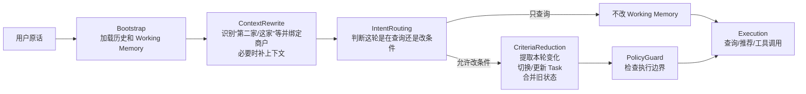
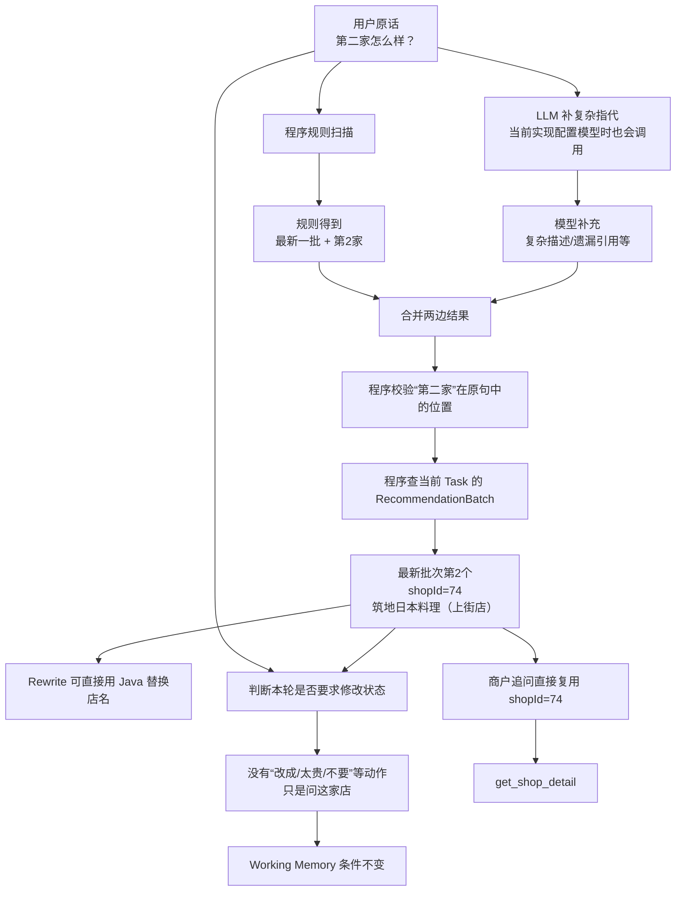
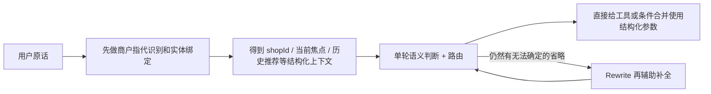

# 用户约束建模、提取与状态合并

这条线先从两个真实会把系统搞乱的场景开始。上一轮用户已经有一批推荐，下一轮只问：“**第二家人均多少？**”这本来只是查价格；但如果系统一看到“人均”就去提预算，再把提取结果写回工作记忆，就会把一次事实查询误当成“用户要改预算”。另一个场景是：“**第一家那个日本料理环境怎么样？**”这里“日本料理”只是描述第一家店，不代表用户以后都要找日料；如果直接写成 `cuisine=日料`，后面的搜索条件同样会被污染。

所以这条线真正解决的不是“怎么让 LLM 多提几个字段”，而是几个更实际的问题：**这轮到底是在问事实还是改条件；如果真要改，改什么；“第二家、这家、最开始那家”到底是谁；最后这些变化怎样确定地合并到已有状态。** 后面继续审代码时又发现，历史推荐怎么保存、哪些店下一轮要排除，其实也属于同一条线：它决定了“换一批”“还是之前那家”“还是火锅吧”这些话最后会不会被执行成用户真正想要的行为。

> 【核心提炼】这条线的目标只有一个：**不能让一次语言理解的波动直接变成长期状态错误或错误的搜索行为。** LLM 可以帮助理解，但“能不能写、写什么、写到谁、怎么合并、哪些历史候选还能继续用”都要有明确边界。

## 一、这条线在整个 Pipeline 里处在什么位置

当前主链路固定是：`BootstrapNode → ContextRewriteNode → IntentRoutingNode → CriteriaReductionNode → PolicyGuardNode → ExecutionNode`。这篇讲的内容横跨中间三段：Rewrite 阶段现在顺带做商户指代识别与绑定；Routing 阶段判断这一轮是在查询还是修改条件；CriteriaReduction 阶段才真正提取本轮变化、切换 Task、计算本次搜索需要排除哪些历史商户，并把新状态合并进 Working Memory。后面的 PolicyGuard 和 Execution 使用的已经是前面收敛好的结果。

```java
private ChatPipeline chatPipeline() {
    List<ChatPipelineNode> nodes = Arrays.asList(
        new BootstrapNode(this),
        new ContextRewriteNode(this),
        new IntentRoutingNode(this),
        new CriteriaReductionNode(this),
        new PolicyGuardNode(this),
        new ExecutionNode(this)
    );
    return new ChatPipeline(nodes);
}
```



这里已经能看到一个后来才暴露的问题：**商户指代识别、Rewrite、单轮语义判断都在理解“用户这句话到底什么意思”，职责开始出现重叠。** 这个问题后面单独展开。

> 【核心提炼】本文不是“约束提取器说明书”。它讲的是 Pipeline 中从**自然语言 → 对象绑定 → 写权限 → 本轮变化 → 新状态 → 本次搜索行为**这一整段链路。

## 二、先用仓库里的真实评测数据，把整条链走一遍

仓库里有一个真实评测用例 `CONTEXT_REWRITE_SECOND_CANDIDATE`。第一轮用户在坐标 `(26.05367074313305, 119.187378)` 说“**帮我看看附近有没有什么好吃的**”，第二轮说“**第二家怎么样？**”。V30 的评测数据要求第二轮最终落到 **筑地日本料理（上街店），shopId=74**，并进入商户详情查询；后续 V31 又把 Rewrite 的断言从死盯店名收敛成“识别到候选序号 2”，避免把动态候选顺序和改写文本绑得过死。

仓库中的商户数据里，shopId=74 确实是“筑地日本料理（上街店）”，人均 165 元。第二轮实际可以这样理解：



这里最重要的一点是：**“第二家是谁”最终不是 LLM 自己猜出来的。** LLM 最多帮助理解复杂说法；真正把“最新一批第 2 个”变成 shopId=74 的，是程序读取历史推荐批次。一旦已经得到 shopId，后面的工具就可以直接使用这个 ID。

如果第二轮换成“**第二家太贵了，便宜一点**”，前半段“第二家是谁”完全一样，只是后面会判断这句话确实要求修改预算，再进入条件更新。也就是说，同样提到了第二家，事实查询和状态修改会在这里分叉。

> 【核心提炼】一条请求不是直接“扔给 LLM 得答案”，而是先把能确定的东西逐步确定下来。真实店是谁、这轮能不能改状态，都先收敛以后，后面的模型和工具才有更小的自由度。

## 三、为什么后来不再“每轮提一份完整条件”

最早最自然的做法是：每轮都让模型输出一份完整结构化条件。单轮没问题，多轮很快会出错。假设上一轮已经确定“福州 / 火锅 / 人均 100 / 安静”，用户这一轮只说“**预算改成 80**”。如果仍让模型重新生成完整状态，它就必须再次输出福州、火锅、安静；它只要漏掉一个，系统就可能把一个仍然有效的旧条件误删掉。

所以后来改成：**旧状态作为基线，本轮只表达变化。** 用户没提某个字段，就保持旧值；给了新值，就覆盖；明确取消，就删除。这里最关键的是“没提”和“删除”不能混在一起。

```text
上一轮预算 = 100

用户：再推荐几家
→ 这一轮根本没提预算
→ 预算继续保持 100

用户：预算不限
→ 用户明确取消预算限制
→ 预算应该被清掉
```

如果两种情况都只得到 `budget=null`，程序就不知道这个 null 到底表示“没说”还是“故意取消”。因此现在把**值**和**操作**拆开：普通字段表示“改成什么”，`clearedFields[]` 表示“明确删哪些字段”，`removedPreferences[]` 表示“明确删哪些偏好”。“不用安静了”不是把整个偏好数组清空，而是只删除“安静”；“看看有没有别的吃的”可以明确清掉旧 `cuisine/keyword`，而不是因为本轮没说新菜系就继续错误继承。

当前实现从语义上已经是增量，但 Java 类型还没完全纯化：本轮变化和最终完整状态仍共用 `DecisionConstraints`。所以准确说法是**“稀疏增量”**，而不是已经有一个完全独立的 Delta 类型。以后如果继续重构，可以把设置、清除、删除、相对调整这些操作做成真正独立的数据结构。

当前重要字段也不用背成 DTO 清单，按后面谁会用它来记即可：地点字段给搜索范围用，`cuisine/keyword/excludedCuisines` 给餐饮目标和过滤用，预算/距离/时间给确定执行用，`preferences[]` 放开放偏好，`clearedFields/removedPreferences/budgetDirection/radiusDirection` 表示这一轮要做的操作。`sourceHints` 只是在本轮告诉系统“这个条件是用户明确说的、系统默认的还是推导出来的”；`entityTypeHint` 只是地点解析的临时提示，完整位置链路在第三篇单独讲。

> 【核心提炼】多轮状态最重要的是区分：**没说 = 不动，给新值 = 覆盖，明确取消 = 删除。** 这也是为什么“值”和“操作”必须分开。

## 四、为什么“能不能改状态”和“具体改什么”必须拆开

还是看“**第二家人均多少？**”。这句话里确实有“人均”，模型也完全可能抽出价格相关信息；但用户是在问第二家价格，不是在说“把我的预算改掉”。如果一个模块既负责提字段，又负责决定自己有没有写权限，就可能出现：看见“人均” → 抽到价格 → 认为自己有东西可写 → 顺手污染 Working Memory。

现在先放一道很小的“写权限门”。这一层主要是程序规则，不是再调一个 LLM。核心代码就是看原话里有没有明确的状态修改动作：

```java
private boolean hasExplicitMutationSignal(String text) {
    return containsAny(text,
        "改成", "换成", "调整为", "设置为", "改为",
        "不要", "不用", "去掉", "清除", "取消", "不限",
        "排除", "除了", "太贵", "便宜点", "更便宜",
        "太远", "近一点", "更近", "换一批"
    );
}
```

所以“第二家人均多少”默认没有写权限；“第二家太贵了，便宜一点”才有。后面的 `CriteriaReductionNode` 也不是每轮都跑约束合并，只有前面已经明确这轮允许改条件，才真正进入 `prepareDecision()`：

```java
@Override
public void reduceCriteria(ChatProcessingContext context) {
    if (context.getTurnPlan() == null
            || context.getTurnPlan().getCriteriaIntent() != CriteriaIntent.APPLY_DELTA) {
        return;
    }
    prepareDecision(context);
}
```

拆开真正是为了**隔离风险，而不是为了架构好看**。即使后面的 LLM 多抽了一个词，只要前面没给写权限，它也碰不到长期状态。反过来，如果“提取字段”和“决定能不能写”由同一次模型输出共同决定，一次误判就可能同时拿到内容和写权限。

> 【核心提炼】先问“这轮有没有资格改”，再问“具体改什么”。两步分开以后，提取错误不会自动升级成持久状态错误。

## 五、“第二家”“最开始第二家”“这家”到底怎么实现

这部分先把中文叫法定下来：`ReferenceIntentExtractor` 可以理解成**商户指代识别**，`BatchAwareReferenceResolver` 可以理解成**商户实体绑定**。前者回答“用户说的是最新第几家、最开始第几家，还是当前正在聊的这家”；后者把这个描述真正落到某个 `shopId`。

假设系统先后推荐过两批：

```text
第1批：A / B / C
第2批：D / E / F
```

用户说“第二家”，默认是最新一批 E；说“最开始第二家”，才是第一批 B；说“这家”，优先指当前聚焦商户。当前识别不是纯规则，也不是纯 LLM，而是**规则和 LLM 两条线都跑，再合并**：

```java
public List<ReferenceIntent> extract(String message) {
    List<ReferenceIntent> rules = extractByRule(message);
    return mergeRuleAndModel(message, rules, extractByModel(message));
}
```

规则负责最确定的表达：

```java
private static final Pattern ORDINAL = Pattern.compile(
    "(?:(最开始|最初|一开始)\\s*)?(第一家|首选|第二家|第三家)"
);
private static final Pattern FOCUSED = Pattern.compile(
    "刚才那家|刚才那个|上一轮那个|上一家|这家|那家|这个"
);
```

所以“第二家”的第 2 个、“最开始第二家”的“最早一批 + 第 2 个”，这些都可以由程序直接算。LLM 主要补规则不好覆盖的表达和复合句，比如“**第一家太贵了，第二个有插座吗？**”：规则能抓到“第一家”，模型可以补“第二个”，还可以帮助指出“第一家”才是这轮价格反馈针对的对象。

这里有一个后来审代码确认的问题：**只要 AI Client 配好了，当前商户指代识别即使规则已经完全命中，也仍然会调用 LLM。** 理由是命中一个引用不代表整句话里没有第二个复杂引用。所以当前方案重点是“规则保住高确定性部分 + LLM 补覆盖率”，并没有真的省掉模型调用。更合理的下一步可以加一个简单句快速路径：像“第二家怎么样”“最开始第一家有券吗”这种规则已经完整覆盖的请求直接跳过模型，复杂多引用再调 LLM。

接着说 `surface/start/end`。它并不是为了“让模型数第几家”，而是为了记录**“第二家”这几个字在用户原句的哪个位置**。例如：

```text
第一家太贵了，第二家有插座吗？
^^^^          ^^^^
第一个引用      第二个引用
```

保存位置有两个用途：一句话有多个引用时能知道每个引用对应哪一段；Rewrite 做字符串替换时也能只替换对应那几个字，而不是全局乱替。

让模型输出字符位置确实有风险，尤其是从 0 还是从 1 开始、中文字符怎么数，都可能错。因此当前代码**不直接相信模型位置**：

```java
if (start != null && end != null
        && start >= 0 && start < end && end <= message.length()
        && message.substring(start, end).equals(surface)) {
    return true;
}

int first = message.indexOf(surface);
if (first < 0
        || message.indexOf(surface, first + surface.length()) >= 0) {
    return false;
}
intent.setStart(first);
intent.setEnd(first + surface.length());
```

模型先给一个位置，程序自己用 `substring()` 验证；如果位置错了，但这几个字在原句中只出现一次，程序自己重算；如果出现多次又无法确定，就丢弃，不继续猜。这个方案比直接信模型安全，但仍然可以继续收敛：**能由程序从原文算出的字符位置和序号，最好都让程序算，LLM 只输出真正需要语言理解的部分。**

最后一步实体绑定已经完全是确定性程序：

```java
RecommendationBatch batch = intent.getScope() == EARLIEST
        ? firstNonEmpty(batches)
        : latestNonEmpty(batches);

RecommendationCandidateRef candidate =
        batch.getCandidates().get(intent.getOrdinal() - 1);

return new ResolvedShopReference(
        intent, batch, intent.getOrdinal(),
        candidate.getShopId(), candidate.getShopName());
```

因此真正链路是：**“第二家” → 最新批次第 2 个 → 查 Batch → 得到真实 `shopId`。** LLM 不应该直接生成 shopId。

> 【核心提炼】当前指代链是“规则 + LLM 补充 → 程序校验 → 程序查历史推荐绑定 shopId”。高确定性的序号、下标和实体 ID 越能交给程序，就越不应该让模型自由生成。

## 六、原话、Rewrite 和实体 ID 怎么配合，以及为什么开始出现职责重复

先看 Rewrite 为什么曾经需要。用户可能说“**就按我当前位置找吧，除了东北菜都可以。**”这句话同时有两件事：位置切到当前设备；排除东北菜。如果 Rewrite 只顾着补“当前位置”，把整句话整理成“按当前位置继续搜索”，原句里的“排除东北菜”就丢了。项目里确实出现过这类复合语义被改写吞掉的问题，所以后来约束提取明确优先读 `originalMessage`：

```java
extracted = constraintExtractor.extract(
    context.getOriginalMessage(),
    activeCriteriaBeforeExtraction
);
```

因此现在三种信息的边界应该这样理解：**原话**保存用户完整语义，是权限判断和约束提取的主要来源；**Rewrite**只是把上下文省略补完整，方便后面的路由或回答；**已经绑定好的实体 ID**直接告诉下游“这家到底是谁”，不需要再从自然语言猜一次。

但随着 Working Memory、推荐批次、焦点商户、商户指代绑定越来越结构化，Rewrite 的很多职责已经被别的组件吃掉了。当前 `ConversationContextRewriter` 在有明确商户引用时，本身就是拿到绑定结果以后直接用 Java 替换店名，并不会再调用 Rewrite LLM：

```java
if (!resolved.isEmpty()) {
    String rewritten = replaceResolvedReferences(query, resolved);
    result.setRewrittenQuery(rewritten);
    result.setUsedModel(false);
    result.setReason("BATCH_REFERENCE_RESOLVED");
    return result;
}
```

对“**第二家怎么样？**”这种请求，系统在 Rewrite 之前其实已经知道 `shopId=74`。此时再把“第二家”改成“筑地日本料理怎么样”，再让下游理解一次，就出现一个很自然的问题：**既然已经有 shopId，为什么还要把确定信息重新变回自然语言？**

“**这家有优惠券吗？**”更明显。只要“这家”已经绑定到当前焦点商户，工具真正需要的是 `shopId`。当前工具执行链本身也会优先使用已经解析好的商户 ID，没有显式 ID 时还会回退到 `focusedShopId`：

```java
if (explicitlyReferencedShopId != null && isSingleShopTool(toolName)) {
    input.put("shopId", explicitlyReferencedShopId);
} else if (isSingleShopTool(toolName)
        && !input.containsKey("shopId")
        && context.getFocusedShopId() != null) {
    input.put("shopId", context.getFocusedShopId());
}
```

所以我们现在得到的新认知是：**Rewrite 早期有价值，是因为很多上下文只藏在聊天文本里；现在上下文越来越结构化，固定 Rewrite Node 的必要性开始下降。** 它现在还不能直接删除，因为“走过去多久？”“附近呢？”这种开放省略在某些场景下仍可能需要补上下文；但更合理的方向，是把 Rewrite 降成结构化状态仍然无法确定时的补充手段，而不是每轮固定承担一次重新理解。



这里要明确区分**当前代码**和**下一步建议**：目前主 Pipeline 仍然有固定 Rewrite Node；“把 Rewrite 降为补充手段”和“简单指代命中后跳过 LLM”都还是这次审查得到的改进方向，尚未完成代码改造和完整对照评测。

> 【核心提炼】Rewrite 不是天然必须存在。**如果“这家是谁、要查什么、工具参数是什么”已经能从结构化状态确定，就没必要先生成一条新中文再让下游理解。**

## 七、相对反馈和合并：为什么还要确定顺序

“**第二家太贵了，便宜一点**”和“**太贵了，便宜一点**”不一样。前者已经有明确商户对象，后者没有。当前价格链优先使用本轮已经绑定的商户，其次看当前焦点商户，再退到已展示候选和候选池；开场没有候选时才退到菜系价格基准。

如果第二家就是前面的筑地日本料理，仓库数据里它人均 165 元；按当前业务规则，新预算大致是 `round(165 × 0.85)=140` 元，并且最低不低于 20 元。这里的 0.85 和 20 元不是模型学出来的，也不是行业标准，而是业务侧为了避免用户一句“太贵”就把预算调整得过激设置的经验值。更早“锚点价格减 1 元”的方案几乎没有业务意义，所以才换成比例收紧。距离“更近一点”思路类似，但“第二家太远”目前还没有像价格一样完全复用显式商户对象，这是现有遗留改进点。

合并器也不能简单把新对象覆盖旧对象，因为操作之间有顺序依赖。比如“**不要火锅了，换日料，人均改成 80**”，如果先写新菜系再执行“清掉旧菜系”，新值也可能一起被删掉；从“我附近”切到“杭州西湖”时，如果先写城市却没处理旧的当前位置语义，旧半径也可能残留。因此合并必须有固定顺序：先处理显式清除和作用域变化，再写新值，再处理偏好增删和相对调整。

同时 `CriteriaMergeResult` 会记录这一轮哪些字段继承、哪些覆盖、哪些追加、哪些清除、哪些派生结果失效。这个记录不是为了日志好看，而是为了排查“最后为什么变成这样”。预算从 100 变成 85，可以确认是用户明确改的，还是相对预算规则算的；换城市以后候选被清空，也能确认是不是地点变化触发的正常级联失效。

地点本身已经复杂到单独拆成第三篇：行政区、POI、设备 GPS、附近半径、同名区县消歧和多轮地点切换都在 `03_地理位置解析与多轮位置状态——开发故事与面试准备.md`。本篇只记住：**地点字段一旦变化，会改变合法候选范围，因此不仅要改字段，还要让旧的“当前候选”和焦点商户失效。**

> 【核心提炼】先确定“改谁、改什么”，最后才进入合并。固定顺序保证同一组操作得到稳定结果，变更明细保证以后能定位是哪一步把状态改坏了。

## 八、推荐批次和“排除旧商户”：现在的设计哪里过粗

这部分是继续顺着代码往下审以后发现的一个很实际的问题。先看当前数据到底怎么存。现在真正长期保存在 Task 里的，是 `RecommendationBatch[]`，也就是“一次次推荐出去的批次”。假设用户连续看了三批：

```text
Batch 1：A / B / C
Batch 2：D / E / F
Batch 3：G / H / I
```

当前代码并没有再单独持久化一份 `shownShopIds`。需要知道“这个 Task 到目前为止给用户展示过哪些店”时，程序会遍历所有 `RecommendationBatch`，临时算出：

```text
shownShopIds = [A, B, C, D, E, F, G, H, I]
```

所以从状态模型上说，**`shownShopIds` 已经不应该被理解成一份独立状态，它只是历史推荐批次的一个查询结果。** 这个概念仍然有用，因为“换一批”时确实需要知道哪些店已经看过；但事实源只有 `RecommendationBatch[]`，没有必要再维护第二份列表。

真正的问题是：`RecommendationBatch[]` 自己也会一直增长。当前代码没有正式的“只留最近几批”限制，`shownShopIds()` 也会遍历当前 Task 的全部历史批次。用户如果聊了几十轮、不断换一批，不仅 Working Memory 会越来越大，“已经看过哪些店”这个集合也会越来越长。更重要的是，**产品上用户真的需要在线状态永远精确记住第 1 批吗？** 用户聊了 20 轮以后说“最早第二家”，他更可能指近期上下文里的“前面那批”，而不是会话开始半小时以前真正的第 2 家。

所以这里比较合理的后续方向，不是无限保存，而是先定义一个**可回溯窗口**。比如在线 Working Memory 只保留最近 5 个推荐批次，足够支持“上一批、刚才第二家、前几轮那家”这种高频表达；更老的批次如果产品确实需要审计，可以进冷历史，但不继续参加每轮在线判断。具体保留 5 批还是其他数量需要评测和产品数据决定，现在代码还没有做，不能把 5 当成现有规则。还有一个细节必须处理：如果最老的在线批次已经是 Batch 16，就不能把它冒充成用户说的“最开始那批”；超出回溯窗口时应该承认上下文不足或查询冷历史。

接下来再看 `excludeShopIds`。它也不是长期状态，而是**本次重新搜索时临时生成的一份“不要再召回这些店”的 ID 列表**。当前代码在准备一次新的推荐请求时，会判断用户是不是在要求继续调整/换选择；只要进入这个路径，就优先把当前 Task 所有历史展示过的商户全部放进 `excludeShopIds`：

```java
List<Long> shown = conversationStateService.shownShopIds(memory);
if (!shown.isEmpty()) {
    excluded.addAll(shown);
    return excluded;
}
```

然后真正查商户时做：

```java
if (request.getExcludeShopIds() != null
        && !request.getExcludeShopIds().isEmpty()) {
    shopQuery.notIn("id", request.getExcludeShopIds());
}
```

所以当前实际语义是：**只要这轮被当成“继续搜新的选择”，以前这个 Task 展示过的店默认全排除。** 这对“换一批，别重复之前看过的”很好理解，但对别的用户表达就开始显得过粗。

先看最简单的：

```text
之前推荐：A / B / C
用户：还是之前那一家吧
```

从产品语义上，这句话根本不是“重新搜索”，而是**选回一个历史商户**。正确行为应该先把“之前那一家”绑定成历史 `shopId`，然后恢复焦点、查看详情、优惠券或继续下单相关操作；这时 `excludeShopIds` 根本不应该参与。当前代码只有进入新的推荐准备流程才会计算排除列表，所以如果路由正确，这种请求不会真的被排除。但是“还是之前那一家吧”这种表达是否能稳定被路由成历史商户选择，目前值得补一个端到端用例，不能只靠代码结构推断它一定正确。

再看更容易出错的一种：

```text
Task A：福州火锅
曾经推荐：A / B / C

后来切到 Task B：杭州日料
曾经推荐：D / E / F

用户：还是之前福州那套火锅吧
```

从用户体验看，这句话首先应该是**恢复 Task A**。A/B/C 本来就是这套火锅需求下已经产生过的候选，用户没有说“火锅还是要，但之前那些店都不要”。因此默认行为更合理的是：恢复 A 的条件和原候选，让用户可以继续看 A/B/C；只有用户接着说“再换一批”时，才开始排除历史店去探索新的。

而当前代码有一个值得警惕的地方：`prepareDecision()` 里会先执行 Task 切换，然后再基于**切换后的当前 Task**计算 `excludeShopIds`。也就是说，如果“回到历史 Task”这一轮同时又被判断成需要重新搜索，那么它有机会把刚恢复出来的 Task A 历史商户全部加入排除列表。这个行为从程序上自洽，但从产品语义上不一定对，因为“恢复旧方案”和“在旧方案下继续找新店”是两个不同动作。

“**还是火锅吧**”还要再多想一步。这句话本身有歧义。假设当前正在聊杭州日料，历史里有福州火锅，用户只说“还是火锅吧”，他可能只是想把当前杭州需求的菜系改回火锅，也可能是想回到以前完整的“福州火锅”方案。当前 Task 机制只有在用户明确说“之前/最开始”，或者本轮地点+菜系能唯一匹配某个历史 Task 时，才比较有把握地切回旧 Task；单独一句“还是火锅吧”并不能自动证明他连城市也想恢复。因此这里**不能为了恢复旧商户而擅自把历史 Task 拉回来**，必要时应该结合最近上下文，仍然无法唯一判断就澄清。

所以这块真正需要改的，不是简单把 `excludeShopIds` 从“全部历史”改成“只排除上一批”，而是先把用户这轮到底在干什么分清楚。比较合理的产品语义可以是：

```text
“还是之前那一家吧”
→ 选择历史商户
→ 不重新搜索
→ excludeShopIds 不参与

“还是之前那套火锅吧”
→ 恢复历史 Task 和原候选
→ 默认不排除原候选

“还是火锅，不过便宜一点”
→ 修改当前需求并重新搜索
→ 重点根据新条件筛选
→ 是否排除旧店要看它们是否仍满足条件，而不是无脑清空全部历史

“换一批 / 再来几家没看过的”
→ 用户明确要新选择
→ 此时才应该排除近期已经展示过的商户

“之前那些都不要，再换一批”
→ 用户明确要求不要重复历史
→ 排除范围可以扩大到当前保留窗口内全部已展示商户
```

这里也能看出当前 `excludeShopIds` 的另一个问题：**全部历史永不再召回，可能过度排除。** 假设用户已经换了 5 批，共看过 15 家店，第 6 次说“换一批”，当前实现可以把前 15 家全部 `NOT IN`。短期体验是绝不重复，但候选空间会持续缩小；用户后来改了预算、换回菜系，其中某一家老店重新变成最合适的选择，也可能因为“以前展示过”而永远进不来。为了不重复而牺牲推荐质量，产品上不一定划算。

因此更合理的后续设计是把“历史事实”和“本轮排除策略”彻底分开：`RecommendationBatch[]` 只负责记录近期真实推荐历史；本轮是否排除、排除最近一批还是最近几批、是否允许历史优质商户重新进入候选，由**用户这轮的动作**决定，而不是只要继续搜索就统一套“全部 shown shops”。这和前面 Rewrite 的问题很像：我们现在已经有越来越多结构化状态，下一步应该让执行行为直接建立在明确业务语义上，而不是继续依赖一个过粗的布尔判断。

这部分后续应该补一组专门评测，而不是改完代码看一句回答对不对。至少要覆盖：“还是之前那一家吧”能恢复具体 shopId；“还是之前那套火锅吧”恢复历史 Task 时不会自动排除旧候选；“换一批”不重复近期候选；多次换批后不会因为排除集合无限增长把可用候选耗尽；“还是火锅吧”在上下文歧义时不会擅自恢复错误城市；超出历史保留窗口的“最开始第二家”不会被错误绑定到当前最老批次。

> 【核心提炼】**推荐批次是历史事实，`shownShopIds` 只是从历史算出来的视图，`excludeShopIds` 只是本轮搜索策略。** 当前主要问题不是“有没有这几个字段”，而是排除策略还太粗：恢复历史、选择旧商户、修改条件、明确换新一批，本来应该是四种不同产品行为。

## 九、从这条线得到的新理解，以及当前还没解决完的问题

这条线最初看起来只是“约束提取”，最后其实演进成了一个更通用的 Agent 状态写入问题。第一，**已有状态稳定以后，本轮只表达变化，不要让模型每轮重建整个世界。** 第二，**理解到一个词不代表有权修改它，写权限要单独守。** 第三，**自然语言里的“第二家”先转成真实实体，再把实体 ID 给后面用，不要每层重新猜。** 第四，**能由程序算出来的序号、字符位置、shopId、状态转移，就尽量不要让 LLM 自由生成。** 第五，**自然语言 Rewrite 应该是辅助，不应该重新成为业务真相。** 第六，**历史推荐是事实，下一轮要不要排除它们是策略，两者不能混成一个东西。**

继续读代码以后，目前至少有三个值得后续重构的问题。一个是商户指代识别即使规则完整命中，也会调用 LLM，可以增加简单句快速路径。第二个是 `ContextRewriteNode` 在结构化上下文已经足够时仍可能重复理解，未来应该评估把商户指代解析前置成独立步骤，Rewrite 降成真正需要时才使用的补充。第三个是当前历史商户排除过于统一，需要把“恢复历史 / 选历史店 / 改条件重搜 / 明确换新一批”拆成不同动作，再决定排除范围。

这些都应该作为**架构审查结论和待验证方案**记录，而不是写成已经上线。后续真改 Pipeline 或排除策略时，要补对照评测：模型调用次数、平均和长尾延迟、Token、原有路由/指代用例通过率、历史 Task 恢复正确率，以及多轮换批后的候选质量和重复率。

> 【核心提炼】这条线正在从“文本补全驱动”继续往**结构化上下文和明确业务动作驱动**演进。减少模型调用只是收益之一，更重要的是减少重复理解、状态污染和执行语义错位。

## 十、面试时真正值得准备的问题

**Q1：为什么不每轮重新提完整条件？**

> 上一轮状态已经确认过，这一轮用户通常只改一两个条件。如果每轮让模型重建完整状态，漏掉一个旧字段就可能误删。现在以上一轮为基线，本轮只提变化，再由确定性程序合并。

可能追问：为什么空值不能直接表示删除？答：因为“没提”和“主动取消”都可能为空，必须把值和删除操作分开。

**Q2：为什么先判断能不能改，再提具体字段？**

> 因为事实查询也会出现“人均、日料”等词。识别到了内容不等于用户允许系统改长期状态。把写权限单独收口以后，后面的模型即使多抽一个字段，只要前面没放行，也改不了 Working Memory。

可能追问：为什么不让同一个 LLM 同时输出 shouldMutate 和字段？答：可以，但一次模型错误会同时拿到内容和写权限，故障边界更大；当前项目更愿意让高风险写权限走窄规则。

**Q3：第一家、第二家、这家到底怎么解析？最终谁决定 shopId？**

> 当前先由程序规则抓标准表达，同时 LLM 补复杂说法和多引用；程序再校验引用文本的位置，最后根据历史推荐批次和当前焦点商户确定真实 shopId。最终实体绑定是程序，不是模型自由生成。

可能追问：既然规则命中也会调用 LLM，规则还有什么价值？答：当前规则主要提供高确定性底座，不是为了省模型调用；模型主要补未覆盖引用和复合语义。这个实现还有简单句快速路径的优化空间。

**Q4：为什么还保存 start/end？模型不是很容易数错吗？**

> start/end 不是商户序号，而是“第二家”这几个字在原句里的位置，用于一句话多引用的区分和精确替换。模型给的位置不直接信，程序会 `substring()` 校验；位置错但文本唯一时程序自己重算，多次出现无法确认就丢弃。

可能追问：能不能不让模型输出数字位置？答：可以，而且这是更干净的方向——模型只给需要语言理解的信息，能由程序唯一定位的下标让程序算。

**Q5：Rewrite 到底还有什么用？为什么现在觉得它可能重复？**

> 早期很多上下文只存在聊天文本里，Rewrite 用来补“这家、走过去多久、有券吗”这类省略很有价值。但现在 Working Memory 已经有焦点商户、推荐批次和已经解析好的商户引用，很多请求已经能直接得到结构化参数。像“这家有优惠券吗”，一旦拿到 shopId，就没有必要再改成完整中文后让下游重新理解。

可能追问：那是不是应该直接删 Rewrite？答：不能直接删。开放式省略仍可能需要它，当前更合理的方向是把它降为结构化状态无法确定时的补充，并通过评测验证是否能减少模型调用且不损失覆盖率。

**Q6：“第二家太贵了”和“太贵了”预算分别根据谁？**

> 前者优先用已经绑定的第二家真实价格；后者没有明确对象，只能按焦点商户、已展示候选、候选池逐级回退。相对反馈必须先确定参考对象，再把“更便宜”转成绝对预算。

可能追问：0.85 和 20 元是不是实验最优？答：不是，是当前经验参数，生产上还需要数据校准；距离链也还没有完全复用同一套显式商户对象。

**Q7：原话、改写句、实体 ID 到底谁更可信？**

> 原话负责“用户到底说了什么”，是权限和约束提取的主要语义源；改写句只补省略；实体 ID 负责“第二家到底是谁”，后续能直接消费就直接消费。之前“当前位置 + 排除东北菜”被 Rewrite 吞掉负向条件，就是为什么不能让改写句覆盖原话。

可能追问：为什么不全靠结构化结果、不保留原话？答：结构化提取本身也可能漏信息，原话仍是审计和重新理解的证据源；结构化状态负责执行，原话负责证据。

**Q8：合并器为什么要固定顺序？**

> 因为清除、设置、地点切换、相对调整不是可以任意交换顺序的操作。固定顺序保证同一输入得到稳定结果；同时记录继承、覆盖、清除和失效，才能知道状态错误具体发生在哪一步。

可能追问：最终回答对就够了吗？答：不够，Agent 可能最终一句碰巧正确但中间状态已经污染，下一轮才暴露，所以必须看状态轨迹。

**Q9：`RecommendationBatch`、`shownShopIds`、`excludeShopIds` 有什么区别？为什么当前排除策略还要改？**

> `RecommendationBatch` 是真正保留的历史推荐事实；`shownShopIds` 不是独立状态，只是把当前 Task 的历史 Batch 汇总后得到“展示过哪些店”；`excludeShopIds` 更不是历史，它只是某一次重新搜索时临时告诉数据库“这次不要召回哪些店”。
>
> 当前问题是，只要走“继续搜索”路径，就倾向把这个 Task 以前展示过的店全部排除。这对“换一批”合理，但对“还是之前那家”“恢复之前那套火锅”就可能太激进。后续应该先区分用户是在恢复历史、选择旧商户、修改条件，还是明确探索新选择，再决定要不要排除、排除多大范围。

可能追问：为什么不直接永远排除所有展示过的店？答：因为长会话候选空间会越来越小，而且用户修改条件后历史优质店可能重新变得合适；“不重复”和“推荐质量”之间需要做产品权衡。

## 十一、简历口径

AI 应用 / Agent 方向可以写：

> **多轮约束理解与状态归并：**针对事实追问误改状态、用户反悔及历史商户指代问题，将本轮输入拆分为状态写权限、增量条件和商户实体绑定，再由确定性合并器处理继承、覆盖、清除与相对反馈，避免自然语言理解波动直接污染多轮业务状态。

Java 后端方向可以写：

> **会话状态归并：**设计 previous + delta 的确定性状态更新链路，显式区分继承、覆盖、清除及相对调整；基于历史推荐批次完成商户序号与实体 ID 绑定，并记录状态变更明细，支持多轮会话问题定位与回归验证。

当前还不建议把“移除 Rewrite”“商户指代简单句快速路径”“重做历史商户排除策略”写进简历，因为这些只是继续审项目以后发现的下一步方案，尚未完成代码改造和对照评测。它们更适合面试时作为“我继续审代码后发现的架构改进方向”来讲。