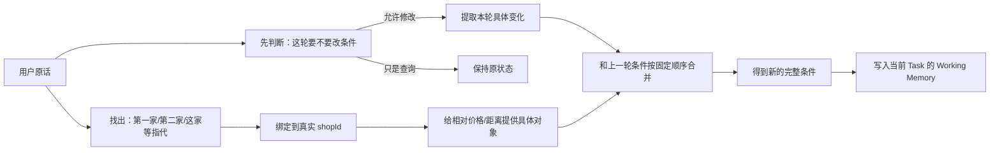
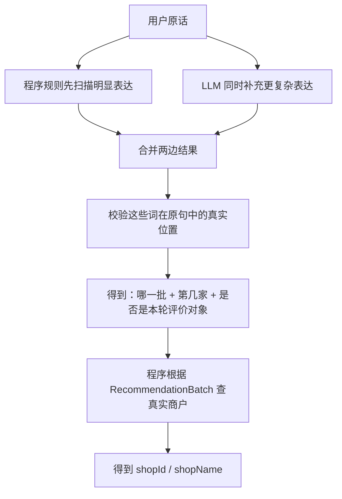
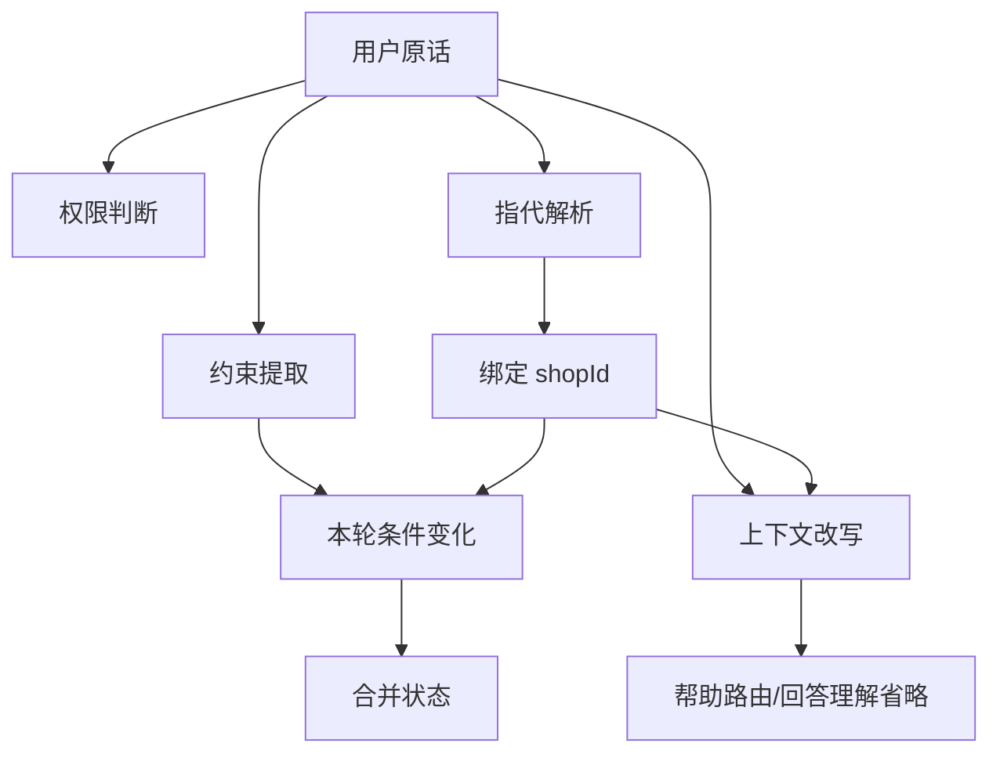

# 用户约束建模、提取与状态合并

这条线先从一个最容易把系统搞乱的场景开始。上一轮用户已经确定“福州、日料、人均 100”，系统也推荐了几家店；下一轮用户只是问：“**第二家人均多少？**”这本来只是查第二家店的价格。如果程序只看到“人均”两个字，就把这句话交给约束提取器，再把提取结果直接写回状态，就可能把一个**事实查询**误当成“用户要修改预算”。从这一轮开始，后面的推荐、排序、换一批都会建立在被污染的状态上。

另一个真实问题更隐蔽。用户问：“**第一家那个日本料理环境怎么样？**”这里“日本料理”只是用来描述第一家店，并不是在说“以后都给我找日料”。如果提取器看到“日本料理”就写入 `cuisine=日料`，当前条件同样会被偷偷改变。

后面这一整套设计，其实都在回答四个很朴素的问题：**用户这句话是在改条件，还是只在问东西？如果真的要改，到底改了什么？如果提到了“第一家、这家、刚才那个”，到底指哪家店？最后这些变化怎样安全地合并进已有状态？**

> 【核心提炼】这条线最重要的不是“模型能抽出多少字段”，而是**不能让一次语言理解错误直接变成长期状态错误**。所以写状态之前必须先判断权限、确定对象，再做合并。

## 一、先看完整流程：一句话到底怎么变成新的状态

先用一个例子走一遍。假设当前条件是“福州火锅，人均 100”，最新推荐了 A、B、C 三家。用户说：“**第二家太贵了，给我便宜一点的。**”系统不能一上来就把“便宜一点”算成某个预算，因为它先得知道“第二家”是谁，也得确认这句话确实是在修改条件，而不是问价格。

当前流程可以简化成下面这张图：



这里最重要的是顺序和职责。**权限判断只回答“能不能改”；约束提取只回答“具体改什么”；指代解析只回答“这句话里的第二家到底是谁”；合并器才负责把旧状态和本轮变化拼成新的完整状态。** 这些步骤拆开以后，一个环节出错，不会自动获得修改所有长期状态的权限。

代码里的类名可以放到最后再对应，不需要先背：权限判断主要在 `TurnUnderstandingService`，具体字段由 `ConstraintExtractor` 提取，商户指代由 `ReferenceIntentExtractor` 和 `BatchAwareReferenceResolver` 处理，最终由 `ConversationCriteriaMerger` 合并，`ConversationStateService` 写入 Working Memory。

> 【核心提炼】先记业务流程，再记类名：**能不能改 → 改什么 → 针对谁 → 怎么合并 → 谁来落库。**

## 二、为什么约束字段后来越做越少，而不是越做越多

早期看到一种需求就加一个字段很自然。用户说“约会”，建 `occasion`；说“安静”，建 `quiet`；说“不排队”，再建 `avoidQueue`。问题是，真实自然语言没有边界：今天有约会、安静，明天还有商务聚餐、适合聊天、带孩子、一个人吃、氛围好。继续按这种方式做，字段会越来越多，而且很多字段最后根本没有明确的下游逻辑。

后来判断一个东西要不要独立建字段，主要看两点：**它是不是有限、稳定的业务维度；后面是不是有明确的程序消费它。** 预算、距离、城市、菜系会直接影响 SQL、召回或排序，所以值得独立保存；“安静、约会、适合聊天”属于开放式偏好，更适合统一放进 `preferences[]`。

当前重要字段按用途记就够了：

```text
地点：targetProvince / targetCity / targetDistrict / targetArea / locationIntent
吃什么：cuisine / excludedCuisines[] / keyword
明确条件：budgetPerPerson / radiusKm / nearby / arrivalTime
开放偏好：preferences[]
本轮删除/调整动作：clearedFields[] / removedPreferences[] / budgetDirection / radiusDirection
辅助信息：missingInformation[] / lockedConstraints[] / systemNotes[]
本轮临时提示：sourceHints / entityTypeHint
```

这里再把两个不直观的字段说清楚。`sourceHints` 只是记录“**这个条件是怎么来的**”。用户直接说“要安静”，来源就是用户明确输入；用户说“和女朋友吃饭”，系统把它归纳成“约会”，来源就是系统推导；用户只说“附近”，系统补默认 3km，这个 3km 属于系统默认。`sourceHints` 本身只是本轮临时信息，合并以后真正需要长期保留的来源会写到 Task 的 `constraintSources`。

`entityTypeHint` 只服务地点解析。比如“福建师范大学附近”，模型可以先判断它大概是一所大学。这个“大学”提示能帮助地图服务返回多个同名候选时排序，但它不是事实，不能拿它直接做硬过滤。完整地点链路已经拆到第三篇文档。

> 【核心提炼】不要根据“用户能说出多少概念”设计字段，而要根据**后面程序到底怎么消费**来设计字段。

## 三、为什么从“每轮提完整条件”改成“只提这一轮的变化”

假设上一轮已经是“福州 / 火锅 / 人均 100 / 安静”，这一轮用户只说：“**预算改成 80。**”如果还要求模型重新输出一份完整条件，它就要再次生成“福州、火锅、安静”等旧信息。它只要漏掉一个，系统就可能误以为用户把那个条件取消了。

所以后来改成：**上一轮完整状态作为基线，这一轮只记录用户明确发生的变化。** 用户没提到某个字段，就继承；用户给了新值，就覆盖；用户明确说不要了，就清除。

这里最容易被忽略的是：**为什么不能直接用空值表示“清除”？** 假设上一轮预算是 100：

```text
用户：再推荐几家
→ 这一轮没提预算
→ 应该继续保留 100

用户：预算不限
→ 用户主动取消预算
→ 应该删除 100
```

如果这两种情况最后都得到 `budget=null`，程序根本分不清用户是**没说**还是**故意取消**。因此现在把“值”和“操作”分开：普通字段负责“改成什么”，`clearedFields[]` 负责“哪些旧字段要删掉”，`removedPreferences[]` 负责“哪些旧偏好要删掉”。

比如“不用安静了”不是把整个偏好数组直接设成空，而是只把“安静”加入删除清单；“看看有没有别的吃的”则可以明确清除旧 `cuisine/keyword`，而不是因为本轮没有提新菜系就继续错误继承。

当前代码从**语义上**已经是在做增量，但 Java 类型还没有完全拆开：本轮变化和完整状态仍然共用 `DecisionConstraints`。所以面试时准确说法是“**当前用稀疏增量表达本轮变化**”，不要说成已经实现了一套非常完整的独立 Delta 类型系统。

> 【核心提炼】多轮状态必须区分三件事：**没说 = 不动，给新值 = 覆盖，明确取消 = 删除。** 空值本身无法表达这三种不同语义。

## 四、为什么“能不能改状态”和“具体改什么”必须拆成两步

还是回到开头那句：“**第二家人均多少？**”如果一个模块既负责抽字段，又负责决定自己有没有写权限，它很容易得到这样的错误链路：看到了“人均” → 抽到价格相关信息 → 既然抽到了字段，就认为这是一次条件修改 → 写 Working Memory。

问题就出在最后一步：**识别到了某个信息，不等于用户要求修改这个信息。**

所以现在先做一层比较保守的判断。像“改成、换成、不要、不限、排除、太贵、便宜一点、更近、换一批”等，明显带“我要修改当前方案”的含义，才允许进入条件修改；而“第二家人均多少”“这个日料怎么样”“为什么推荐第一家”这类事实问题，默认只读，不让它改长期状态。

这一层当前主要是**程序规则实现，不是再调一次 LLM**。它只识别少量高风险控制语义，不负责理解所有开放式自然语言。这样做的目的也不是“架构更漂亮”，而是隔离风险：即使后面的模型偶尔多抽了一个字段，只要前面没有给写权限，它就改不了 Working Memory。

只有判断为“确实要改条件”以后，后面的提取器才开始回答第二个问题：用户到底是把菜系换成日料、预算改成 80、取消安静，还是要求更便宜。

> 【核心提炼】拆成两步是为了**防止提取器自己给自己发写权限**。第一步管权限，第二步管内容；模型抽错一个词，不应该直接污染长期状态。

## 五、“第二家”“最开始第二家”“这家”到底是怎么找出来的

这一块之前写得太像技术文档，先直接用两批推荐看问题。

假设第一轮推荐：

```text
第 1 批：
1. A 店
2. B 店
3. C 店
```

用户后来“换一批”，得到：

```text
第 2 批：
1. D 店
2. E 店
3. F 店
```

这时用户说“**第二家怎么样？**”，默认应该指**最新一批的 E 店**；如果说“**最开始第二家怎么样？**”，才应该回到第一批的 B 店。这就是为什么不能只保存一个“当前候选数组”，也不能每个模块自己根据聊天文字重新猜一次。

当前实现分两步，而且两步一个偏语言理解，一个完全是程序查数据。

第一步是**先找出原话里哪些词是在指商户**。代码里的 `ReferenceIntentExtractor` 使用“规则 + LLM 补充”的混合方式：



程序规则负责高确定性的表达。目前正则可以直接识别“第一家、首选、第二家、第三家”，以及“最开始/最初/一开始 + 第几家”；“这家、那家、刚才那家、上一家”等则先标记为当前焦点商户。也就是说：

```text
“第二家”
→ 最新批次 + 第 2 家

“最开始第二家”
→ 最早批次 + 第 2 家

“这家”
→ 当前焦点商户
```

LLM 不是替代这些规则，而是补规则不容易处理的信息。比如一句话里同时出现两个对象：“**第一家太贵了，第二家有插座吗？**”模型可以补出两个引用，并指出“第一家”才是“太贵了”这个修改动作针对的对象；如果引用里还带“那个日料”这种描述，也可以把描述词一起带出来。然后程序把规则结果和模型结果合并：重叠的引用以规则结果为基础，模型只补充“是不是评价对象、带了什么描述”等信息；模型发现了规则没覆盖的第二个引用，则追加进去。

之前出现的“原文 span”其实没有那么神秘。**它就是“这几个字在用户原句里的起止位置”。** 代码字段叫 `surface/start/end`：`surface` 是原句中的文字，例如“第二家”；`start/end` 是它在整句话中的起止下标。之所以要保存位置，是因为一句话可能有多个引用，程序必须知道“太贵了”靠近的是第一家还是第二家，也要避免把两次出现的“这家”混成一个。

而且 LLM 给出的起止位置不能直接信。程序会重新拿用户原话核对：如果模型说某一段是“第二家”，但那个字符范围实际不是“第二家”，就认为位置不可信；只有当“第二家”在整句里只出现一次时，才允许重新定位。出现多次又无法确定，就直接丢弃，不继续猜。

第二步已经**完全不让 LLM 猜商户是谁**。`BatchAwareReferenceResolver` 只拿上一步的结果去查当前 Task 的 `RecommendationBatch`：最新第二家就查最新有效批次第二个，最开始第二家就查最早批次第二个，“这家”就根据 `focusedShopId` 找商户。如果用户说“那个日料”，则会在对应批次里比较商户名、菜系和已有引用标签，只有唯一匹配时才绑定，多个都符合就不强猜。

还有一个容易忽略的边界。假设用户已经换了搜索条件，系统追加了一个**空推荐批次**表示“旧候选已经失效”，这时再说普通“第二家”，程序不会越过这个空批次偷偷回到旧结果；如果真想回历史，用户要明确说“最开始第二家”等历史表达。

> 【核心提炼】这里不是“把第二家替换成店名”这么简单。当前实现是：**规则先抓明显表达，LLM 补复杂表达，程序校验位置，最后再根据推荐批次确定 shopId。** 真正决定“是谁”的最后一步是确定性程序，不是 LLM。

## 六、“第二家太贵了”和只说“太贵了”，预算到底根据谁算

有了上一节的实体绑定以后，“第二家太贵了”就好处理了。假设最新第二家 E 店人均 120，指代解析已经得到 E 店的 `shopId`，并判断“第二家”就是这次“太贵”针对的对象，那么相对预算会优先以 E 店的 120 元为基准，而不是随便从候选里找一个价格。

如果用户只说“**太贵了，便宜点。**”情况就不一样：句子里没有明确说哪家店，系统不能声称自己知道用户具体在嫌哪家。当前只能按一套保守的回退顺序找基准：先看当前有没有明确聚焦的商户，再看已经展示的候选，再退到当前候选价格；开场连候选都没有时，才用当前菜系的价格基准。

当前“便宜一点”的规则是大致把基准价格乘 0.85，同时最低不低于 20 元。**0.85 和 20 元都不是模型学出来的，也不是行业标准，而是当前业务侧为了避免调整过激设置的经验参数。** 更早曾用“基准价减 1 元”，实际几乎没有意义，所以才改成比例收紧。开场没有候选时，会先查菜系平均价，再取约 0.8 作为基准；数据库不可用才退到硬编码价位，这同样只是兜底。

距离的“更近一点”思路类似，但目前还没完全做到和价格一致。距离侧会按现有距离基准收紧半径，大致乘 0.9，并设置 0.5km 下限；但“第二家太远了”还没有像价格一样完整复用显式 `shopId` 锚点，目前主要仍按焦点商户、已展示候选、当前候选回退。这是**当前遗留问题**，不能说两条链已经完全统一。

> 【核心提炼】相对反馈先要确定“针对谁”，再把相对语义转换成绝对数字。没有明确对象时只能保守回退；0.85、20 元等是当前经验规则，不是最优参数。

## 七、为什么必须同时保留“用户原话”和“改写后的句子”

先复现一个真实问题。假设上一轮系统已经有一批结果，用户这一轮说：

> “**就按我当前位置找吧，除了东北菜都可以。**”

这句话其实同时包含两件事：第一，搜索位置切到当前位置；第二，新增一个负向条件——排除东北菜。

上下文改写模块的任务本来只是**把省略的信息补完整，让后面更容易理解**。它可能特别关注“当前位置”这一部分，把句子整理成类似“按当前位置继续搜索”。如果后面的约束提取直接拿这个改写句当成用户的新原话，那么“除了东北菜”就被彻底丢掉了。项目里真实出现过这种“改写吞掉复合语义”的问题。

所以后来把三种信息的职责彻底分开：



**用户原话是唯一的业务语义来源。** 权限判断和约束提取优先读原话，因为只有原话能保证这一轮用户说的所有命令都还在。当前编排代码在真正提条件时也是优先调用 `constraintExtractor.extract(originalMessage, activeCriteria)`；只有兼容性的旧路径才会在没有提取结果时退到改写句。

**改写句只负责补上下文，不负责重新定义用户的整句话。** 典型用途是把“第二家怎么样”补成“某某店怎么样”，或者把“这家”补成当前焦点店，方便路由和回答理解；但它不能覆盖原句后再被当成新的业务事实。

**已经解析好的商户引用直接走旁路传 `shopId`。** 例如“第二家太贵了”，一旦第二家已经绑定到 E 店，后面的相对预算直接拿 E 店的 ID 和价格算，不需要先把句子改写成“E 店太贵了”，然后再从字符串里猜一遍 E 店是谁。

所以现在可以把三者记成：

```text
原话：用户到底说了什么 —— 约束和权限的真相来源
改写：把省略补完整 —— 方便理解，但不能覆盖原话
结构化引用：这个“第二家/这家”到底是谁 —— 直接给 shopId
```

> 【核心提炼】原话、改写、实体 ID 不是三选一。**原话保完整语义，改写补上下文，实体 ID 消除“这家是谁”的歧义。** 改写最大的限制是可能只补好一部分语义，所以不能拿它替换原话。

## 八、为什么地理位置单独拆成第三篇

假设用户说“**我在福州，但帮我找杭州西湖附近的日料。**”这里同时出现设备位置、明确城市、POI、附近半径。它已经不是一个普通约束字段能讲清楚的问题：行政区要做确定性校验，POI 要经过地图解析，设备 GPS 和命名目的地还必须分开保存。

因此地点链已经独立为 `03_地理位置解析与多轮位置状态——开发故事与面试准备.md`。本篇只需要记住和约束合并直接相关的三点：模型给出的行政区只是候选，最终要经过确定性校验；POI 类型提示只能辅助排序；地点变化会改变合法候选范围，所以旧 candidate/focused shop 需要失效。

> 【核心提炼】位置问题不是“多加几个字段”，而是另一条完整状态链。本篇只保留和约束写入有关的接口边界。

## 九、为什么合并器不能随便按字段顺序复制

考虑一句话：“**不要火锅了，换日料，人均改成 80。**”如果程序先把新菜系“日料”写进去，随后再执行“清除旧菜系”，就可能连新值一起清掉。再比如从“我附近”切到“杭州西湖”，如果只改城市，却没先处理原来的当前位置语义，旧 `nearby/radius` 也可能继续残留。

所以合并器必须规定固定顺序。原因很直接：**这些状态操作彼此会影响，顺序不同，最终结果可能不同。** 当前大致顺序是：先复制上一轮状态并记录继承 → 处理明确清除 → 处理整套需求替换 → 处理位置作用域 → 写入新的菜系/关键词/排除菜系 → 写预算、半径等直接值 → 处理偏好新增/删除 → 最后计算“更便宜/更近”这类相对变化 → 更新缺失信息和来源。

同时每次合并还会记录这一轮到底发生了什么：哪些字段是继承的，哪些被覆盖，哪些新增，哪些被清除，哪些派生候选因此失效。代码里分别叫 `inherited`、`replaced`、`appended`、`cleared`、`invalidated`。

这些记录不是为了日志好看，而是为了排查。假设最后发现预算从 100 变成 85，可以直接判断它到底是用户明确改的，还是“太贵了”通过相对预算算出来的；如果用户换城市以后候选突然清空，也可以确认是不是地点变化正常触发了候选失效。没有这些过程记录，只能拿最终状态倒推原因，很容易把问题定位错层。

> 【核心提炼】固定顺序保证同一组输入得到稳定结果；变更明细负责告诉我们**这个结果为什么变成这样**。

## 十、从这些坑里真正应该带走什么

第一个经验来自“预算改 80”：**已有状态不要每轮重算，本轮只表达变化。** 第二个来自“第二家人均多少”：**理解到一个词不等于有权限改它，写权限要单独控制。** 第三个来自“不用安静了”：**没说、设置、删除必须是不同操作。** 第四个来自“第二家太贵了”：**相对反馈必须先确定对象，不能先算数字再猜对象。** 第五个来自“当前位置 + 排除东北菜”：**改写只能补上下文，不能替代原话。** 第六个来自菜系、位置这些字段：**只要一个字段会直接影响 SQL、召回或工具参数，它的语义和来源就必须比普通聊天文本更严格。**

这里不用背很多英文术语。真正可以迁移到其他 Agent 的方法就是：**把概率理解和确定性状态修改隔开。** LLM 适合理解开放语言，但最终“能不能写、写到谁、怎么合并、哪些旧结果失效”应尽量由可测试的程序逻辑控制。

> 【核心提炼】这条线的核心方法论是：**LLM 负责理解，程序负责约束写入边界和状态一致性。**

## 十一、面试题：按四类复习

### A. 增量与状态

**Q1：为什么不用每轮重建完整约束？** 因为旧状态已经确认过，本轮只重新理解变化更稳；否则模型漏一个字段就可能误删旧条件。**追问陷阱：是不是主要为了省 Token？** 不是，主要解决状态正确性，Token 只是副收益。

**Q2：为什么空值不能表示清除？** 因为“没提预算”和“明确说预算不限”都可能得到空值，但前者要继承，后者要删除。**追问陷阱：协议能不能把 null 定义成清除？** 可以，只要协议还能区分“字段根本没出现”和“显式 null”；关键是必须有独立操作语义。

**Q3：现在的增量是不是独立数据结构？** 语义上是，本轮只表达变化；类型上还复用了 `DecisionConstraints`。**追问陷阱：是不是设计不完整？** 可以承认有继续纯化空间，但当前已经能明确区分设置、清除、偏好删除和相对变化。

**Q4：为什么“更便宜”不能长期保留？** 因为它是这一轮的一次性命令，执行后必须清零。**追问陷阱：用户说太贵是不是代表长期喜欢便宜？** 不能这样推断。

> 【核心提炼】这一类统一回答：**旧状态是基线，本轮只记录真正发生的变化。**

### B. 权限与提取

**Q5：为什么要先判断能不能改，再提具体字段？** 因为事实问题里也会出现“人均、日料”等词；如果抽到字段就自动写状态，一次误抽就会污染长期状态。**追问陷阱：为什么不让模型同时输出 shouldMutate？** 可以设计，但当前项目把高风险写权限收在确定性规则里，故障边界更小。

**Q6：权限判断是不是又调了一次 LLM？** 当前主要不是，而是窄范围程序规则，只判断明显的修改/只读控制语义。**追问陷阱：规则会不会越来越多？** 会，所以它不负责开放式语义理解，只守写状态这道门。

**Q7：`sourceHints` 是干什么的？** 区分“用户明确说的、系统默认的、系统推导的”。**追问陷阱：它本身会持久化吗？** 本轮临时对象不持久化，合并后的来源结论进入 Task 的 `constraintSources`。

> 【核心提炼】这一类统一回答：**模型能理解内容，但不能因为理解到了内容就自动获得写权限。**

### C. 指代与实体绑定

**Q8：第一家/第二家/这家具体怎么实现？** 先用程序规则抓明显表达，同时让 LLM 补复杂引用；合并后校验原句位置，再由确定性 Resolver 根据推荐批次和焦点商户查出真实 `shopId`。**追问陷阱：最终是谁决定 shopId？** 是程序根据 `RecommendationBatch` 绑定，不是 LLM 自由生成。

**Q9：换过一批以后“第二家”是谁？** 默认最新有效批次第二个；“最开始第二家”才访问最早批次。**追问陷阱：最新批次已经失效为空怎么办？** 普通“第二家”不穿透失效边界复活旧候选。

**Q10：原文 span 是什么？** 只是引用词在原句中的起止字符位置，代码里是 `surface/start/end`。**追问陷阱：为什么需要位置？** 一句可能有多个引用，位置用于区分它们并校验模型没有把词定位错。

**Q11：模型把引用位置写错怎么办？** 程序重新和原句核对；只有这段文字在原句里唯一出现时才自动重定位，否则放弃。**追问陷阱：为什么不继续让模型猜？** 因为商户绑错以后会继续污染工具调用和状态修改。

**Q12：“第二家太贵了”预算根据谁？** 优先用已经绑定的第二家商户价格；没有明确对象时才按焦点商户和候选集合回退。**追问陷阱：直接说“太贵了”呢？** 只能启发式解释，不能宣称知道用户具体针对哪家。

**Q13：为什么是 0.85 和 20 元？** 当前经验参数：有限幅度收紧并设置价格下限。**追问陷阱：是不是数据证明最优？** 不是，生产上仍需要数据校准。

**Q14：“太远了”和“太贵了”完全一样吗？** 思路相似，但距离侧还没有完全复用显式商户锚点。**追问陷阱：不要为了体系完整说已经完全统一。**

> 【核心提炼】这一类统一回答：**先确定“谁”，再理解“对它做什么”。**

### D. 原话、合并与测试边界

**Q15：为什么改写句不能直接给约束提取？** 因为改写可能只补了一部分上下文，真实出现过“当前位置 + 排除东北菜”中的排除条件被丢掉。**追问陷阱：那改写还有什么价值？** 它仍然适合补省略、补店名，帮助路由和回答理解。

**Q16：原话、改写、结构化引用怎么分工？** 原话保存完整用户语义；改写补上下文；结构化引用直接告诉后续“第二家是哪一个 shopId”。**追问陷阱：最终约束以谁为准？** 原话优先，不能用 rewritten query 覆盖原话。

**Q17：为什么菜系和 keyword 要分开并统一规范化？** 因为菜系是稳定类别，会参与确定性过滤；keyword 更偏具体店名/菜品/实体。两边语义混乱会让同一句话走不同检索路径。**追问陷阱：能不能都丢给向量检索？** 硬约束不能降级成“相似就行”，否则会出现语义像但条件不符合的候选。

**Q18：为什么合并器要固定顺序并记录变更？** 因为清除、设置、地点切换、相对调整之间有依赖，顺序不同结果可能不同；变更记录用于定位状态是在哪一步被继承、覆盖、清除或失效的。**追问陷阱：最终结果正确不就行了？** Agent 的中间状态可能已经错，只看最终一句回答不够定位问题。

Prompt 调优还可能被追问。项目里 `targetCity` 已知集曾从 16/17 提升到 17/17，但独立留出集仍是 7/8，没有提升，因此不能把“已知样本全对”写成“提取准确率 100%”。这也是为什么可验证事实后来更多交给确定性解析，而不是继续堆 Prompt 示例。

> 【核心提炼】面试回答不要背类名，优先按“当时什么场景出错 → 为什么错 → 我们怎么拆职责 → 现在还有什么边界”来讲。

## 十二、简历口径

AI 应用 / Agent 方向可以写：

> **多轮约束理解与状态归并：**针对用户反悔、条件继承及事实追问误改状态问题，将本轮自然语言解析为增量变更，并以独立语义门控制状态写权限；结合历史推荐批次完成“第一家/这家”等实体绑定，再由确定性合并器处理继承、覆盖、清除和相对反馈，避免多轮条件污染。

Java 后端方向可以写：

> **会话约束状态归并：**设计 previous + delta 的确定性状态合并链路，显式区分继承、覆盖、清除、偏好删除及相对调整；统一领域字段规范化、历史实体绑定和状态变更审计，支持多轮会话问题定位与回归验证。

这里仍然不建议写“约束提取准确率 100%”。仓库里有单字段已知集达到 17/17，但独立留出集仍存在失败，而且这个结果既不代表完整约束提取，也不代表整个 Agent。