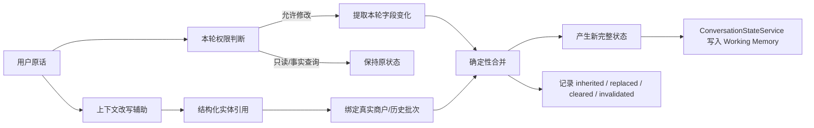

# 用户约束建模、提取与状态合并

这条线不是“让模型把一句话转成 JSON”这么简单。真正把问题暴露出来的是一个很典型的灾难场景：上一轮用户已经形成“福州、日料、人均 100”这套条件，下一轮只是问一句“第二家人均多少？”。如果系统看到“人均”两个字，就让约束提取器抽出预算语义并直接写状态，那么一个**事实查询**就可能被误判成“修改预算”，原本稳定的搜索条件因此被污染；后面再推荐、再排序、再调用工具，全部都会建立在错误状态上。

另一个真实问题更隐蔽。用户问“第一家那个日本料理环境怎么样”，句子里的“日本料理”只是商户描述。如果系统把“提取到了 cuisine=日料”直接等同于“用户要修改菜系”，当前 Working Memory 也会被悄悄改掉。项目后来之所以拆出本轮写权限、增量状态、实体绑定、确定性合并，本质上都是在解决同一个问题：**自然语言里出现了一个信息，不等于这个信息有资格成为新的长期业务状态。**

> 【核心提炼】这条线的核心不是“提取得准不准”，而是“什么信息可以写状态、写成什么操作、针对哪个对象、以什么顺序落地”。错误一旦进入 Working Memory，会跨轮传播，所以必须在写入前做风险隔离。

## 一、完整链路先看一遍

先把整条链路放在一起，再看各模块为什么存在。



这里最重要的分工是：**原话负责业务语义，权限判断决定能不能写，字段提取只回答“具体改什么”，实体绑定回答“针对谁”，合并器决定“怎么从旧状态变成新状态”，状态服务负责最终持久化。** 上下文改写不再承担“整轮业务真相”的角色，它只是辅助理解省略和引用。

> 【核心提炼】一个模块只解决一个问题。权限判断和字段提取必须分离，实体绑定和字符串改写必须分离，最终状态写入必须由单一状态服务完成。

## 二、字段为什么从“越来越多”收敛成现在这样

早期最自然的做法，是看到一种需求就加一个字段：约会建 `occasion`，安静建 `quiet`，不排队建 `avoidQueue`，再加 `hardConstraints`、`softPreferences`。短期看每个字段都合理，长期会出现两个问题：第一，Schema 会随着自然语言场景无限膨胀；第二，很多字段只有生产者，没有明确消费者，最后同一个语义在不同模块用不同方式解释。

现在更稳定的划分是：预算、半径、行政区、菜系这类**有限、结构化、会直接参与 SQL/检索/工具参数**的维度保留独立字段；约会、安静、适合聊天、聚餐、氛围好这类开放属性统一进入 `preferences[]`；系统为了解释和审计产生的文字进入 `systemNotes[]`，不能混成用户偏好。

当前重点字段可以这样理解：

```text
地点：targetProvince / targetCity / targetDistrict / targetArea / locationIntent
食物：cuisine / excludedCuisines[] / keyword
确定条件：budgetPerPerson / radiusKm / nearby / arrivalTime
开放偏好：preferences[]
本轮操作：clearedFields[] / removedPreferences[] / budgetDirection / radiusDirection
辅助状态：missingInformation[] / lockedConstraints[] / systemNotes[]
请求期提示：sourceHints / entityTypeHint
```

`sourceHints` 只表示“这个新值是用户明确说的、系统默认的，还是系统推导的”。用户说“要安静”时，安静来源是 `USER_EXPLICIT`；用户说“和女朋友吃饭”后系统归纳成“约会”，来源是 `DERIVED`；用户说“附近”而系统补默认 3km，来源是 `SYSTEM_DEFAULT`。这个请求期提示本身不持久化，但它会在合并时转成来源更新，最后写进 Task 的 `constraintSources`。

`entityTypeHint` 是地点解析时的一次性类型提示，例如“福建师范大学附近”可以得到 `targetArea=福建师范大学`、`entityTypeHint=UNIVERSITY`。它只能帮助 POI 候选排序，不能当硬过滤，因为它本身来自模型，判断错一次就可能误删正确地点。更完整的地理链路已经独立到 `03_地理位置解析与多轮位置状态——开发故事与面试准备.md`。

> 【核心提炼】字段设计不是“自然语言里有多少概念，就建多少字段”。只有有稳定语义和明确消费方的维度才适合结构化；开放语义更适合规范化标签。

## 三、为什么一定要用“本轮增量”，而不是每轮重建完整状态

假设上一轮状态已经是“福州 / 火锅 / 人均 100 / 安静”，用户下一轮只说“预算改成 80”。如果仍要求模型重新输出一份完整状态，模型就必须重新生成福州、火锅、安静等已经确定的信息；它只要漏掉一个字段，系统就可能误以为用户取消了这个条件。

因此当前思路是：**上一轮完整状态保持不动，本轮只描述用户明确发生了什么变化。** 具体分成三种最基本语义：没提到 → 继承旧值，给了新值 → 覆盖旧值，明确取消 → 执行清除。

这里“为什么不能用空值表示清除”非常关键。如果系统把空值既用作“这一轮没有提到”，又用作“用户明确取消”，就根本分不清用户是**忘了说**还是**故意删掉**。例如上一轮预算 100，这一轮没提预算，本来应该继续保留 100；但用户说“预算不限”，则应该删除 100。两种情况如果都表现成空值，合并器无法知道用户到底发没发出删除命令。

所以必须把“值”和“操作”分开：`clearedFields[]` 记录用户明确要求删除哪些普通字段，`removedPreferences[]` 记录明确删除哪些偏好。比如“不限预算”不是 `budget=null`，而是“把 `budgetPerPerson` 加入清除清单”；“不用安静了”不是把整个 `preferences` 设空，而是“把安静加入删除偏好清单”。

当前实现语义上已经是 Delta，但类型上仍复用 `DecisionConstraints`：普通字段表达 SET，`clearedFields` 表达 CLEAR，`removedPreferences` 表达 REMOVE，`budgetDirection/radiusDirection` 表达相对调整。更准确的描述是“稀疏增量载体”，不是完全独立的 Mutation DSL。

> 【核心提炼】空值只能表达“没有值”，不能可靠表达“用户主动删除”。多轮状态必须把“值”与“操作”拆开，否则 absent 和 clear 会天然混淆。

## 四、为什么“判断能不能改状态”和“提取具体改什么”必须拆开

这一点不要被类名干扰，直接用大白话理解：**第一步先决定用户这一轮有没有资格改长期状态；第二步只有在允许修改以后，才去解析具体改了哪些字段。**

如果把两步合并，风险非常直接。用户只是问“第二家人均多少”，模型为了回答问题，很可能抽出“价格/人均”相关字段；如果“抽到了字段”本身又被拿来判断“这一轮是修改”，那模型就相当于自己给自己发了写权限。事实提问里多抽一个词，就可能把状态改掉。

因此现在的权限判断采用比较保守的 fail-closed 逻辑：明显的“改成、换成、不要、不限、排除、除了、太贵、更便宜、太远、更近、换一批”等状态修改操作才认为有写语义；只有商户引用、事实查询、当前条件查询时，默认不允许改 Working Memory。然后字段提取器只做一件事：**在已经允许修改的前提下，告诉后续具体要 SET/CLEAR/REMOVE/RELATIVE 什么。**

当前 `TurnUnderstandingService` 就是这个请求期权限门，它不是再调一次 LLM，而是一个很小的确定性判断层；输出的 `TurnCommandSet` 也不是长期状态，只是当前 Turn 的控制语义。编排层随后生成 `TurnPlan`，只有 `criteriaIntent=APPLY_DELTA` 时，后面才真正进入约束提取与合并。

> 【核心提炼】拆分不是为了“架构更优雅”，而是为了隔离风险。权限判断失败只会让本轮不写状态；如果权限和字段提取耦合，一次抽取波动可能直接污染长期数据。

## 五、指代和实体绑定：相对反馈必须先回答“针对谁”

用户很少一直说完整店名，更常说“第二家”“最开始第一家”“这家”“刚才那个日料”。如果每个模块都从字符串重新猜一次，就会出现改写层认为“第二家”是 B，工具层却因为候选池已经换过一批，把“第二家”解释成 E。

因此现在先把引用解析成结构化意图，再绑定到历史推荐事实：`ReferenceIntentExtractor` 负责理解“第几家、哪一批、是不是当前焦点、原文 span、描述词、是不是本轮修改对象”；`BatchAwareReferenceResolver` 再根据当前 Task 的 `RecommendationBatch` 和焦点商户，把它绑定成确定的 `shopId/shopName`。后面的改写、事实工具和条件合并复用同一绑定结果。

普通“第二家”默认解释为最新有效推荐批次的第二个，“最开始第二家”才访问最早批次，“这家/刚才那个”优先按当前焦点商户解析。如果最新批次已经因为条件变化变成空 Batch，普通序号引用不会穿透这个失效边界偷偷复活旧候选。

模型返回的引用位置也不直接信任。`surface/start/end` 会重新和原始消息核对；只有位置正确，或者 surface 在原句中唯一出现，才接受这个引用。否则宁可丢弃，也不猜。

> 【核心提炼】“第二家”不是一个字符串替换问题，而是一个实体绑定问题。自然语言可以概率解析，但最终绑定到哪个历史商户必须尽量可验证、可复用。

## 六、“太贵了”“更近一点”为什么必须有锚点

“便宜一点”本身没有绝对预算，它只能相对于某个价格解释。当前价格路径优先级是：本轮明确解析出的修改对象 → 当前焦点商户 → 当前已展示候选 → 当前候选最低价；如果开场还没有任何候选，则退到菜系价格基准。

例如“第二家太贵了”已经把“第二家”解析成具体 `shopId`，并且它被标记为本轮价格反馈对象，那么就优先用第二家的真实人均价格做基准；而只说“太贵了”没有明确对象，只能走焦点/候选集合回退，这其实是一种启发式解释，不能说系统已经确定用户具体嫌哪家贵。

当前新预算是“锚点价格 × 0.85”，同时最低不低于 20 元。这两个数字不是模型学出来的，也不是行业标准，而是业务侧为了稳妥设置的经验规则。0.85 表示每次相对降价先收紧约 15%，避免用户一句“太贵”就直接把预算砍半；20 元是下限保护，避免连续相对反馈把预算压到几乎不可用。更早方案曾经用“锚点减 1 元”，这种变化几乎没有业务意义，所以才改成比例收紧。

开场没有候选时，会先查询当前菜系平均价，再取约 0.8 作为价格基准；数据库不可用才退到硬编码菜系价位。这同样属于工程兜底，不应该包装成经过严格统计学习得到的最优参数。

距离逻辑与价格类似，但当前还没有完全对称。现在“更近一点”会按已有距离锚点收紧半径，使用约 0.9 的比例并设置 0.5km 下限；但“第二家太远了”这条链还没有完全复用价格侧的显式 `mutationAnchorShopId`，主要仍走焦点商户/已展示候选/当前候选的回退。这是现有遗留改进点，不能说两条相对反馈链已经完全统一。

> 【核心提炼】相对反馈必须先找到基准对象，再由确定性规则转成绝对条件。0.85、20 元等都是当前业务经验参数，不是模型结论；距离链路仍有未完全统一的技术债。

## 七、原话、改写句和结构化引用到底怎么配合

当前边界是：**用户原话是业务真相的唯一提取来源；改写句只负责帮助理解上下文；已经解析好的结构化引用作为旁路直接提供实体 ID。**

这三个角色不能混。原话包含用户真正说过的全部命令，因此权限判断、约束提取最终都以 `originalMessage` 为语义源。改写模块只适合做“第二家 → 某某店”“这家 → 当前焦点店”这类省略补全，方便后面的路由或回答理解上下文，但不能把它当成新的整轮业务事实。

真实失败已经证明过这一点。同一轮用户可能同时表达“用当前位置 + 排除东北菜”。如果 Context Rewrite 只关注地点补全，把句子重写成类似“按当前位置继续搜索”，原话里的“排除东北菜”就可能消失；如果后面的约束提取直接读 rewritten query，就会完全漏掉这个负向条件。项目里实际出现过 Rewrite 吞掉“当前位置 + 排除菜系”复合语义的问题，因此后面明确收口：**约束提取继续读原话，Rewrite 不再覆盖整轮业务语义。**

结构化引用则绕开了“继续靠改写后的店名猜实体”的问题。比如“第二家太贵了”，引用解析直接给后续一个已经绑定的 `shopId`；合并器计算相对预算时可以直接使用这个实体 ID，不需要再次从改写句里猜“第二家对应谁”。

> 【核心提炼】原话负责“用户到底说了什么”，改写负责“上下文怎么补全”，结构化引用负责“这个词具体指哪个实体”。三个结果并行配合，不能让改写句升级成新的业务真相。

## 八、地理位置为什么单独拆成一篇

位置链已经复杂到不适合继续塞在这一篇里：行政区、POI、设备 GPS 三类 authority 不同；还涉及 `targetProvince/City/District/Area`、`locationIntent`、默认 3km、多轮城市切换、候选级联失效、同名区县消歧、地图 Provider fallback 等一整套状态与执行契约。

因此这部分已经独立为：`03_地理位置解析与多轮位置状态——开发故事与面试准备.md`。本篇只保留和“约束写入协议”直接相关的结论：行政区模型输出只是候选，最终必须经过确定性校验；POI 的 `entityTypeHint` 只是排序提示；地点切换会影响候选宇宙，因此需要触发当前 candidate/focused shop 失效。

> 【核心提炼】位置不是一个普通字符串字段，而是一整条独立状态链。为了避免本篇继续名词堆积，行政区、POI、附近、消歧和 fallback 已拆成独立文档。

## 九、合并器为什么必须有固定执行顺序

`ConversationCriteriaMerger` 不是“把两个对象字段 copy 一遍”，因为同一轮里不同操作之间有依赖关系。比如用户既明确清除旧菜系，又给出新菜系；如果先 SET 再 CLEAR，新值会被误删。用户从 CURRENT_DEVICE 切到显式城市时，必须先处理地点作用域变化，再决定旧 `nearby/radius` 是否还成立。负向菜系可能要求清掉当前正向 cuisine；相对预算又必须在最终确定锚点以后执行。

因此合并采用固定顺序，本质原因是：**状态操作不是交换律成立的集合操作，执行次序不同会得到不同结果。** 当前流程大致是：先复制并记录继承 → 应用显式清除 → 处理整套需求替换 → 处理位置意图和地点层级 → 应用 keyword/cuisine/排除菜系 → 应用预算/半径/时间/附近 → 追加或删除偏好 → 执行相对预算/距离 → 合并缺失信息 → 更新来源。

同时 `CriteriaMergeResult` 记录 `inherited`、`replaced`、`appended`、`cleared`、`invalidated`、`sourceUpdates`。这些不是为了日志好看，而是为了事后能回答“为什么这一轮状态变成这样”。例如发现预算错了，可以区分：是旧值错误继承、这一轮被错误覆盖、被清除后又重建，还是相对预算规则推导出来；地点切换后候选为什么没了，也能看 `invalidated` 判断是不是搜索范围变化触发。

这对于 Agent 特别重要，因为最终回答可能看起来没问题，但中间状态已经错了。没有这些变更明细，只能从最终 Working Memory 反推过程，很难确定错误发生在哪个阶段。

> 【核心提炼】固定顺序保证同一组状态操作得到唯一结果；变更明细保证错误可以定位到“继承、覆盖、清除、派生失效”的具体阶段，而不是只看到最终错误状态。

## 十、这条线能提炼出的工程原则

第一，已有业务状态稳定以后，本轮尽量表达增量，不让模型每轮重建完整世界。第二，“理解到了什么”与“允许写什么”必须分开；越是会跨轮持久化的状态，写权限越应该收紧。第三，absent、SET、CLEAR、REMOVE、RELATIVE 是不同操作，不能都挤进 null/空串。第四，自然语言引用应先绑定真实实体，后续模块复用绑定结果。第五，相对反馈必须先找锚点，再转成绝对值。第六，结构化 Schema 必须和下游执行语义对齐，不能只追求字段齐全。第七，可验证领域事实应由确定性 authority 做最终确认，而不是把模型输出直接当真。

> 【核心提炼】整套设计的目标不是减少 LLM，而是把概率理解限制在适合它的地方，把状态写入、实体 identity、合并顺序和可验证事实收回确定性系统。

## 十一、面试题：按逻辑分类复习

下面不再按 18 个孤立问题逐条背，而是分四类。每题只保留核心答案和最容易踩的追问陷阱。

### A. 增量与状态操作

**Q1：为什么不用每轮完整重建约束，而要 previous + delta？** 核心答案：已有状态不应该每轮再次经过概率推理；本轮只描述变化，能明确区分继承、覆盖和删除。**追问陷阱：**“是不是主要为了省 Token？”——不是，核心是状态正确性，省 Token 只是副收益。

**Q2：现在这个 Delta 是真正独立的数据结构吗？** 核心答案：语义上是增量，类型上仍复用 `DecisionConstraints`，SET/CLEAR/REMOVE/RELATIVE 混在同一载体里。**追问陷阱：**“那是不是设计不完整？”——承认有边界，更纯的方案是显式 Mutation DSL，但当前已经解决主要业务歧义。

**Q3：为什么 null/空值不能表示清除？** 核心答案：无法区分“没提”与“主动取消”，因此必须用 `clearedFields`、`removedPreferences`。**追问陷阱：**“那 Optional/null 语义设计好不就行？”——如果协议能显式区分 absent 与 null 也可以，关键不是字段名，而是操作语义必须独立可表达。

**Q4：为什么相对预算要做成一次性方向，而不是长期偏好？** 核心答案：“更便宜”是当前 Turn 的命令，被消费后应归零，否则下一轮会再次执行。**追问陷阱：**“用户是不是长期喜欢便宜？”——这不能从一次“太贵”推导出来，不能擅自持久化。

**Q5：为什么 `occasion/quiet/avoidQueue` 后来收进 preferences？** 核心答案：这些是开放集语义，逐个建字段会 Schema 爆炸。**追问陷阱：**“preferences 以后怎么做硬过滤？”——开放偏好本身不应默认升级成硬约束，只有下游有稳定业务语义时才考虑独立结构化。

> 【核心提炼】这一类题统一围绕“状态操作必须显式”回答：旧状态是基线，本轮只描述变化，删除和相对调整都不能靠空值猜。

### B. 权限与字段提取

**Q6：为什么还需要单独判断“能不能改状态”？** 核心答案：事实查询里也会出现预算、菜系等词，提取到字段不等于有写权限。**追问陷阱：**“为什么不直接让模型输出 shouldMutate？”——可以，但当前状态会影响后续 SQL 和长期记忆，项目选择更保守的写权限边界。

**Q7：权限判断是不是又调用一次 LLM？** 核心答案：当前不是，主要是一个窄的确定性语义门，识别明确修改操作、只读上下文查询和引用事实问题。**追问陷阱：**“规则会不会越来越多？”——会有风险，所以只负责高风险控制语义，不承担开放语义理解。

**Q8：为什么权限判断和字段提取不能合并？** 核心答案：合并后提取器多抽一个词就可能顺便给自己写权限，风险耦合；拆开后提取波动不会直接污染状态。**追问陷阱：**“多一层是不是更慢？”——当前权限门是确定性逻辑，成本远小于一次 LLM；重点是故障隔离。

**Q9：`sourceHints` 有什么意义？** 核心答案：区分用户明确输入、系统默认、系统推导，防止系统推导冒充用户原话。**追问陷阱：**“sourceHints 本身持久化吗？”——不持久化，中间来源结论经 `sourceUpdates` 写进 Task 的 `constraintSources`。

**Q10：为什么行政区不能直接相信模型？** 核心答案：行政区是可验证闭集事实，模型只做候选提示，最终由 Resolver 校验。**追问陷阱：**“是不是所有实体都要规则化？”——不是，开放偏好仍适合模型；只有可枚举、可验证、会直接影响执行范围的事实才优先确定化。

> 【核心提炼】这一类题统一围绕“写权限与内容解析解耦”回答。模型可以负责理解，但不能因为理解到了一个字段就自动获得持久状态修改权。

### C. 指代与实体绑定

**Q11：第一家/第二家/这家怎么解析？** 核心答案：先抽结构化引用，再结合 RecommendationBatch 和 focused shop 绑定 `shopId`，后续模块复用同一结果。**追问陷阱：**“换过一批以后第二家是哪家？”——默认最新有效批次；“最开始第二家”才访问历史最早批次。

**Q12：模型把引用 span 抽错了怎么办？** 核心答案：重新校验 `surface/start/end`；只有唯一文本位置才允许修正，否则丢弃。**追问陷阱：**“为什么不让模型再猜一次？”——实体绑定错误会继续污染工具和状态，宁可不解析也不做多次概率猜测。

**Q13：第二家太贵了，预算到底根据谁？** 核心答案：显式 mutation anchor 对应商户优先，其次 focused，再退到展示/候选集合。**追问陷阱：**“直接说太贵了呢？”——没有明确对象，只能启发式回退，不能宣称知道具体针对谁。

**Q14：为什么 0.85 和 20 元？** 核心答案：业务经验参数，0.85 让每次只做有限幅度收紧，20 元防止极端下探。**追问陷阱：**“是不是数据验证出来的最优值？”——不是，当前不是最优性结论，生产应继续数据校准。

**Q15：距离太远和价格太贵完全一样吗？** 核心答案：语义类似，但实现未完全对称；距离侧还没有完整复用显式商户 mutation anchor。**追问陷阱：**不要为了“体系完整”硬说已经统一。

> 【核心提炼】这一类题统一围绕“先确定对象，再解释相对语义”回答。没有实体锚点，相对反馈只能做保守回退。

### D. 原话、规范化、合并与测试边界

**Q16：为什么 Original Message 仍是语义真相，Context Rewrite 不能直接给下游？** 核心答案：Rewrite 只解决省略/引用，可能吞掉同句其他命令；真实出现过“当前位置 + 排除菜系”被改写丢失。**追问陷阱：**“那 Rewrite 还有什么用？”——仍用于上下文补全和回答理解，只是不再覆盖业务原话。

**Q17：为什么 cuisine/keyword 要分开并做 Canonicalization？** 核心答案：两者下游职责不同；同义菜系必须统一规范值，否则一次提取漂移会放大成检索差异。**追问陷阱：**“关键词能不能全部走向量检索？”——不能把确定性品类约束降级成纯语义排序，否则会推荐“最像但不符合”的候选。

**Q18：为什么合并器要固定顺序，还要记录 inherited/replaced/cleared？** 核心答案：状态操作不满足任意交换顺序，执行次序不同可能产生不同结果；变更明细用于定位错误究竟发生在继承、覆盖、清除还是派生失效。**追问陷阱：**“最终状态对不就够了吗？”——不够，Agent 错误经常发生在中间状态，最终回复可能碰巧正确，没有轨迹就难以复现。

另外一个常见延伸追问是“你们 Prompt 调优怎么防止过拟合”。项目里 `targetCity` 已知集曾从 16/17 提升到 17/17，但独立 Holdout 仍是 7/8，没有改善，因此没有把基线 100% 宣传成泛化成功。**追问陷阱：**不要把单字段小实验说成整个 Constraint Extraction 的准确率，也不要把定向测试通过包装成完整 Agent 全量回归通过。

> 【核心提炼】最后一类题重点体现工程可信度：原话不被改写覆盖、规范化只有一个 authority、合并顺序可复现、评测数据只在它真实覆盖的范围内表述。

## 十二、简历口径

AI 应用/Agent 方向可以写：

> **多轮约束理解与状态归并：**针对用户反悔、条件继承及事实追问误改状态问题，将本轮自然语言解析为增量变更，并以独立语义门控制状态写权限；结合历史推荐批次完成“第一家/这家”等实体绑定，再由确定性合并器处理继承、覆盖、清除和相对反馈，避免多轮条件污染。

Java 后端方向可以写：

> **会话约束状态归并：**设计 previous + delta 的确定性状态合并链路，显式区分继承、覆盖、清除、偏好删除及相对调整；统一菜系/偏好规范化、领域事实校验与历史实体绑定，并记录状态变更明细，支持多轮会话问题定位与回归验证。

这里不建议写“约束提取准确率 100%”。仓库里确实出现过单字段已知集 17/17，但独立 Holdout 仍有失败，而且这不代表完整约束提取，更不代表整个 Agent。