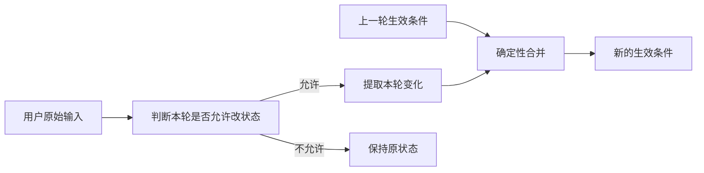

# 用户约束建模、提取与状态合并

这条线如果只总结成“用 LLM 做约束提取”，会把项目里真正值得讲的部分丢掉。单轮把“想吃火锅，人均 100”解析成 `cuisine=火锅`、`budgetPerPerson=100` 并不难，困难的是多轮以后系统必须连续回答四个问题：**这句话到底是在改条件还是只在问事实；如果要改，具体改了什么；它针对的是哪一套历史状态、哪一个商户；最后这些变化怎样确定地写回当前工作记忆。** 这篇就围绕这四个问题讲，不把类名当成知识点堆起来。

它和上一篇“多轮对话状态与工作记忆”是上下游关系。上一篇解决“当前业务真值放在哪里、不同 Task 怎么隔离”；这一篇解决“**一句自然语言如何安全地变成对当前业务真值的修改**”。可以把它理解成工作记忆的写入协议：先判断这一轮有没有修改权限，再提取本轮变化，必要时把“第一家、这家、刚才那个”等指代绑定到真实商户，最后由确定性代码把变化合并进当前状态。

## 一、这条线是怎么一步步做出来的

**最开始的方案很直接：让模型一次性提取结构化条件。** 用户说“在福州找人均 100 的日料”，`ConstraintExtractor` 通过结构化函数参数返回地点、菜系、预算等字段，后面的 SQL、语义检索和排序继续执行。比让模型先输出自然语言再自己正则解析稳定得多，所以这个起点本身没有问题。真正的问题是，随着业务变复杂，我们逐渐发现“结构化”不等于“语义已经设计正确”。

第一批问题来自**字段越加越多，但职责反而越来越模糊**。早期看到“约会”“安静”“不排队”这些需求，很自然地分别建 `occasion`、`quiet`、`avoidQueue`；又为了区分软硬条件出现 `hardConstraints`、`softPreferences`。短期每一个字段都有理由，长期却会变成“来一种用户说法就加一个字段”。2026-09-03 对约束对象做过一次字段职责盘点，最后形成的判断是：预算、距离、城市这类维度**范围有限、需要确定执行、下游明确消费**，适合独立字段；约会、聊天、氛围、聚餐、一个人吃这种语义是开放集，更适合统一进入 `preferences[]`。系统为了展示和审计产生的说明则进入 `systemNotes[]`，不能混进用户偏好。

当前 `DecisionConstraints` 不需要逐字段死背，但要知道它为什么长这样：

```text
DecisionConstraints
├── 搜索地点
│   ├── targetProvince / targetCity / targetDistrict / targetArea
│   └── locationIntent
│
├── 吃什么
│   ├── cuisine                  菜系/品类
│   ├── excludedCuisines[]       明确不要的菜系
│   └── keyword                  具体店名、招牌菜、明确实体
│
├── 可确定执行的条件
│   ├── budgetPerPerson
│   ├── radiusKm / nearby
│   └── arrivalTime
│
├── 开放式偏好
│   └── preferences[]            安静、约会、不排队、清淡……
│
├── 本轮状态操作
│   ├── clearedFields[]          明确清除哪些旧字段
│   ├── removedPreferences[]     明确删除哪些旧偏好
│   ├── budgetDirection          本轮“更便宜”等相对反馈
│   └── radiusDirection          本轮“更近”等相对反馈
│
├── 辅助状态
│   ├── missingInformation[]
│   ├── lockedConstraints[]
│   └── systemNotes[]
│
└── 仅当前请求使用，不进入工作记忆
    ├── sourceHints
    └── entityTypeHint
```

这里有两个之前文档讲得太快的字段，必须单独说清楚。**`sourceHints` 是“这个新条件是用户直接说的，还是系统从用户表达推出来的”的临时提示。** 它现在主要服务偏好来源，不直接持久化。比如用户说“想找安静一点的”，提取结果里有 `preferences=[安静]`，同时产生 `sourceHints["preference:安静"]=USER_EXPLICIT`，表示“安静”是用户亲口说的；用户说“想找个能和朋友聊天的地方”，系统会把它规范成“安静”这一可消费偏好，但因为原话没有直接说“安静”，来源记为 `DERIVED`；“和女朋友吃饭”被归纳为“约会”时同样属于推导。`ConversationCriteriaMerger` 会把这个临时来源转成 `sourceUpdates`，最后 `ConversationStateService` 再写入当前 Task 的 `constraintSources`。也就是说，**`sourceHints` 自己是一次性的，但它传递的“来源结论”可以进入长期状态。** 用户以后问“我什么时候说过要安静”，系统至少能区分“你明确说过”和“这是系统推导的”，而不是把推导结果冒充成用户原话。

`ConstraintSource` 当前只有三种：`USER_EXPLICIT` 表示用户明确输入，`SYSTEM_DEFAULT` 表示系统默认值，`DERIVED` 表示系统根据已有信息推导。例如用户说“附近”，系统默认把半径解释为 3km，这个半径来源就是 `SYSTEM_DEFAULT`；用户说“第一家太贵，便宜一点”，系统根据第一家的价格算出新预算，这个新预算属于 `DERIVED`。这和 `systemNotes` 也不是一回事：`constraintSources` 回答“这个条件从哪来”，`systemNotes` 更像给用户或审计看的解释文字。

**`entityTypeHint` 是地点解析时的一次性“类型线索”。** 用户说“福建师范大学附近”，模型可以抽出 `targetArea=福建师范大学`，同时给出 `entityTypeHint=UNIVERSITY`。后面调用高德 POI 搜索时，这个提示可以帮助“名称都差不多”的候选做排序：大学类候选比普通同名地点更靠前。但它不是事实，更不能因为模型说 UNIVERSITY 就把所有非大学候选直接删掉，所以当前实现把“类型相关度”只当排序信号，名称相关度仍然更重要。解析成功以后真正有长期意义的是规范地点名称、城市、区县和坐标，`entityTypeHint` 没必要进入工作记忆，因此字段被明确标成请求期信息。还有一个当前实现边界要知道：字段模型允许 `UNIVERSITY/MALL/TRANSIT/HOSPITAL/LANDMARK/UNKNOWN` 等值，但当前 `AmapPoiSearchProvider` 真正写了专门类型加分逻辑的主要是 UNIVERSITY，其他类型还没有形成同等级的专门排序规则，所以不能把它吹成完整的通用 POI 类型系统。

字段模型收敛以后，第二个问题是**同一个概念在不同模块里必须使用同一套规范值**。菜系是最典型的例子：用户说“日本料理”，商户画像可能写“日料,寿司”；如果提取侧做一套别名映射，过滤侧再维护另一套字符串比较，表面上大家都在传字符串，实际上语义已经漂移。于是后面把菜系统一交给 `CuisineCanonicalizer`，偏好也通过 `PreferenceCanonicalizer` 做常用表达归一。这里真正要记的是：**结构化字段一旦跨多个模块传递，规范化规则也必须只有一个来源。** 否则系统只是“看起来结构化”，每一层仍然在用自己的解释。

紧接着暴露的是 `cuisine` 和 `keyword` 的边界。`cuisine` 应该表示可归一化的菜系/品类，例如日料、火锅、小吃；`keyword` 更偏用户明确点名的具体店名、招牌菜或特定实体。早期两者边界不清，“沙县小吃”有时会进菜系，有时会进关键词。如果一个字段进入确定性过滤，另一个字段进入不同的检索路径，那么一次提取漂移就会造成完全不同的执行结果。后来除了 Prompt 收紧，还增加了迁移逻辑：某个 `keyword` 如果能明确归一到已知菜系，就迁回 `cuisine`，让它进入确定性过滤。这里形成了一个很重要的经验：**字段不是为了让 JSON 好看，而是在定义后面的执行语义；两个字段职责重叠，会把模型的小误差放大成系统错误。**

到这里我们仍然把“提取结果”看成一份状态，后来多轮反悔把这个思路继续证伪。假设上一轮已经是“福州 / 火锅 / 人均 100 / 安静”，这一轮用户只说“预算改成 80”。如果每轮都要求模型重新输出一份完整状态，那么它还得重新推断城市、菜系、偏好；只要一次漏掉“安静”，系统就可能误以为用户取消了这个条件。更麻烦的是，“这一轮没提预算”和“用户明确说预算不限”如果都用空值表示，程序根本区分不出来。

所以后面把输入改成**本轮增量变更（Delta）**：上一轮的完整状态继续作为基线，本轮只描述用户明确改变了什么，最后再由 `ConversationCriteriaMerger` 合成下一份完整状态。这里最关键的不是 Delta 这个英文，而是三个动作必须分开：**没提到 = 保持旧值，给新值 = 覆盖旧值，明确不要 = 清除旧值。**



“看看有没有别的吃的”就是一个很典型的坑。用户没有给新菜系，但语义上明确放弃了旧菜系。如果仅仅因为新 `cuisine` 为空就选择“继承旧值”，系统会继续拿原菜系搜索。后来增加 `clearedFields[]`，让这一轮能明确表示“清掉 cuisine/keyword”；“不用安静了”则通过 `removedPreferences=[安静]` 表达。这样**字段值**负责“改成什么”，**操作字段**负责“删除什么”，未出现才真正表示“不动”。

当前实现从语义上已经是增量，但类型上还没有完全纯化。`ConstraintExtractor` 返回的 Java 类型仍然是 `DecisionConstraints`，和最终完整状态共用一个类：普通字段表示本轮新增/覆盖，`clearedFields` 表示清除，`removedPreferences` 表示删除偏好，`budgetDirection/radiusDirection` 表示一次性的相对变化。因此更准确的说法是：**语义上是稀疏增量，结构上还是复用了完整状态 DTO。** 如果以后继续重构，更干净的做法是把“设置、清除、追加、删除、排除、相对变化”建成显式操作类型，让空字符串、-1、false 不再同时承担“本轮没提供”的哨兵语义。

增量解决了“改什么”，但真正危险的问题随后出现：**模型抽到一个字段，不代表用户这一轮真的要修改状态。** 用户问“第二家人均多少？”里面当然有“人均”；问“这个日料怎么样？”里面也出现“日料”。如果系统只看 `ConstraintExtractor` 能不能抽出值，然后“有值就写状态”，事实追问就会把当前搜索条件偷偷改掉。这个问题最终促成了 `TurnUnderstandingService`。

这个组件之前文档只说“它判断能不能改”，但没有讲怎么做。当前实现其实没有再调用一个 LLM，它是一个很小的**确定性单轮语义门**。输入包括用户原始消息、上下文改写结果、最近对话，以及必要时当前暂停决策状态；输出是一个请求期对象 `TurnCommandSet`。它主要做三件事：第一，看本轮有没有已经解析好的商户指代；第二，识别这是不是“当前条件是什么、为什么推荐”等只读查询；第三，判断原话里有没有明确的状态修改动作。当前修改动作采用比较保守的词类，例如“改成、换成、不要、不限、排除、更便宜、更近、换一批”等才算；仅仅出现“预算、人均、有什么、推荐”不会自动获得写权限。

`TurnCommandSet` 可以理解成**本轮语义判断结果**，不是长期业务状态。最重要的字段是 `mutationRequested`（本轮是否明确要求改状态）、`referenceOnly`（是否只是围绕一个已解析商户问事实）、`contextQueryRequested`（是否在问当前条件/来源/推荐原因），以及 `commands[]` 里记录的“设置条件、排除条件、引用商户、查询上下文”等控制信号。它不会写进工作记忆。

这里还要把 `TurnPlan` 和它区分开。`TurnUnderstandingService` **不直接产生 `TurnPlan`**。真正流程是：编排层先拿到 `TurnCommandSet`，完成本轮路由，然后 `ChatOrchestrationService.selectAction()` 根据“这轮要执行什么动作 + 是否允许修改条件”生成 `TurnPlan`。`TurnPlan` 只有两个关键维度：`executionAction` 表示这一轮最终执行哪条业务路径，`criteriaIntent` 表示这一轮是否允许修改条件；后者只有 `NONE` 和 `APPLY_DELTA`。到了后面的 `CriteriaReductionNode`，只有 `criteriaIntent=APPLY_DELTA` 才会真正进入 `prepareDecision()`、调用约束提取与合并。

可以用几个真实语义理解这套门：

```text
“换成日料，人均 80”
→ 明确修改条件
→ criteriaIntent = APPLY_DELTA
→ 再提取 cuisine=日料、budget=80

“第二家人均多少？”
→ 第二家先被解析成具体商户
→ 但没有状态修改动作，只是事实查询
→ criteriaIntent = NONE
→ 不允许约束提取结果写入工作记忆

“第一家太贵了，第二家有插座吗？”
→ 同一句同时包含“第一家”的价格反馈和“第二家”的事实查询
→ 引用解析先区分两个对象
→ “第一家”被识别为状态修改所针对的对象
→ 这一轮可以携带预算增量，同时事实查询仍绑定“第二家”
```

这里的“默认不写状态”非常重要。2026-09-07 之前实际上出现过两个判断来源：一处根据 `ConstraintExtractor` 是否抽到字段决定“像不像修改”，另一处又根据单轮语义判断一次，最终“第一家那个日本料理环境怎么样”这种纯事实问题可能因为提到了日本料理而把 `cuisine` 写进去。后面删除了旧的“抽到值就算修改”逻辑，引用态修改权限统一以 `TurnUnderstandingService` 为准；缺少这层语义判断时，引用态默认不允许修改。**提取器只负责告诉你“如果允许改，具体改什么”，不能再反过来给自己发写权限。**

再往下就是你提到的**上下文指代和“相对反馈到底针对谁”**。这是这条线里非常重要、而上一版确实缺失的一段。用户不会总说完整店名，更多时候会说“第二家”“最开始第一家”“这家”“刚才那个日料”“第一家太贵了”。如果每个模块都自己从字符串猜一次，就可能出现改写模块认为“第二家”是 B，工具层却根据新候选池把“第二家”理解成 E。后面把这件事拆成两步：`ReferenceIntentExtractor` 负责把自然语言中的引用变成结构化指代，`BatchAwareReferenceResolver` 再根据当前 Task 的推荐批次和焦点商户，把它绑定成确定的 `ResolvedShopReference`。

`ReferenceIntent` 的重要字段不多：`scope` 表示引用最新一批、最开始一批还是当前焦点商户；`ordinal` 表示第一家/第二家/第三家；`surface/start/end` 保存它在用户原句里的具体文本位置；`qualifier` 保存“日料、烧烤”这种描述；`mutationAnchor` 表示“这个引用是不是本轮价格/距离反馈真正针对的对象”。例如第一批推荐 A/B/C，第二批推荐 D/E/F，那么“第二家”默认绑定最新一批的 E，“最开始第二家”绑定最早一批的 B，“这家”优先按当前焦点商户解释。解析结果最终带着对应 Batch、序号、`shopId`、`shopName`，后续改写和工具绑定复用同一结果，不再各猜一次。

`ReferenceIntentExtractor` 也不是纯规则或纯模型二选一。高置信表达“第一家/第二家/第三家/首选/最开始/刚才那家/这家/那个”等先由集中规则识别；同时模型仍会处理规则没覆盖的自然表达，并补充 `qualifier`、`mutationAnchor` 等语义。早期出现过一个真实坑：只要规则命中“第一家”，就直接跳过模型，导致“第一家太贵了，第二个有插座吗”只留下第一个引用。后面改成规则结果和模型结果合并：规则已经识别的 span 优先，模型可以补充未覆盖的第二个引用，也可以给已有引用补充“它是价格反馈对象”这个标记。

模型给出的字符位置也不能直接相信。它返回的 `surface/start/end` 会重新和用户原句核对；位置不对时，只有当这段文本在原句里唯一出现，才允许重新定位，否则丢弃而不是猜。这个细节的价值在于：**自然语言解析可以概率化，但把解析结果绑定到哪个实体时要尽量可验证。**

`BatchAwareReferenceResolver` 本身不再理解自然语言，它只消费结构化引用。普通“第二家”去最新非空推荐批次找第二个；明确“最开始第二家”去最早非空批次；当前最新 Batch 如果是空 Batch，普通序号引用不会越过这个失效边界偷偷复活旧候选；带描述的引用会在对应 Batch 里根据商户名、菜系、引用标签匹配，只有唯一命中才解析，否则保持不确定，不强猜。这和上一篇保存 `RecommendationBatch` 的设计正好连起来：**没有历史批次边界，“上一批第二家”和“最开始第二家”根本没有稳定含义。**

这套引用结果还参与“太贵了”这种相对条件的锚点计算。当前价格路径的优先级很明确：如果本轮存在一个被解析并标记为 `mutationAnchor` 的具体商户，并且它仍在当前候选视图中，就优先使用这家店的人均价格；否则看当前 `focusedShopId`；还没有明确对象时，再从当前候选中已展示的商户取一个价格基准；再不行退到当前候选最低价；如果这一轮甚至没有候选池，例如用户开场就说“想找便宜点的火锅”，才退到菜系价格基准，当前实现优先查询该菜系平均价再乘 0.8，数据库不可用时还有硬编码兜底。

因此几个句子的实际区别可以这样理解：

```text
“第二家太贵了，便宜一点”
→ 第二家绑定到最新 Batch 的具体 shopId
→ 如果模型/引用解析把它标成价格反馈对象，优先用第二家的价格做基准

“XX 店太贵了”
→ 前提是这个店名/描述能够唯一绑定到当前推荐实体
→ 成功绑定后，同样可以成为本轮价格反馈对象

“太贵了，便宜点”
→ 没有明确商户引用
→ 先尝试当前焦点商户
→ 再退到当前展示/候选集合的价格基准
→ 这是启发式解释，不等价于系统真的知道用户在抱怨哪一家
```

最后一种要特别注意：当前代码选择了“尽量继续执行”的策略，而不是强制澄清，所以裸“太贵了”仍然存在语义不确定性。这是 Trade-off，不应该讲成完美指代系统。还有一个更具体的当前边界：**价格相对反馈已经能显式接收 `mutationAnchorShopId`，距离的“这家太远了/第二家太远了”路径目前还没有完全对称地消费这个显式商户锚点**；距离计算仍主要走焦点商户 → 当前展示候选 → 当前候选的回退链。因此面试时可以说价格锚点已经完成显式绑定，距离锚点还有进一步统一空间，不能笼统说两者实现完全相同。

引用处理还解释了为什么后来坚持**原始用户消息是本轮语义源，上下文改写只是辅助信息**。`ConversationContextRewriter` 会把“第二家”“这家”等引用替换成已经解析出的商户名，或者补全省略，让下游更容易理解；但一次改写可能只关注某个局部。如果把改写后的整句直接当成新的业务真相，原句里的另一条命令可能被吞掉。真实多轮链路里就出现过“当前位置 + 排除菜系”这样的复合信息被改写损失，以及商户描述中的“日料”被误当成新搜索条件。最终边界是：**约束提取仍读 `originalMessage`，引用解析结果作为旁路结构化信息传给后续模块；不再让改写后的字符串覆盖整轮语义。**

位置字段又把“语言理解”和“事实校验”的边界推了一步。城市、区县是可验证事实，而且直接决定搜索范围，所以模型填写 `targetProvince/targetCity/targetDistrict` 后不能立刻成为最终状态。当前 `ConstraintExtractor` 会先调用 `AdministrativeRegionResolver`，模型给出的行政字段最多作为候选提示，再由确定性行政区数据验证；解析歧义时清掉未经验证的行政字段并进入缺失信息，而不是把模型猜测写进去。POI 也类似，`entityTypeHint` 只是帮助候选排序，真正落到搜索位置的是解析后的规范实体和坐标。**模型适合做开放语言解释，可查证的领域事实尽量再经过确定性来源确认。**

最后看 `ConversationCriteriaMerger` 就比较容易理解了。它从上一轮生效状态开始，按固定顺序处理显式清除、地点切换、字段覆盖、负向菜系、偏好追加/删除、相对预算和距离，再生成新的完整状态。它同时产出 `CriteriaMergeResult`，记录 `inherited`、`replaced`、`appended`、`cleared`、`invalidated` 和 `sourceUpdates`。这些不是为了多几个类，而是为了让状态变化可解释：这一轮哪些是从上一轮继承的，哪些是用户改的，哪些被清掉，哪些派生结果需要失效，条件来源有没有变化。

```text
上一轮：福州 / 火锅 / 100 / [安静]
用户：预算改 80，不用安静了

本轮增量：
  budgetPerPerson = 80
  removedPreferences = [安静]

合并记录：
  inherited = [福州, 火锅, ...]
  replaced = [budgetPerPerson:100->80]
  cleared = [preferences:安静]

新的生效状态：
  福州 / 火锅 / 80 / []
```

这条线的整体设计最后可以压成一句话：**模型和规则负责把本轮自然语言解释成“候选语义”，引用解析负责把“这家/第二家”绑定到真实历史实体，`TurnUnderstandingService` 控制这一轮有没有资格修改状态，`ConstraintExtractor` 只提取允许写入的本轮变化，`ConversationCriteriaMerger` 再确定性合并，最终由 `ConversationStateService` 写入当前 Task。**

评测也能看出这条认知演进。2026-08-30 针对地点实体边界做过 Prompt v1/v2 实验，它的目的不是测整个 Agent，而是回答一个很具体的问题：**“继续给提取 Prompt 补正反例，能不能解决 targetCity 把菜名里的地名误当城市的问题？”** 已知样本里 `targetCity` 从 16/17 提升到 17/17，但独立留出集仍是 7/8，没有提升。这个结果只能证明新增示例修好了已知边界，不能证明泛化变强，所以当时没有继续为了追求基线全绿无限堆 Prompt。这个实验也推动后面把行政区事实更多交给确定性解析器。

字段职责重构后，`conversation-v1` Run 71 为 18/20，与重构前持平。它说明删掉一批专用字段、改成开放 `preferences` 后，现有会话评测没有出现明显回归；它不能证明所有开放偏好都被更准确地理解。2026-09-07 的单轮语义门、引用态写权限收口则主要依赖相关单测和少量定向 HTTP E2E，当时明确没有跑完整 robustness/v1/holdout，所以只能说已知“事实查询污染状态”等失败 Case 被定向验证，不能包装成完整 Agent 全量提升。

## 二、从这条线真正应该带走什么 Agent 开发经验

第一，**不要让模型每轮重建完整业务世界，已有状态稳定以后，本轮优先表达增量。** 多轮系统最怕把“没提到”误解释成“取消了”，或者让模型每轮重新猜已经确定的历史条件。增量把概率判断限制在这一轮，确定性合并负责继承过去。

第二，**“提到一个字段”和“允许修改这个字段”必须分开。** 用户问“第二家人均多少”时识别出价格语义完全正确，但这没有给系统修改预算的权限。越是会跨轮持久化、会影响 SQL 和工具调用的状态，越应该把读取/理解和写权限分离。

第三，**未提及、设置、清除、删除列表成员、相对调整是不同操作。** 一个 `null` 很难同时表达这些语义。反悔能力一旦进入业务，状态操作最好显式建模；DP-Plus 目前通过 `clearedFields`、`removedPreferences`、方向字段解决主要问题，但类型层面仍有进一步纯化空间。

第四，**引用不能每层各猜一次。** “第二家”必须先确定是哪一批的第二个商户，再把同一个绑定结果同时给改写、事实工具和约束合并使用。规则适合高置信序号和指示词，模型适合补开放表达，但最终的 span 和实体绑定要做确定性验证。

第五，**相对反馈必须先找到评价对象，再计算绝对条件。** “更便宜”不是固定预算。显式对象优先，焦点/展示集合只能做回退；如果对象本身不明确，就应该承认这是启发式解释，而不是把回退规则包装成“理解了用户真实意图”。

第六，**字段模型要从下游消费反推，而不是从自然语言名词反推。** 有限、稳定、需要硬执行的维度适合单独字段，开放场景适合标签；新字段上线前先问“谁消费它、消费方式是否一致”。`occasion/quiet/avoidQueue` 的删除就是这一原则的结果。

第七，**语言模型负责开放语义，可验证领域事实再交给确定性组件确认。** 行政区、规范菜系、POI 身份这类一旦直接影响搜索范围，就不能因为模型输出了一个字符串就当真。Prompt 能改善边界，但不能替代真正的数据约束。

## 三、这条线放到简历上怎么写

AI 应用/Agent 方向更推荐这一版：

> **多轮约束理解与状态归并：**针对用户反悔、条件继承及事实追问误改状态问题，将本轮自然语言解析为增量变更，并以独立单轮语义门控制状态写权限；结合历史推荐批次完成“第一家/这家”等实体绑定，再由确定性合并器处理继承、覆盖、清除和相对反馈，避免多轮条件污染。

Java 后端方向可以更工程化：

> **会话约束状态归并：**设计 previous + delta 的确定性状态合并链路，显式区分条件继承、覆盖、清除、偏好删除及相对调整；统一菜系/偏好规范化、行政区事实校验与历史实体绑定，并记录状态变更明细和来源，支持多轮会话问题定位与回归验证。

这里不建议写“约束提取准确率 100%”。仓库里确实有 `targetCity` 已知集 17/17，但留出集仍是 7/8，而且这个实验只针对单个字段的一类边界，不代表完整约束提取，更不代表整个 Agent。

## 四、面试问题

**Q1：为什么不让模型每轮直接提取一份完整约束，而要做本轮增量 + 合并？**

这题实际在问多轮状态为什么不能每次重新从历史计算。核心不是省一次模型调用，而是让已经确认的状态不再反复经过概率推理。

> 单轮时直接提完整约束没问题，但多轮以后上一轮已经有稳定状态，这一轮可能只说“预算改 80”。如果还让模型重建完整状态，它必须重新猜城市、菜系、偏好，任何一次遗漏都可能把旧条件弄丢。
>
> 所以后来改成上一轮状态作为基线，本轮只描述变化，再由确定性代码合并。这样“没提预算”就是继承，“预算改 80”就是覆盖，“预算不限”就是显式清除，三种语义不会混在一起。

**Q2：你们现在这个 Delta 是真正独立的数据结构吗？**

这里要主动说明当前实现边界，避免把设计说得比代码更漂亮。

> 语义上是增量，但类型上还不是完全独立。`ConstraintExtractor` 返回的还是 `DecisionConstraints`，普通字段表示本轮设置值，`clearedFields` 表示清除，`removedPreferences` 表示删除偏好，`budgetDirection/radiusDirection` 表示相对调整。
>
> 所以我会说它是“稀疏增量载体”。如果继续重构，我会把 SET/CLEAR/APPEND/REMOVE/EXCLUDE/RELATIVE 变成显式操作类型，减少空串、-1、false 这些哨兵值的歧义。

**Q3：`DecisionConstraints` 里最重要的字段有哪些？**

不要逐个背字段，按业务职责回答即可。

> 我主要分五类：地点目标，包括省市区、POI 和 locationIntent；食物目标，包括 cuisine、排除菜系和 keyword；确定性条件，包括预算、半径、附近和到店时间；开放式 preferences；以及本轮状态操作，包括 clearedFields、removedPreferences 和相对预算/距离方向。
>
> 另外 systemNotes 是系统解释，sourceHints 和 entityTypeHint 只在当前请求里辅助处理，不直接进入 Working Memory。

**Q4：`sourceHints` 到底是什么？为什么不直接写进 Working Memory？**

这题本质是在问“来源判断”和“长期状态”为什么分开。

> sourceHints 是提取阶段的临时来源提示。比如用户直接说“要安静”，会产生 preference:安静=USER_EXPLICIT；用户说“和女朋友吃饭”，系统推成“约会”，来源就是 DERIVED。
>
> 它本身不持久化，因为它属于本轮提取过程；Merger 会把有效来源转成 sourceUpdates，StateService 再写到 Task 的 constraintSources。这样长期状态保存的是经过合并后的来源结论，而不是整个提取器的中间对象。

**Q5：`entityTypeHint` 是什么？举个实际例子。**

> 比如用户说“福建师范大学附近”，targetArea 是“福建师范大学”，entityTypeHint 可以是 UNIVERSITY。调用高德 POI 搜索时，它告诉候选排序“大学类型更可能是用户要找的实体”，但不会因为类型不匹配就直接删候选，因为这个值来自模型，只能当提示。
>
> 解析完成后真正进入搜索状态的是规范地点和坐标，所以这个 Hint 不需要长期保存。当前代码里专门的类型加分主要实现了 UNIVERSITY，其他类型虽然在字段模型里有定义，还没有同等级的专门排序逻辑。

**Q6：`TurnUnderstandingService` 具体是怎么做“能不能改状态”的？它是不是又调了一次 LLM？**

这是当前文档里必须会讲的重点。

> 它自己不再调 LLM，而是一个比较小的确定性语义门。它读原始用户消息和已经解析好的引用结果，判断本轮是不是只读上下文查询、是不是只有商户引用，以及有没有“改成、换成、不要、不限、排除、更便宜、更近、换一批”这类明确状态修改操作。
>
> 输出是请求期的 TurnCommandSet，里面最重要的是 mutationRequested、referenceOnly、contextQueryRequested 和一些结构化命令。之后 ChatOrchestrationService 完成路由，再生成 TurnPlan；只有 TurnPlan.criteriaIntent=APPLY_DELTA，后面的 CriteriaReductionNode 才真正调用约束提取和合并。

**Q7：为什么 `TurnUnderstandingService` 和 `ConstraintExtractor` 不能合成一个模型调用？**

> 可以合，但风险边界不同。Extractor 负责“这句话里有哪些值”，而状态写权限决定这些值能不能跨轮留存。一旦把两者绑在一起，模型只要在事实问句里多抽出一个字段，就可能顺便把自己判成可写。
>
> 项目里真实出现过“第一家那个日本料理环境怎么样”被 cuisine 污染的情况，所以最后把引用态写权限收口到独立语义门，只有获得权限以后才去取 Delta。代价是多一层控制逻辑，收益是持久状态不会被提取器一次波动直接污染。

**Q8：你们“第一家、第二家、这家、最开始那家”到底怎么解析？**

这题对应上下文指代链路，不要只回答“靠上下文改写”。

> 现在先由 ReferenceIntentExtractor 把自然语言变成结构化引用，里面有 scope、ordinal、原文 span、描述词和是否为本轮评价对象。常见的第一/第二/第三家、最开始、这家/那家先走集中规则，模型负责补规则没覆盖的表达和 mutationAnchor。
>
> 然后 BatchAwareReferenceResolver 不再读自然语言，只拿结构化引用去 RecommendationBatch 里解析：普通第二家取最新非空 Batch 的第二个，最开始第二家取最早非空 Batch，FOCUSED 指向当前焦点商户。最终得到 batch + ordinal + shopId + shopName，改写和工具调用都复用同一份绑定结果。

**Q9：如果模型把指代位置抽错了怎么办？**

> 模型返回的 surface/start/end 不会直接信。系统会验证这个字符区间和原始消息是否真的一致；如果位置错了，只有当 surface 在原句里唯一出现时才允许重新定位，否则直接丢掉，不猜。
>
> 我们的思路是自然语言理解可以有概率性，但最后把它绑定到哪个真实实体时要尽量做可验证约束。

**Q10：“第二家太贵了”和直接说“太贵了”，预算调整到底根据谁？**

这是你现在最应该能说清楚的一道题。

> 如果“第二家”已经解析成具体商户，而且引用解析把它标记为本轮价格反馈对象，Merger 会优先使用这个 shopId 对应的人均价格作为基准。其次才看当前 focusedShopId。
>
> 如果用户只说“太贵了”，没有明确对象，当前实现会回退到焦点商户，再到当前候选中已展示商户的价格基准，再到当前候选最低价；如果连候选都没有，就用菜系价格基准。所以裸“太贵了”本质是启发式解释，并不能证明系统知道用户具体在嫌哪家贵。
>
> 当前还有一个边界：价格路径已经能显式使用 mutationAnchorShopId，但距离的“第二家太远”还没有完全对称接入这个显式锚点，距离主要仍按 focused/shown/current candidates 回退，这是可以继续统一的地方。

**Q11：为什么不直接让模型输出一个新的预算，比如“便宜一点”直接变成 80？**

> 因为“便宜一点”是相对语义，没有脱离对象的唯一数字。当前先提取 budgetDirection=-1，再由确定性代码根据商户价格算新预算。现在是基准价乘 0.85，并设置最低 20 元；如果开场没有候选，则用菜系价格基准。
>
> 方向字段被消费后会立即归零，因为它代表本轮命令，不是长期偏好。否则下一轮可能无意中再执行一次“继续便宜”。

**Q12：为什么 Original Message 必须保留，Context Rewrite 不是已经把上下文补全了吗？**

> Rewrite 最适合做“第二家→具体店名”“这家→焦点店”这种补全，但它只是在解决某一部分歧义。一句复合输入里可能还有“当前位置”“排除东北菜”等其他命令，改写时如果丢掉其中一部分，再把 rewritten query 当成整轮真相就会污染后续。
>
> 所以后来原始消息一直作为约束语义输入，结构化引用结果旁路传递。改写是辅助，不再覆盖用户原话。

**Q13：`null` 或空值为什么不能直接表示“清除”？**

> 因为“这一轮没提预算”和“用户明确说预算不限”都可能表现为空值，但前者应该继承，后者应该删除。合并器不可能从 null 猜出用户是不是主动取消。
>
> 所以后来把值和操作分开：clearedFields 表示清除字段，removedPreferences 表示删除某个偏好，真正没提到才表示不操作。

**Q14：为什么后来把 `occasion/quiet/avoidQueue` 这些专用字段删掉？**

> 因为它们代表的是开放式场景和偏好。今天有约会、安静、不排队，明天就有商务、亲子、夜宵、适合聊天，如果每一种都建字段，Schema 一定膨胀，而且很多字段可能只有生产者没有消费者。
>
> 后来保留预算、距离、地点、菜系这类稳定且需要确定执行的字段，开放语义统一进入 preferences。字段模型不是越细越高级，而是每个独立字段都应该有稳定语义和明确消费方。

**Q15：为什么 `cuisine` 和 `keyword` 要分开，还要统一 Canonicalizer？**

> cuisine 是可归一化类别，例如日料、火锅；keyword 更偏具体店名、招牌菜或实体。如果两者职责重叠，一次模型输出漂移就会走进不同的过滤/检索路径。
>
> 同时用户说“日本料理”、商户写“日料”时，提取侧和过滤侧必须使用同一 CuisineCanonicalizer，否则同义词会被硬过滤当成不匹配。结构化字段的意义建立在“上下游对这个值有同一种解释”之上。

**Q16：行政区为什么不能直接相信 LLM 提取结果？**

> 城市、区县是可以验证的事实，而且会直接改变搜索范围。模型可能把菜名里的地名当城市，也可能自动补用户没有说的层级，所以后面模型字段只作为候选提示，再由 AdministrativeRegionResolver 验证，确认后才进入状态。
>
> 这条经验可以概括成：开放自然语言交给模型理解，能通过字典、数据库或服务校验的领域事实尽量再过一道确定性验证。

**Q17：`ConversationCriteriaMerger` 为什么不能也交给模型？**

> 一旦已经知道“预算改 80、删除安静、保留福州火锅”，后面就是确定性的状态转移，没有必要再调用模型猜一次。Merger 从 previous 开始按规则处理继承、覆盖、清除、追加、相对变化和地点级联，并记录每一类变更。
>
> 这么做最大的收益是可测试、可审计和可复现：状态错了能看出是哪一步 inherited/replaced/cleared 出了问题，而不是只拿最终模型回答反推原因。

**Q18：你们怎么知道 Prompt 调优不是在记训练样例？**

> 当时 targetCity 已知集从 16/17 提到 17/17，但独立留出集仍是 7/8，没有改善，所以没有把“基线 100%”宣传成泛化成功，也没有继续堆示例追 100%。
>
> 这个实验最终帮助我们判断：Prompt 能修表达边界，但行政区这类可验证事实长期应该由确定性 Resolver 负责，而不是把所有责任继续压在 Prompt 上。

最后可以单独补、但不用在本文展开的知识有：Function Calling / JSON Schema 重点理解“模型生成结构化参数 ≠ 参数天然可信”；传统对话系统的槽位填充和状态跟踪可以拿来对照增量状态；Command/Event/State 可以帮助理解一次性方向字段为什么不能长期保存；JSON Patch / Merge Patch 可以作为更纯增量模型的参考。