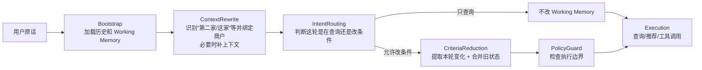
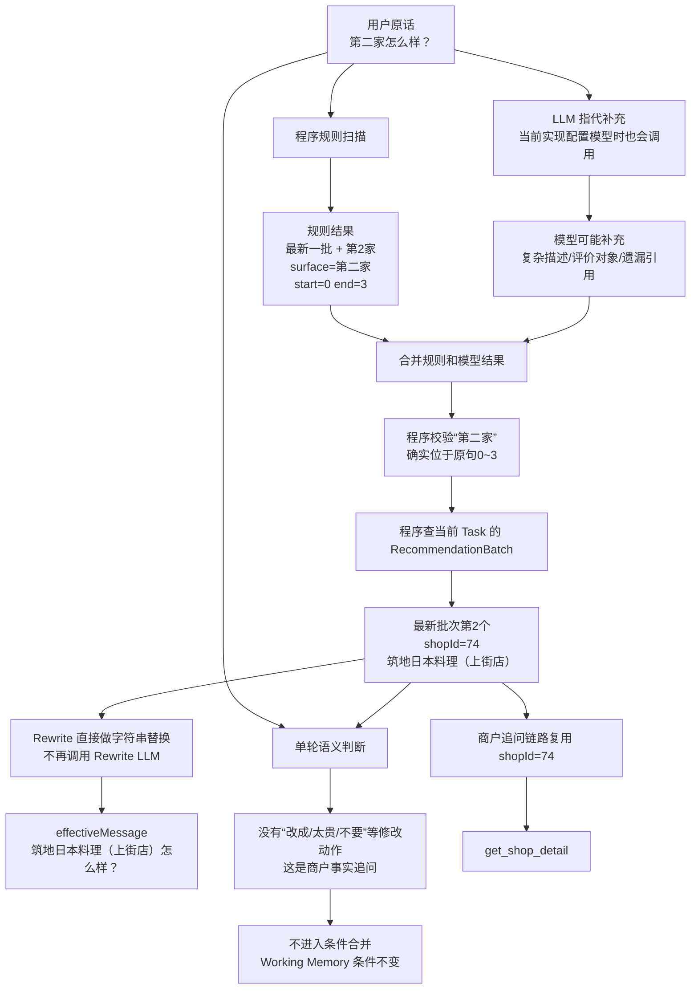

# 用户约束建模、提取与状态合并

这条线先从两个真实会把系统搞乱的场景开始。上一轮用户已经有一批推荐，下一轮只问：“**第二家人均多少？**”这本来只是查价格；但如果系统一看到“人均”就去提预算，再把提取结果写回工作记忆，就会把一次事实查询误当成“用户要改预算”。另一个场景是：“**第一家那个日本料理环境怎么样？**”这里“日本料理”只是描述第一家店，不代表用户以后都要找日料；如果直接写成 `cuisine=日料`，后面的搜索条件同样被污染。

所以这条线真正解决的不是“怎么让 LLM 多提几个字段”，而是几个更实际的问题：**这轮到底是在问事实还是改条件；如果真要改，改什么；“第二家、这家、最开始那家”到底是谁；最后这些变化怎样确定地合并到已有状态。** 前面几轮讨论里最容易让人糊涂的，也正是这些职责为什么要拆开、每一步到底是程序做还是 LLM 做、Rewrite 到底还有没有必要。下面全部按真实请求和代码走，不先堆类名。

> 【核心提炼】这条线的目标只有一个：**不能让一次语言理解的波动直接变成长期状态错误。** LLM 可以帮助理解，但“能不能写、写什么、写到谁、怎么合并”必须尽量有明确边界。

## 一、这条线在整个 Pipeline 里处在什么位置

当前主链路固定是：`BootstrapNode → ContextRewriteNode → IntentRoutingNode → CriteriaReductionNode → PolicyGuardNode → ExecutionNode`。这篇讲的内容其实横跨中间三段，不是某一个孤立组件：Rewrite 阶段现在顺带做商户指代识别与绑定；Routing 阶段会判断这一轮是不是允许改状态；CriteriaReduction 阶段才真正提取本轮条件变化并合并进 Working Memory。后面的 PolicyGuard 和 Execution 使用的已经是前面收敛好的确定状态。当前代码里的 Pipeline 就是这个顺序：

```java
private ChatPipeline chatPipeline() {
    List<ChatPipelineNode> nodes = Arrays.asList(
        new BootstrapNode(this),
        new ContextRewriteNode(this),
        new IntentRoutingNode(this),
        new CriteriaReductionNode(this),
        new PolicyGuardNode(this),
        new ExecutionNode(this)
    );
    return new ChatPipeline(nodes);
}
```

可以先把本文在整个系统里的角色记成下面这张图。灰色概念不需要背，重点看数据怎么一步步从“用户原话”变成“可执行状态”。



这里已经埋着一个我们刚刚讨论出来的新问题：**商户指代识别、Rewrite、单轮语义判断都在理解“用户这句话到底什么意思”，职责开始出现重叠。** 这个问题后面单独展开，先看当前链路到底怎么跑。

> 【核心提炼】本文不是“约束提取器说明书”。它讲的是 Pipeline 中从**自然语言 → 对象绑定 → 写权限 → 本轮变化 → 新状态**这一整段写入链路。

## 二、先用仓库里的真实评测数据，把整条链走一遍

仓库里有一个真实评测用例 `CONTEXT_REWRITE_SECOND_CANDIDATE`。第一轮用户在坐标 `(26.05367074313305, 119.187378)` 说“**帮我看看附近有没有什么好吃的**”，第二轮说“**第二家怎么样？**”。V30 的评测数据要求第二轮最终落到 **筑地日本料理（上街店），shopId=74**，并进入商户详情查询；后续 V31 又把 Rewrite 的断言从死盯店名收敛成“识别到候选序号 2”，避免把动态候选顺序和改写文本绑得过死。

仓库中的商户数据里，shopId=74 确实是“筑地日本料理（上街店）”，人均 165 元。下面就用这条真实用例看第二轮到底发生什么。



这个例子里要特别看清一个细节：**“第二家是谁”最终不是 LLM 决定的。** LLM 最多帮助理解复杂说法；真正把“最新一批第 2 个”变成 shopId=74 的，是程序读取 `RecommendationBatch`。而且一旦绑定成功，后面的商户追问可以直接复用这个 ID。

如果第二轮换成“**第二家太贵了，便宜一点**”，前半段“第二家是谁”完全一样，只是单轮语义判断会看到“太贵、便宜一点”，允许进入条件修改；约束提取器得到“本轮要求更便宜”，合并器再用第二家真实价格作为基准计算新预算。也就是说：**同样提到了第二家，事实查询和状态修改在这里正式分叉。**

> 【核心提炼】一条请求不是直接“扔给 LLM 得答案”，而是先把能确定的东西逐步确定下来。真实店是谁、这轮能不能改状态，都先收敛以后，后面的模型和工具才有更小的自由度。

## 三、为什么后来不再“每轮提一份完整条件”

最早最自然的做法是：每轮都让模型输出一份完整结构化条件。单轮没问题，多轮很快会出错。假设上一轮已经确定“福州 / 火锅 / 人均 100 / 安静”，用户这一轮只说“**预算改成 80**”。如果仍让模型重新生成完整状态，它就必须再次输出福州、火锅、安静；它只要漏掉一个，系统就可能把一个仍然有效的旧条件误删掉。

所以后来改成：**旧状态作为基线，本轮只表达变化。** 用户没提某个字段，就保持旧值；给了新值，就覆盖；明确取消，就删除。这里最关键的是“没提”和“删除”不能混在一起。

比如上一轮预算 100：

```text
用户：再推荐几家
→ 这一轮根本没提预算
→ 预算应该继续是 100

用户：预算不限
→ 用户明确取消预算限制
→ 预算应该被清掉
```

如果两种情况都只得到 `budget=null`，程序就不知道这个 null 到底表示“没说”还是“故意取消”。因此现在把**值**和**操作**拆开：普通字段表示“改成什么”，`clearedFields[]` 表示“明确删哪些字段”，`removedPreferences[]` 表示“明确删哪些偏好”。“不用安静了”不是把整个偏好数组清空，而是只删除“安静”；“看看有没有别的吃的”可以明确清掉旧 `cuisine/keyword`，而不是因为本轮没说新菜系就继续错误继承。

当前实现从语义上已经是增量，但 Java 类型还没完全纯化：本轮变化和最终完整状态仍共用 `DecisionConstraints`。所以准确说法是**“稀疏增量”**，而不是已经有一个特别漂亮的独立 Delta 类型。以后如果继续重构，可以把 SET、CLEAR、REMOVE、RELATIVE 这些操作做成真正独立的类型，进一步减少空串、-1、false 这类哨兵值。

当前重要字段也不用背成 DTO 清单，按后面谁会用它来记即可：地点字段给搜索范围用，`cuisine/keyword/excludedCuisines` 给餐饮目标和过滤用，预算/距离/时间给确定执行用，`preferences[]` 放开放偏好，`clearedFields/removedPreferences/budgetDirection/radiusDirection` 表示这一轮要做的操作。`sourceHints` 只是在本轮告诉系统“这个条件是用户明确说的、系统默认的还是推导出来的”；`entityTypeHint` 只是地点解析的临时提示，完整位置链路在第三篇单独讲。

> 【核心提炼】多轮状态最重要的是区分：**没说 = 不动，给新值 = 覆盖，明确取消 = 删除。** 这也是为什么“值”和“操作”必须分开。

## 四、为什么“能不能改状态”和“具体改什么”必须拆开

还是看“**第二家人均多少？**”。这句话里确实有“人均”，模型也完全可能抽出价格相关信息；但用户是在问第二家价格，不是在说“把我的预算改掉”。如果一个模块既负责提字段，又负责决定自己有没有写权限，就可能出现：看见“人均” → 抽到价格 → 认为自己有东西可写 → 顺手污染 Working Memory。

现在先放一道很小的“写权限门”。这一层主要是程序规则，不是再调一个 LLM。核心代码就是看原话里有没有明确的状态修改动作：

```java
private boolean hasExplicitMutationSignal(String text) {
    return containsAny(text,
        "改成", "换成", "调整为", "设置为", "改为",
        "不要", "不用", "去掉", "清除", "取消", "不限",
        "排除", "除了", "太贵", "便宜点", "更便宜",
        "太远", "近一点", "更近", "换一批"
    );
}
```

所以“第二家人均多少”默认没有写权限；“第二家太贵了，便宜一点”才有。后面的 `CriteriaReductionNode` 也不是每轮都跑约束合并，只有前面已经把 `criteriaIntent` 判成 `APPLY_DELTA`，才真正进入 `prepareDecision()`：

```java
@Override
public void reduceCriteria(ChatProcessingContext context) {
    if (context.getTurnPlan() == null
            || context.getTurnPlan().getCriteriaIntent() != CriteriaIntent.APPLY_DELTA) {
        return;
    }
    prepareDecision(context);
}
```

这就是拆模块真正的原因：**隔离风险，而不是为了架构好看。** 即使后面的 LLM 多抽了一个词，只要前面没给写权限，它也碰不到长期状态。相反，如果“提取字段”和“判断能不能写”由同一次模型结果共同决定，模型一次误判就可能同时拿到内容和写权限。

> 【核心提炼】先问“这轮有没有资格改”，再问“具体改什么”。两步分开以后，提取错误不会自动升级成持久状态错误。

## 五、“第二家”“最开始第二家”“这家”到底怎么实现

这部分先把中文叫法定下来，后面别再被类名绕进去：`ReferenceIntentExtractor` 可以理解成**商户指代识别**，`BatchAwareReferenceResolver` 可以理解成**商户实体绑定**。前者回答“用户说的是最新第几家、最开始第几家、还是当前这家”；后者把这个描述真正落到某个 `shopId`。

假设系统先后推荐过两批：

```text
第1批：A / B / C
第2批：D / E / F
```

用户说“第二家”，默认是最新一批 E；说“最开始第二家”，才是第一批 B；说“这家”，优先指当前聚焦商户。当前识别不是纯规则，也不是纯 LLM，而是**规则和 LLM 两条线都跑，再合并**。真实代码入口非常直接：

```java
public List<ReferenceIntent> extract(String message) {
    List<ReferenceIntent> rules = extractByRule(message);
    return mergeRuleAndModel(message, rules, extractByModel(message));
}
```

规则负责最确定的表达：

```java
private static final Pattern ORDINAL = Pattern.compile(
    "(?:(最开始|最初|一开始)\\s*)?(第一家|首选|第二家|第三家)"
);
private static final Pattern FOCUSED = Pattern.compile(
    "刚才那家|刚才那个|上一轮那个|上一家|这家|那家|这个"
);
```

所以“第二家”的 `ordinal=2`、“最开始第二家”的“最早批次 + 第 2 个”，这些都可以由程序直接算。LLM 主要补规则不好覆盖的表达和复合句，比如“**第一家太贵了，第二个有插座吗？**”：规则能抓到“第一家”，模型可以补“第二个”，还可以告诉系统“第一家”才是这轮价格反馈针对的对象。

这里有一个我们刚刚审代码时确认的新问题：**只要 AI Client 配好了，当前 `ReferenceIntentExtractor` 即使规则已经完全命中，也仍然会调用 LLM。** 代码注释给出的理由是：命中一个规则不代表整句话里没有其他未覆盖引用。所以当前设计重点是“规则保底正确性 + LLM 补覆盖率”，并没有真的省掉模型调用。

这件事为什么仍有意义？因为模型和规则重叠时，规则结果是底座，模型主要补充 `mutationAnchor`、描述词或未覆盖的第二个引用，不会随便把规则算出的“第几家”整体推翻。但它的 Trade-off 也很明确：**简单句也要付一次模型延迟和 Token。** 更合理的下一步是加高置信 Fast Path：像“第二家怎么样”“最开始第一家有券吗”这种规则已经完整覆盖的简单句直接跳过模型；只有多引用、复杂描述、规则没覆盖时再调 LLM。这个优化目前还没做。

接着说 `surface/start/end`。它并不是为了“让模型数第几家”，而是为了记录**“第二家”这几个字在用户原句的哪个位置**。例如：

```text
第一家太贵了，第二家有插座吗？
^^^^          ^^^^
第一个引用      第二个引用
```

测试里真实断言过：第一家从位置 0 开始，第二家从位置 7 开始。保存位置有两个用途：第一，一句话有多个引用时能知道每个引用对应哪一段；第二，Rewrite 做字符串替换时能只替换对应那几个字，而不是全局乱替。

你前面质疑“让 LLM 输出 start/end 很危险”是对的。模型可能把 0-based/1-based 搞错，也可能单纯数错。因此当前代码**不直接相信模型位置**：

```java
if (start != null && end != null
        && start >= 0 && start < end && end <= message.length()
        && message.substring(start, end).equals(surface)) {
    return true;
}

int first = message.indexOf(surface);
if (first < 0
        || message.indexOf(surface, first + surface.length()) >= 0) {
    return false;
}
intent.setStart(first);
intent.setEnd(first + surface.length());
```

也就是说，模型先“提议”一个位置，程序自己 `substring()` 验证；如果位置错了，但这几个字在原句中只出现一次，程序自己重算；如果出现多次又无法确定，直接丢弃，不继续猜。这个方案比直接信模型安全，但仍然有改进空间：**能由程序从 `surface` 推导出的下标和序数，最好都让程序算，LLM 只输出真正需要语言理解的语义。**

最后一步实体绑定已经完全是确定性程序。核心逻辑就是：

```java
RecommendationBatch batch = intent.getScope() == EARLIEST
        ? firstNonEmpty(batches)
        : latestNonEmpty(batches);

RecommendationCandidateRef candidate =
        batch.getCandidates().get(intent.getOrdinal() - 1);

return new ResolvedShopReference(
        intent, batch, intent.getOrdinal(),
        candidate.getShopId(), candidate.getShopName());
```

因此真正链路是：**“第二家” → 最新批次第 2 个 → 查 Batch → 得到真实 `shopId`。** LLM 不应该直接生成 shopId。

> 【核心提炼】当前指代链是“规则 + LLM 补充 → 程序校验 → 程序查 Batch 绑定 shopId”。高确定性的序号、下标和实体 ID 越能交给程序，就越不应该让模型自由生成。

## 六、原话、Rewrite 和实体 ID 到底怎么配合，以及我们新发现的职责重复

先看 Rewrite 为什么曾经需要。用户可能说“**就按我当前位置找吧，除了东北菜都可以。**”这句话同时有两件事：位置切到当前设备；排除东北菜。如果 Rewrite 只顾着补“当前位置”，把整句话改成“按当前位置继续搜索”，原句里的“排除东北菜”就丢了。项目里确实出现过这类复合语义被改写吞掉的问题，所以后来约束提取明确优先读 `originalMessage`：

```java
extracted = constraintExtractor.extract(
    context.getOriginalMessage(),
    activeCriteriaBeforeExtraction
);
```

因此现在三种信息的边界应该这样理解：**原话**保存用户完整语义，是权限判断和约束提取的主要来源；**Rewrite**只是把上下文省略补完整，方便后面的路由或回答；**已经绑定好的实体 ID**直接告诉下游“这家到底是谁”，不需要再从自然语言猜一次。

真正有意思的是：随着 Working Memory、推荐批次、焦点商户、商户指代绑定这些东西逐渐结构化，Rewrite 的很多职责已经被别的组件吃掉了。当前 `ConversationContextRewriter` 在有明确商户引用时，其实已经是：先拿到绑定好的实体，再用 Java 直接把原文中的“第二家”替换成店名，而且 `usedModel=false`：

```java
if (!resolved.isEmpty()) {
    String rewritten = replaceResolvedReferences(query, resolved);
    result.setRewrittenQuery(rewritten);
    result.setUsedModel(false);
    result.setReason("BATCH_REFERENCE_RESOLVED");
    return result;
}
```

也就是说，对“**第二家怎么样？**”这类请求，系统在 Rewrite 之前其实已经知道：`shopId=74`、店名=筑地日本料理。然后它又把文字改成“筑地日本料理怎么样？”，让下游继续理解这句话。这里就出现一个很直接的问题：**既然已经有 shopId，为什么还要把确定信息重新变回自然语言？**

更明显的是“**这家有优惠券吗？**”。只要“这家”已经绑定到当前焦点商户，后面的工具真正需要的是 `shopId`，不是一句更完整的中文。`AgentConversationService` 现在本身就能复用前面已经解析好的 `resolvedReferences`，而单商户工具如果参数里没写 `shopId`，还会从显式引用或 `focusedShopId` 补进去：

```java
if (explicitlyReferencedShopId != null && isSingleShopTool(toolName)) {
    input.put("shopId", explicitlyReferencedShopId);
} else if (isSingleShopTool(toolName)
        && !input.containsKey("shopId")
        && context.getFocusedShopId() != null) {
    input.put("shopId", context.getFocusedShopId());
}
```

甚至用户只说“**有优惠券吗？**”，没有“这家”两个字，商户追问链已经有“事实问题可以继承当前焦点商户”的逻辑；而 Rewrite 的 `needsRewrite()` 同时又把“有优惠/有券/营业/地址”等列为可能需要 LLM 补全的句子。于是当前设计里确实存在**结构化上下文已经足够，但 Rewrite 仍可能再做一次文本理解**的重复。

这就是我们这次审查后得到的新认知：**Rewrite 早期有价值，是因为上下文主要藏在聊天文本里；现在上下文已经越来越结构化，固定 Rewrite Node 的必要性开始下降。** 当前它还不能直接删除，因为像“走过去多久？”、“附近呢？”这类开放省略在某些链路里仍可能需要补上下文；但更合理的方向不是让 Rewrite 永远站在主链路上，而是把它降成**无法用结构化状态确定时的 fallback**。

当前实现可以概括成：

```text
用户原话
→ 指代识别/实体绑定
→ 如果能绑定，Rewrite 用 Java 替换店名
→ 如果不能直接解决但 needsRewrite 命中，可能再调用 Rewrite LLM
→ Routing 再判断本轮动作
```

我们现在更倾向的目标形态是：


同样，`ReferenceIntentExtractor` 现在“规则命中仍必调 LLM”也属于可继续收敛的地方。最终更合理的原则是：**能由程序和现有状态直接确定的，就直接传结构化结果；只有开放语言真的无法确定时再请 LLM 帮忙。** 这样不仅减少 Token 和延迟，更重要的是减少同一句话被多个模块重复解释后产生冲突的机会。

这里要注意：这是**基于当前代码审查得到的重构建议，代码还没有按这个目标改完**。文档必须把“当前实现”和“我们认为下一步应该怎么改”分开，不能把建议写成已经上线。

> 【核心提炼】Rewrite 不是天然必须存在。**如果“这家是谁、要查什么、工具参数是什么”已经能从结构化状态确定，就没必要先生成一条新中文再让下游理解。** 当前 Rewrite 更适合逐步降级成复杂省略场景的 fallback。

## 七、相对反馈和合并：为什么还要确定顺序

“**第二家太贵了，便宜一点**”和“**太贵了，便宜一点**”不一样。前者已经有明确商户锚点，后者没有。当前价格链优先使用本轮已经绑定的修改对象，其次看当前焦点商户，再退到已展示候选和候选池；开场没有候选时才退到菜系价格基准。

如果第二家就是前面的筑地日本料理，仓库数据里它人均 165 元；按当前业务规则，新预算大致是 `round(165 × 0.85)=140` 元，并且最低不低于 20 元。这里的 0.85 和 20 元不是模型学出来的，也不是行业标准，而是业务侧为了避免用户一句“太贵”就把预算调整得过激设置的经验值。更早“锚点价格减 1 元”的方案几乎没有业务意义，所以才换成比例收紧。距离“更近一点”思路类似，但“第二家太远”目前还没有像价格一样完全复用显式商户锚点，这是现有遗留改进点。

合并器也不是简单把新对象覆盖旧对象，因为操作之间有顺序依赖。比如“**不要火锅了，换日料，人均改成 80**”，如果先写新菜系再执行“清掉旧菜系”，新值也可能一起被删掉；从“我附近”切到“杭州西湖”时，如果先写城市却没处理旧的当前位置语义，`nearby/radius` 也可能残留。因此合并必须有固定顺序：先处理显式清除和作用域变化，再写新值，再处理偏好增删和相对调整。

同时 `CriteriaMergeResult` 会记录这一轮哪些字段继承、哪些覆盖、哪些追加、哪些清除、哪些派生结果失效。这个记录不是为了日志好看，而是为了排查“最后为什么变成这样”。预算从 100 变成 85，可以确认是用户明确改的，还是相对预算规则算的；换城市以后候选被清空，也能确认是不是地点变化触发的正常级联失效。

地点本身已经复杂到单独拆成第三篇：行政区、POI、设备 GPS、附近半径、同名区县消歧和多轮地点切换都在 `03_地理位置解析与多轮位置状态——开发故事与面试准备.md`。本篇只记住：**地点字段一旦变化，会改变合法候选范围，因此不仅要改字段，还要让旧候选和焦点商户失效。**

> 【核心提炼】先确定“改谁、改什么”，最后才进入合并。固定顺序保证同一组操作得到稳定结果，变更明细保证以后能定位是哪一步把状态改坏了。

## 八、从这条线得到的新理解，以及当前还没解决完的问题

这条线最初看起来只是“约束提取”，最后其实演进成了一个更通用的 Agent 状态写入问题。第一，**已有状态稳定以后，本轮只表达变化，不要让模型每轮重建整个世界。** 第二，**理解到一个词不代表有权修改它，写权限要单独守。** 第三，**自然语言里的“第二家”先转成真实实体，再把实体 ID 给后面用，不要每层重新猜。** 第四，**能由程序算出来的序号、字符位置、shopId、状态转移，就尽量不要让 LLM 自由生成。** 第五，**自然语言 Rewrite 应该是辅助，不应该重新成为业务真相。**

这次继续读代码以后，又发现两个值得后续重构的问题。一个是商户指代识别目前即使规则完整命中，也会调用 LLM，覆盖率高但有额外延迟和 Token，可以加高置信 Fast Path。另一个更大：`ContextRewriteNode` 在结构化状态已经足够时仍可能做重复工作，未来应该评估把**指代解析前置成独立结构化步骤，Rewrite 降级成 fallback**，甚至让 LLM fallback 直接输出结构化动作/引用，而不是再生成一条新中文。

这两个问题现在都应该作为**架构审查结论/待验证方案**记录，而不是写成已经完成的优化。后续如果真改 Pipeline，必须补对照评测：至少比较模型调用次数、平均/长尾延迟、Token、原有路由/指代用例通过率，以及多实体复合句是否出现回归。

> 【核心提炼】这条线正在从“文本补全驱动”继续往**结构化上下文驱动**演进。减少 Rewrite 不是目的，减少重复理解和互相冲突才是目的。

## 九、面试时真正值得准备的问题

**Q1：为什么不每轮重新提完整条件？**

先讲多轮状态问题，不要先讲 Token。

> 上一轮状态已经确认过，这一轮用户通常只改一两个条件。如果每轮让模型重建完整状态，漏掉一个旧字段就可能误删。现在以上一轮为基线，本轮只提变化，再由确定性程序合并。

可能追问：为什么空值不能直接表示删除？答：因为“没提”和“主动取消”都可能为空，必须把值和删除操作分开。

**Q2：为什么先判断能不能改，再提具体字段？**

> 因为事实查询也会出现“人均、日料”等词。识别到了内容不等于用户允许系统改长期状态。把写权限单独收口以后，后面的模型即使多抽一个字段，只要前面没放行，也改不了 Working Memory。

可能追问：为什么不让同一个 LLM 同时输出 shouldMutate 和字段？答：可以，但一次模型错误会同时拿到内容和写权限，故障边界更大；当前项目更愿意让高风险写权限走窄规则。

**Q3：第一家、第二家、这家到底怎么解析？最终谁决定 shopId？**

> 当前先由程序规则抓标准表达，同时 LLM 补复杂说法和多引用；程序再校验引用文本的位置，最后根据 RecommendationBatch 和 focusedShopId 确定真实 shopId。最终实体绑定是程序，不是模型自由生成。

可能追问：既然规则命中也会调用 LLM，规则还有什么价值？答：当前规则主要提供高确定性底座，不是为了省模型调用；模型主要补未覆盖引用和复合语义。这个实现还有 Fast Path 优化空间。

**Q4：为什么还保存 start/end？模型不是很容易数错吗？**

> start/end 不是商户序号，而是“第二家”这几个字在原句里的位置，用于一句话多引用的区分和精确替换。模型给的位置不直接信，程序会 substring 校验；位置错但文本唯一时程序自己重算，多次出现无法确认就丢弃。

可能追问：能不能不让模型输出数字位置？答：可以，而且这是更干净的方向——模型只给 surface 和语义，能由程序唯一定位的下标让程序算。

**Q5：Rewrite 到底还有什么用？为什么现在觉得它可能重复？**

> 早期很多上下文只存在聊天文本里，Rewrite 用来补“这家、走过去多久、有券吗”这类省略很有价值。但现在 Working Memory 已经有 focusedShopId、RecommendationBatch 和 resolvedReferences，很多请求已经能直接得到结构化参数。像“这家有优惠券吗”，一旦拿到 shopId，就没有必要再改成完整中文后让下游重新理解。

可能追问：那是不是应该直接删 Rewrite？答：不能直接删。开放式省略仍可能需要它，当前更合理的方向是把它降为结构化状态无法确定时的 fallback，并通过评测验证是否能减少模型调用且不损失覆盖率。

**Q6：“第二家太贵了”和“太贵了”预算分别根据谁？**

> 前者优先用已经绑定的第二家真实价格；后者没有明确对象，只能按焦点商户、已展示候选、候选池逐级回退。相对反馈必须先确定锚点，再把“更便宜”转成绝对预算。

可能追问：0.85 和 20 元是不是实验最优？答：不是，是当前经验参数，生产上还需要数据校准；距离链也还没有完全复用同一套显式锚点。

**Q7：原话、改写句、实体 ID 到底谁更可信？**

> 原话负责“用户到底说了什么”，是权限和约束提取的主要语义源；改写句只补省略；实体 ID 负责“第二家到底是谁”，后续能直接消费就直接消费。之前“当前位置 + 排除东北菜”被 Rewrite 吞掉负向条件，就是为什么不能让改写句覆盖原话。

可能追问：为什么不全靠结构化结果，不保留原话？答：结构化提取本身也可能漏信息，原话仍是审计和重新理解的证据源；结构化状态负责执行，原话负责证据，两者职责不同。

**Q8：合并器为什么要固定顺序？**

> 因为清除、设置、地点切换、相对调整不是可以任意交换顺序的操作。固定顺序保证同一输入得到稳定结果；同时记录继承、覆盖、清除和失效，才能知道状态错误具体发生在哪一步。

可能追问：最终回答对就够了吗？答：不够，Agent 可能最终一句碰巧正确但中间状态已经污染，下一轮才爆出来，所以必须看状态轨迹。

## 十、简历口径

AI 应用 / Agent 方向可以写：

> **多轮约束理解与状态归并：**针对事实追问误改状态、用户反悔及历史商户指代问题，将本轮输入拆分为状态写权限、增量条件和商户实体绑定，再由确定性合并器处理继承、覆盖、清除与相对反馈，避免自然语言理解波动直接污染多轮业务状态。

Java 后端方向可以写：

> **会话状态归并：**设计 previous + delta 的确定性状态更新链路，显式区分继承、覆盖、清除及相对调整；基于历史推荐批次完成商户序号与实体 ID 绑定，并记录状态变更明细，支持多轮会话问题定位与回归验证。

当前还不建议把“移除 Rewrite”“Reference Fast Path”写进简历，因为这只是这次审查得到的下一步方案，尚未完成代码改造和对照评测。它们更适合面试时作为“我继续审项目后发现的架构改进方向”来讲。