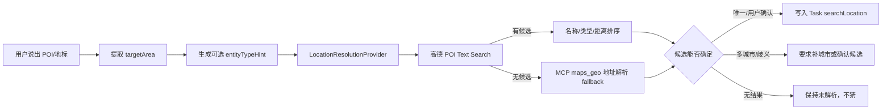
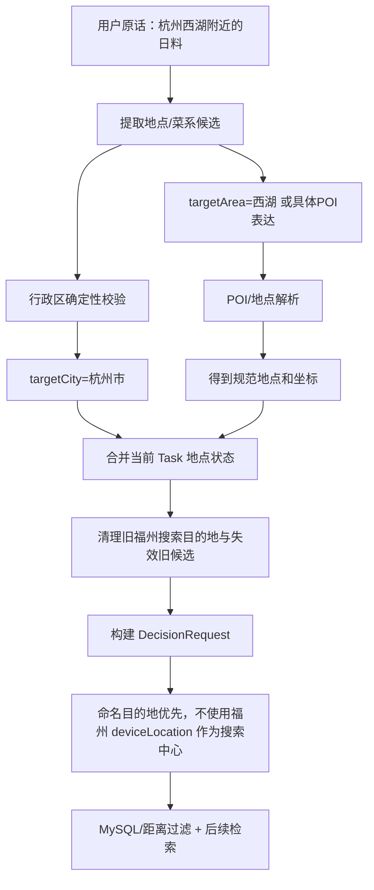

# 地理位置解析与多轮位置状态

这条线值得单独拆出来，因为“地点”表面上只有几个字段，实际同时涉及三类完全不同的问题：**行政区是谁、POI 到底是哪一个实体、用户说“我附近”时用哪组设备坐标。** 这三类问题的可信来源不同、失败策略不同、最后进入检索的形式也不同。如果全部塞在“约束提取”里讲，容易只记住几个字段名，却解释不清为什么一个地点能直接做 SQL 过滤，另一个地点必须先解析成坐标。

当前实现应以 main 分支的代码为准。最重要的总原则是：**模型可以帮助理解用户在说什么，但地点 identity 和执行范围不能只靠模型猜；行政区交给确定性行政区解析，POI 交给地图实体解析，“我附近”交给设备定位。**

> 【核心提炼】同样是“地点”，行政区、POI、设备位置不是同一种数据。先确定地点语义属于哪一类，再选择对应的可信来源和执行方式。

## 一、先把地点字段的职责分清楚

当前 `DecisionConstraints` 里与地点直接相关的字段主要是 `targetProvince`、`targetCity`、`targetDistrict`、`targetArea`、`locationIntent`、`nearby` 和 `radiusKm`。前四个描述“用户明确要去哪搜”，`locationIntent` 描述“这个搜索范围来自命名地点还是用户当前位置”，`nearby/radiusKm` 描述是否需要局部半径约束。

```text
targetProvince
= 省级行政范围，例如 福建省
= 下游投影到 DecisionRequest.province
= 进入结构化行政范围过滤

targetCity
= 城市/直辖市，例如 福州市、重庆市
= 下游投影到 DecisionRequest.city
= 既参与结构化过滤，也可作为 POI 搜索的城市上下文

targetDistrict
= 区/县级行政范围，例如 鼓楼区、闽侯县
= 下游投影到 DecisionRequest.district
= 进入结构化行政区过滤

targetArea
= 非行政地点，例如 福州大学、解放碑、某商圈、车站
= 不能直接当 district 过滤
= 需要进一步解析成规范 POI/地址和坐标

locationIntent
= EXPLICIT_TARGET / CURRENT_DEVICE / UNSPECIFIED
= 决定执行时优先使用命名目的地还是设备当前位置

nearby
= 用户要求局部附近搜索

radiusKm
= 实际半径；nearby=true 且没给半径时，系统默认补 3km
```

`targetDistrict` 和 `targetArea` 必须分开，是因为两者消费方完全不同。用户说“鼓楼区”，数据库里本来就有行政区字段，可以直接做硬过滤；用户说“福州大学”，数据库不可能把每个 POI 都当成 district，所以必须先把“福州大学”解析成一个真实地点，再以坐标作为空间搜索锚点。把二者混成一个字段，会让上游看起来更简单，却把错误推给检索层。

另外还有两份很容易混淆的状态：**设备位置 `deviceLocation` 属于整个会话，某个 Task 的 `searchLocation` 属于这一套消费方案。** 用户人在福州，但明确要求“帮我看杭州西湖附近的日料”，设备位置仍然是福州，搜索位置却应该是杭州。不能因为浏览器有 GPS，就覆盖用户明确指定的目的地。

> 【核心提炼】行政字段负责“在哪个行政范围内筛”，`targetArea` 负责“哪个具体地点作为空间锚点”，`locationIntent` 负责“这个锚点来自命名地点还是当前位置”。设备位置和搜索位置必须分开保存。

## 二、行政区解析：模型只能给候选，最终 identity 由确定性解析器确认

行政区有一个和普通自然语言偏好完全不同的特点：它是**有限集合，而且有严格父子层级和同名冲突**。因此“鼓楼”不是一段随便的文本，它必须最终对应某个具体的省、市、区县关系；知道它是“区”还不够，还必须知道是哪个城市的鼓楼区。

概念上可以把流程理解成：

```text
用户原话
→ 可能得到 province/city/district 候选
→ AdministrativeRegionResolver 做确定性校验
→ RESOLVED / AMBIGUOUS / NOT_FOUND
→ 只有 RESOLVED 才能成为规范行政状态
```

当前代码实际比这个更保守：`ConstraintExtractor` 在调用模型前，就会先让 `AdministrativeRegionResolver` 直接从**用户原话 + 当前生效地点上下文**尝试解析；模型调用完成后，如果前面的确定性解析还没有成功，而模型又给出了行政字段，只把这些字段当作 hint，再调用 `resolveHint()` 做一次“这个候选是否真的能在用户原话中得到证据”的校验。也就是说，模型不是行政区最终 authority。

`AdministrativeRegionResolver` 的确定性路径分两层。第一层是本地行政区 Registry：省、市、区县优先在本地数据中匹配；区县还会结合已有 `targetCity/targetProvince` 做父级过滤。第二层只有在本地 `NOT_FOUND`、输入又确实像行政区表达时，才允许调用可选的远程行政区 Provider 补覆盖率。远程服务失败、超时或返回不可确认的数据时，最终结果仍然是 `NOT_FOUND`，不会因为“可能是这个地方”就继续执行。

解析器输出三种状态：

```text
RESOLVED
= 找到唯一、父子关系可信的行政实体

AMBIGUOUS
= 有多个可能实体，当前上下文不足以唯一确认

NOT_FOUND
= 没有可信候选，或者外部数据不足以建立可执行 identity
```

当结果为 `RESOLVED` 时，系统会用解析器返回的规范行政层级覆盖模型字段。例如解析到福州市鼓楼区，最终可以得到 `targetProvince=福建省`、`targetCity=福州市`、`targetDistrict=鼓楼区`。当结果为 `AMBIGUOUS`，或者模型给了行政字段但解析器无法验证时，未确认的行政字段会被清空，`locationIntent` 回到未确定状态，并在 `missingInformation` 中加入行政区缺失标记，后续走澄清，而不是继续拿一个猜测值查询数据库。

这一步解决的不是“模型不够聪明”，而是**行政区是可查证事实**。可查证事实如果仍然直接相信一次模型输出，就会把低概率错误放大成错误的 SQL 范围。

> 【核心提炼】行政区的最终结果只认确定性解析器。模型可以提示“可能是福州市/鼓楼区”，但只有父子关系和原文证据都能确认时，行政字段才进入可执行状态。

## 三、城市、区县冲突怎么消歧

行政区最容易出现的错误不是“完全识别不到”，而是**同名或父子关系冲突**。当前解析器处理这类问题的核心不是猜，而是用父级上下文收缩候选。

第一种情况是当前对话已经有明确城市。上一轮已经确定 `targetCity=福州市`，下一轮用户说“那鼓楼呢”，区县候选会先按福州市作为 parent context 过滤。如果在这个父级下能唯一找到鼓楼区，就可以解析成功。

第二种情况是用户本轮自己写出了父级，例如“福州鼓楼区”。解析器优先保留与用户显式父级匹配的候选，不会因为全国还有其他“鼓楼区”就继续保持歧义。

第三种情况是没有任何父级上下文，只说“鼓楼”。如果 Registry 不是全国完整集，哪怕本地恰好只查到一条，也不能把“本地唯一”当成“全国唯一”。这种情况下更安全的结果是 `AMBIGUOUS`，让用户补城市。

第四种情况是父子关系冲突。例如当前状态是福州，而本轮提取出的区县只在另一个城市存在，`matchesParentContext()` 会把不符合当前父级的候选过滤掉；最终没有可信候选时返回未解析，而不是硬把新 district 套进旧 city。用户如果明确给出了新的城市，则新城市本身会进入本轮地点变更，后面的合并逻辑再清理旧的区县和 POI 状态。

还有一个容易踩坑的边界：行政区别名不能只做字符串包含。`resolveHint()` 会检查模型给出的行政名称是否在原话中**独立出现**。例如模型因为看到“福州大学”就猜 `targetCity=福州市`，这里“福州”只是 POI 名的一部分，不足以证明用户明确指定了福州市行政范围，因此不能直接把它当城市状态。

> 【核心提炼】区县 identity 必须带父级语境。当前城市、本轮显式城市和行政区 Registry 一起参与消歧；没有足够证据时宁可澄清，也不把“字符串像”当成“行政实体就是它”。

## 四、POI 解析：`targetArea` 不能直接执行，必须先变成可信实体

`targetArea` 负责商圈、学校、地标、交通枢纽等非行政地点。例如“福建师范大学”“解放碑”“福州南站”。这些值不能直接映射为 `district`，所以需要一条独立 POI 解析链。

当前大致流程是：



当前 `LocationResolutionProvider` 的生产实现会优先尝试 `AmapPoiSearchProvider`。POI WebService 能返回正式的 `poiId`、规范名称、经纬度、省市区和可用的校区/商圈标签；如果 POI 搜索没有结果，再退到已有 MCP `maps_geo` 做地址类 geocoding fallback。MCP 调用有超时保护，失败或超时返回空候选，不让主链路因为地图服务异常直接 500。

`entityTypeHint` 就在这里发挥作用。用户说“福建师范大学附近”，模型除了给 `targetArea=福建师范大学`，还可以给 `entityTypeHint=UNIVERSITY`。高德返回多个名称近似地点时，类型线索可以提高大学类 POI 的排序，但它**只能做排序信号，不能做硬过滤**。原因很直接：这个 hint 本身来自模型，如果把它当过滤条件，模型一次把 UNIVERSITY 判断成 LANDMARK，就可能把真正的候选全部删光。

当前 POI 排序顺序也不是“类型第一”。`AmapPoiSearchProvider` 先比较名称相关度，再比较类型相关度，如果还无法区分且有设备位置，再按设备距离排序。这样避免出现“类型对，但名字完全不对”的地点反而压过真正名称匹配。当前专门实现得比较完整的类型加分主要是 UNIVERSITY；Schema 还允许 MALL、TRANSIT、HOSPITAL、LANDMARK 等提示，但不能把它描述成已经成熟的全类型 POI 分类系统。

一旦某个 POI 候选被唯一确认或用户明确选择，写入长期状态的不是 `entityTypeHint`，而是 Task 下的 `searchLocation`：规范名称、`poiId`、经纬度、省市区、来源、时间等。`entityTypeHint` 仍然只是当前请求里的辅助信息。

> 【核心提炼】`targetArea` 是待解析的地点表达，`entityTypeHint` 是弱提示，`searchLocation` 才是解析完成后的可执行位置。类型提示只能排序，不能替代地图服务返回的真实实体 identity。

## 五、“附近”到底怎么处理

“附近”不是一个地点名称，而是**相对于某个锚点的半径语义**。所以系统至少要回答两个问题：围绕谁附近，以及半径多大。

用户明确说“我附近”“当前位置”“我身边”时，提取层会把 `locationIntent` 设为 `CURRENT_DEVICE`，同时 `nearby=true`，并清空命名目的地的省、市、区、POI 字段，防止上一轮的杭州/福州大学继续和当前 GPS 混在一起。设备坐标由浏览器位置事件进入会话级 `deviceLocation`，当前实现设置 30 分钟有效期；过期后不再当作可用当前位置。

如果用户说了“附近”但没有给具体半径，`ConversationStateService.normalizeNearbyRadius()` 会默认把 `radiusKm` 补成 3km，同时把来源记为 `SYSTEM_DEFAULT`，`systemNotes` 里记录“附近按默认 3km 解释”。如果用户明确说“5 公里内”，就使用显式半径，而不是再套默认值。

命名 POI 的“附近”和“我附近”要区分。前者应该围绕解析后的 `searchLocation` 坐标，后者围绕 `deviceLocation`。显式命名目的地优先于浏览器 GPS：用户人在福州、说“杭州西湖附近”，不能因为设备定位可用就把搜索中心偷换回福州。

从当前状态切换也有明确语义。上一轮是 `CURRENT_DEVICE`，下一轮用户改成明确城市/POI，并且没有继续要求 nearby/radius 时，旧的 nearby 和半径应该被清理；反过来，用户明确切到“我附近”时，旧的 `targetProvince/City/District/Area` 全部清空。这样不会出现“地点已经变了，上一轮半径和定位意图还残留”的混合状态。

> 【核心提炼】“附近”必须绑定锚点。`CURRENT_DEVICE` 用设备坐标，命名 POI 用解析后的搜索坐标；没给半径时才补默认 3km，显式地点与设备位置不能混用。

## 六、多轮切换城市/区域时，为什么必须级联失效

地点不是孤立字段，它直接定义候选商户的合法范围。因此城市、区县、POI 或设备坐标一旦发生实质变化，旧候选集合和焦点商户就可能已经不再属于新搜索空间，必须失效。

合并地点时会按行政层级清理不再成立的下级状态。典型情况是：用户从“福州鼓楼区”改成“厦门”，旧 `targetDistrict=鼓楼区`、旧 POI 不能继续继承；用户改成省级范围时，原城市/区县如果本轮没有重新确认，也不能残留；用户从命名地点切到 CURRENT_DEVICE 时，命名地点字段全部清空。反过来，如果 Resolver 已经确认了城市的父省信息，则规范父级可以一起写入，而不是简单把所有上级都丢掉。

`ConversationStateService.reduceCriteria()` 在拿到合并结果后，会把新的条件写进当前 Task，再同步 `searchLocation`。如果变更会改变候选宇宙，就调用候选失效逻辑：追加一个空的 RecommendationBatch 作为新的失效边界，并清空 `focusedShopId/focusedShopName`。这样**当前 candidate projection 失效，但历史 RecommendationBatch 不会被删除**，用户以后显式说“最开始第二家”仍有历史事实可查。

设备位置变化同样会触发候选失效。当前实现会判断坐标是否发生足以影响搜索的变化；发生实质变化后，旧候选不能继续沿用。命名 `searchLocation` 被确认到新的 POI 坐标时也执行同样的级联。

这里需要区分两种变化：**地点字段更新**是业务状态变更，**候选池失效**是派生状态失效。不能只改 city 却继续保留旧 candidate pool，否则 Working Memory 虽然看起来是“厦门”，实际后续事实查询可能还在引用福州的店。

> 【核心提炼】地点变化会改变合法候选集合，所以必须同时失效当前候选视图和焦点实体；历史推荐批次作为事实保留，当前投影重新生成。

## 七、地点解析失败时怎么兜底

这条线的失败策略是**fail closed：宁可要求补信息，也不伪造一个可执行地点**。

行政区本地 Registry 找不到时，可以调用远程行政区 Provider；Provider 异常时返回未解析，不猜。模型给出了行政字段但无法在原话或父级关系中验证时，字段会被清掉并进入 `missingInformation`。因此“模型看起来知道答案”不能绕过行政区校验。

POI 路径先走高德 POI Search；没有结果时，如果 MCP geocoder 可用则继续 fallback；MCP 超时、报错或最终仍没有候选时返回空结果。当前真实环境如果地图 key 未配置，也不会静默把“农大”“理工大学”之类本地简称猜成某个学校，更不会拿当前 GPS 代替用户点名的 POI。

如果全国范围内同名 POI 候选分布在多个城市，而当前没有城市上下文，系统会要求用户补城市，或者允许使用当前位置辅助缩小范围。这里设备位置只是**消歧辅助**，不是把 POI 变成当前位置。

如果行政范围已经足够执行，例如用户明确给出了已解析的“福州市/鼓楼区”，就不需要为了“更精确”再强制用户提供 GPS。设备定位只应该成为 CURRENT_DEVICE 语义的前置条件，不是所有地点查询的前置条件。

> 【核心提炼】地点解析失败后不“猜一个差不多的”。行政区失败进入澄清，POI 搜索可以降级到 geocoder，再失败就保持未解析；设备 GPS 不能替代用户明确点名的目标地点。

## 八、一条完整地点链路怎么走

以“我人在福州，帮我看看杭州西湖附近的日料”为例，合理链路不是“拿 GPS 搜附近”，而是：



而“我附近找日料”的链路则不同：

```text
我附近
→ locationIntent=CURRENT_DEVICE
→ nearby=true
→ 没给 radius 时补 3km
→ 清空旧 targetProvince/City/District/Area
→ 读取仍在有效期内的 deviceLocation
→ 以设备坐标作为本轮搜索锚点
```

这两个例子说明地点系统最核心的不是“经纬度怎么拿”，而是**先把用户想搜的范围和设备本身所在的位置分开。**

> 【核心提炼】执行前必须先确定“搜索目标位置的来源”。命名目的地和当前位置是两条不同链路，只有在语义上明确 CURRENT_DEVICE 时才让 GPS 成为搜索锚点。

## 九、当前实现还能继续改什么

第一，`entityTypeHint` 的类型体系目前比真实消费逻辑更宽。Schema 已经允许多类 POI，但当前专门的类型相关排序主要覆盖 UNIVERSITY。要么补齐其他类型的消费逻辑和评测，要么收窄对外口径，避免形成“字段存在 = 功能完整”的错觉。

第二，POI、行政区和设备定位已经分开，但地点链路仍跨 `ConstraintExtractor`、行政区解析器、POI Provider、编排层和状态服务多个模块。后续可以继续把 Location Contract 做成更明确的中间结果，减少同一地点在字符串、行政字段、`searchLocation`、`DecisionRequest` 之间重复判断。

第三，当前附近默认 3km、位置 TTL 30 分钟属于业务/工程参数，不是自然语言真理。生产环境应该根据城市密度、业务数据和用户行为校准，而不是把这些数字当成普适结论。

第四，地点候选确认、同名 POI、多城市消歧的端到端评测仍应该持续扩大。地点错误往往不是单个字段错，而是会继续污染硬过滤、候选池和后续指代，因此需要看完整 trajectory，而不只测 Resolver 单元函数。

> 【核心提炼】当前 Location Contract 已经把三类 authority 拆开，但参数校准、POI 类型覆盖和端到端消歧评测仍有生产化空间。面试时应明确哪些是已实现事实，哪些只是合理下一步。

## 十、面试时最容易被追问的几个点

**1. 为什么行政区不能直接让 LLM 输出？** 核心答案是行政区是闭集、可查证、有层级和同名歧义，最终 identity 应由 Registry/权威 Provider 确认。追问陷阱是“那你是不是完全不用 LLM？”——不是，模型仍可提供候选 hint，但 hint 没有最终写入权限。

**2. `targetDistrict` 和 `targetArea` 为什么分开？** 核心答案是下游消费不同：district 能直接做行政硬过滤，POI/地标必须解析成实体和坐标。追问陷阱是“商圈是不是 district？”——不能按中文表面词判断，要看数据模型和实际执行维度。

**3. 为什么有 GPS 还要保存 `searchLocation`？** 核心答案是 GPS 表示用户在哪，`searchLocation` 表示这一套 Task 要去哪搜。追问陷阱是“用户指定杭州、GPS 在福州到底谁优先？”——显式命名目的地优先。

**4. “鼓楼”怎么处理？** 核心答案是结合当前 city/province 和显式 parent 做消歧；没有可信 parent 时保持 AMBIGUOUS。追问陷阱是“本地库只有一条鼓楼区为什么不能直接用？”——partial registry 的单条结果不能证明全国唯一。

**5. `entityTypeHint` 为什么不能硬过滤？** 核心答案是它来自模型，是不可信辅助信号；硬过滤会把一次类型误判放大成召回归零。追问陷阱是“那它有什么用？”——在名称候选已经合理的前提下做次级排序。

**6. “附近”为什么默认 3km？** 核心答案是当前业务经验默认值，为了把模糊意图转换成可执行半径，不代表行业标准。追问陷阱是“3km 怎么验证最优？”——当前没有证明它最优，生产应按数据校准。

**7. 切城市为什么要清 candidate/focused shop？** 核心答案是地点改变了合法候选宇宙，旧候选已经不再属于当前状态。追问陷阱是“历史推荐是不是也删掉？”——不删，历史 Batch 作为事实保留，只让当前投影失效。

**8. 地图服务挂了怎么办？** 核心答案是本地行政区优先，POI Search 可降级到 MCP geocoder，外部服务失败最终进入未解析/澄清，不让错误地点继续执行。追问陷阱是“为什么不直接用当前位置兜底？”——因为当前位置不是用户点名目的地的等价替代。