---

---

# 店铺点评系统

# 系统架构

用户注册、登录和校验

商铺模块

探店笔记模块

## 大纲：

### 功能：

商品分类展示、基本增删查改、用户发布笔记、点赞、点赞排行、优惠券秒杀

### 技术点：

基于session的共享登录、商品缓存、优惠券秒杀、分布式锁、stream流（Java，Redis)set,zset。

本项目是仿照大众点评的一个项目，项目运行方法

### 运行步骤

1.克隆代码

2.修改数据库的配置(账号和密码）为自己的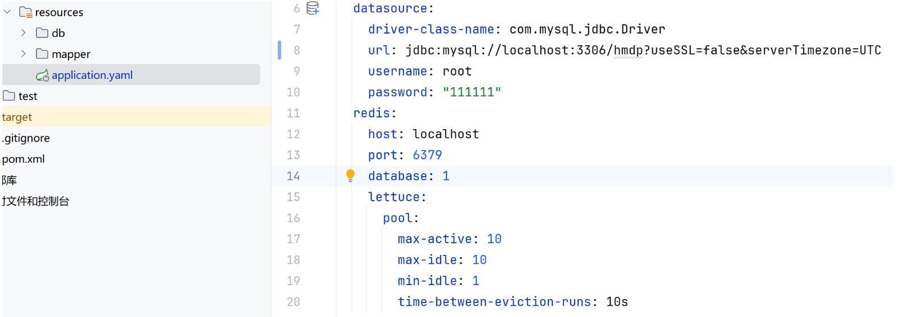

3.执行sql文件

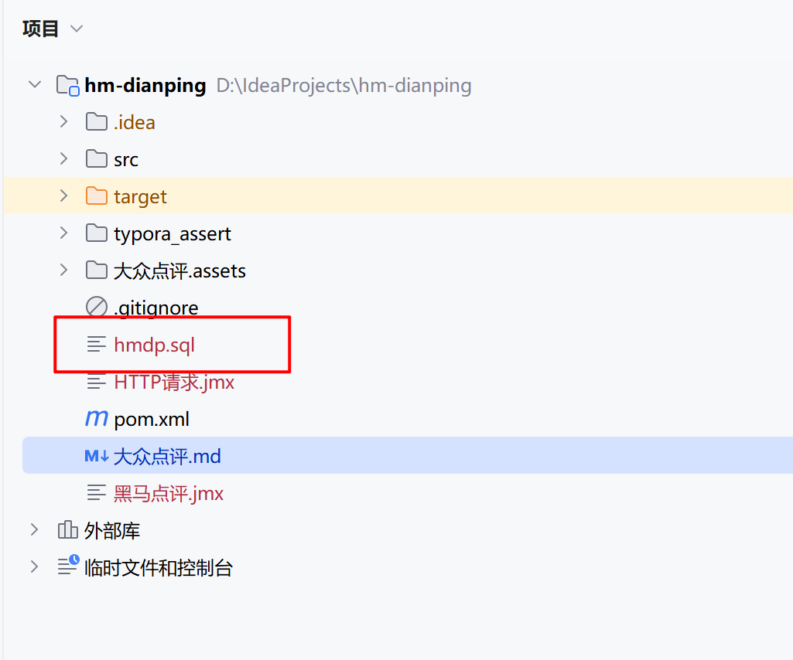4.启动redis

命令行输入：start redis-server.exe

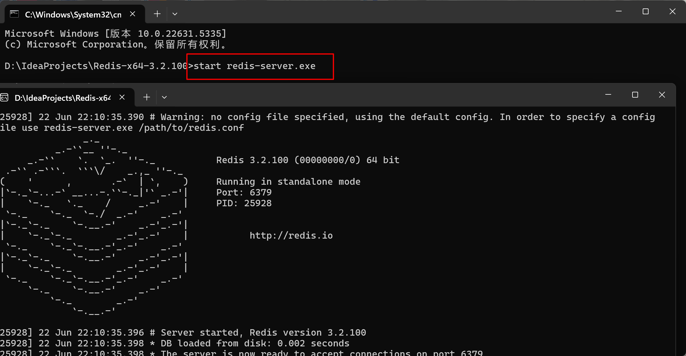

5.启动nginx,命令行输入start nginx.exe

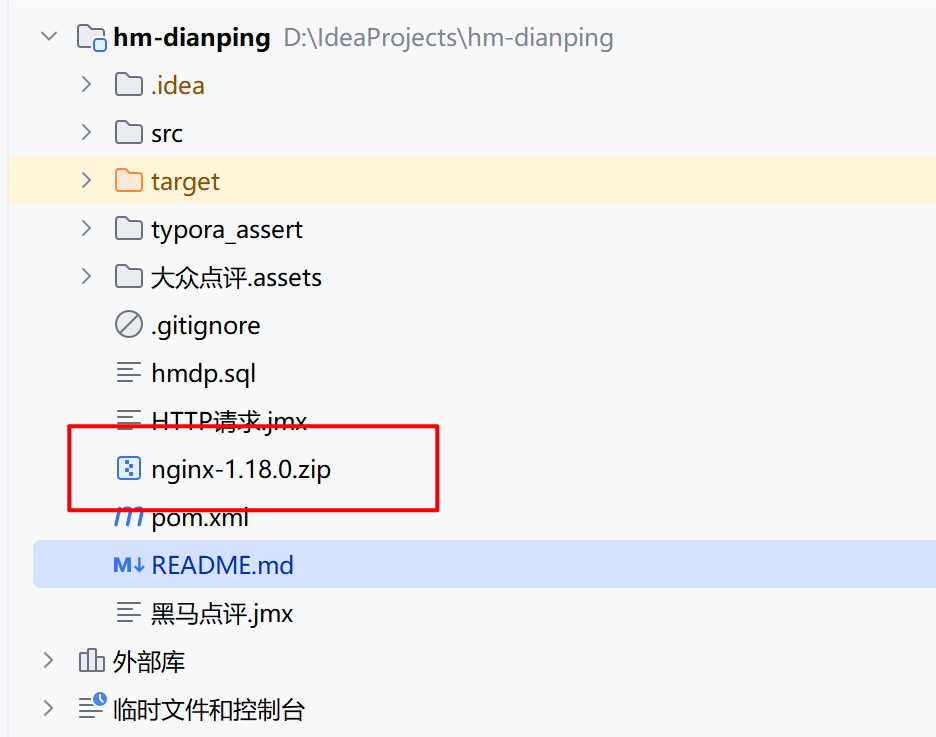

资源管理器输入cmd

6.运行成功

# 项目亮点和学习方法

## 项目亮点和我的职责（简历写法）

**技术架构**

Java+SpringBoot+MyBatis-plus+MySQL+Redis+Nginx

**亮点**

Caffine

缓存、秒杀、分布式锁、多级缓存。

Lambda，高并发，Jmeter

**我的职责**

1.基于Redis解决session共享的问题，实现登录功能（JTW？单点登录？两者什么关系？）

2.把店铺信息、店铺类型添加到缓存，提升读写效率，减低响应时间，并解决了缓存穿透、缓存击穿、缓存雪崩的问题（Jmeter具体测试数据有问题？为什么用了缓存和没用缓存响应时间都是400ms？QPS100？）

3.为防止并发情况下的优惠券超卖问题，我们采用CAS的乐观锁的思想来实现

（思路：原先我们判断初始库存量字段是否相同，其实只要用SQL判断库存大于0就可以，因为就算产生了线程安全的问题，只要有库存就可以下单）

（方法对比：有两种锁，悲观锁和乐观锁。乐观锁有两种实现方式，版本号法和CAS法。）

**4.（遇到的第一个小难点和优化点）用Redisson分布式锁实现优惠券一人一单的功能，并用Redis的Stream结构作为消息队列来优化，实现异步下单功能，提升并发性能，实测从QPS提升xxx，响应速度提升xxx**

核心业务流程是首先根据用户id和优惠券id查询订单，判断订单是否存在，不存在就扣减库存。

问题1，查询，判断，扣减，多线程并发执行的时候,扣减之前多个线程查询结果都为不存在，从而一个人下单了多个

方法一，加锁Synchronize：我们可以在在判断和扣减的整个方法中加锁，这样锁的力度太大，我们可以只锁对用户的ID加锁。这里还会遇到因为Spring的代理对象和目标对象从而引起的事务失效的场景，还有字符串常量池的问题，通过intern解决（八股点，背背背）

问题2，Synchronize的同步锁方法，每个线程存放在JVM的锁监视器中，在集群模式下，每个服务都对应不同的JVM，锁失效。

方法2，基于Redis分布式锁：满足分布式系统或者集群模式下多线程可见并且互斥的锁

我们使用基于setnx来实现分布式锁,命令 `set key thread nx ex seconds`,实现互斥和超时释放

还有释放锁的时候，假设第一个线程阻塞了，并且超时自动释放，第二个线程又获得了锁，那么当第一个线程恢复了之后就会把别人的锁释放，我们用Lua脚本来保证锁释放的原子性

问题3，setnx存在四个问题，不可重入，不可重试，超时释放，主从一致。

**方法3，一个Java驻内存数据网格，Redisson来实现。背原理:Hash存储线程id和重入次数，还有可重试、看门狗**

**优化点1，基于Redis的Stream结构作为消息队列，实现异步秒杀下单，提升并发性能，从xxx(数据）提升到xxx(数据）（必须用Jmeter测试并记录数据写到简历上）**

5.用zset实现一个一个用户点赞一次、点赞排行的功能

6.

## bug

1.巨恶心，同意用户协议必须要点到中上方才有用

2.Jmeter测试数据QPS才100多，响应时间400ms，用了缓存怎么这么慢？

## 学习方法（不断补充）

沉浸式听课和记笔记

拒绝听一点敲一点，随堂笔记

听一遍，自己能讲出来

总结笔记

高效利用官方笔记

描述方法：

学习目标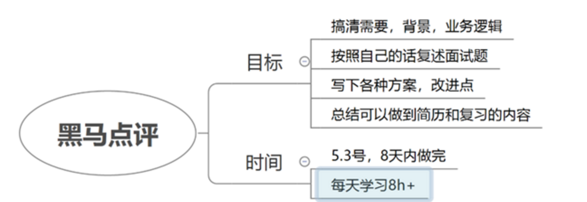

# 项目背景和我的角色

## 项目背景

仿照大众点评的项目，可以实现**商品查询缓存，优惠券秒杀，**短信登录、达人探店，好友关注，用户签到，商品查询缓存，优惠券秒杀，附近的商户，UV统计的功能。

## 我的角色

后端开发，文档攥写

# 技术栈选择

## Redis

Redis是基于内存存储的，相对于MySQL数据库会更快

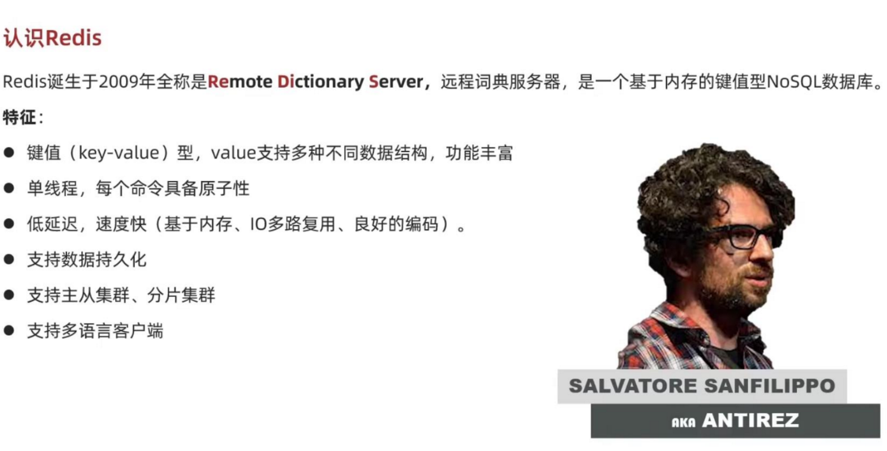

# 登录功能

## cookie,session,JWT的区别

cookie存在浏览器，session存在服务器（tomcat),JWT也是存在浏览器的。

cookie是浏览器存储数据的，用户每次发起请求就会带着自己的cookie。

session是存在服务器的，和cookie不同的是还生成了自己的sessionID，但是当用户量上升的时候服务器需要存储大量的session，而且集群之间的session还需要共享

JWT是JSON Web Token，通过数字签名的方式，以JSON对象为载体，在不同的服务器终端之间安全的传输信息，可以解决集群部署的登录校验的问题。

session共享的问题：并发量上升之后的用户的请求可以发送到多台tomcat，这是session被保存在不同的tomcat，找不到用户的登录信息。

基于Redis解决session共享的问题，并保存用户信息到threadLocal(这里是用随机生成的Token来校验的，我们可以用JWT来校验)，验证码用String存储，用户信息用Hash存储。

实现逻辑

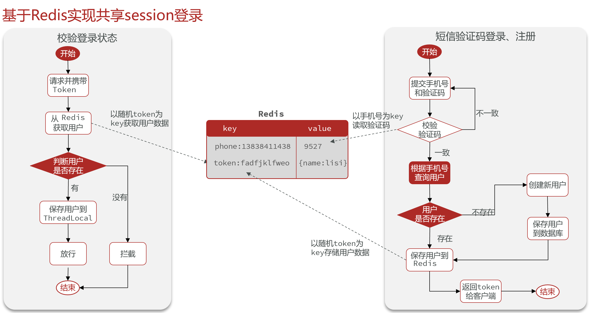

# 商户查询缓存

缓存就是临时存储信息的地方，一般读写性能较高

应用的各个层面都会用到缓存

缓存的优点

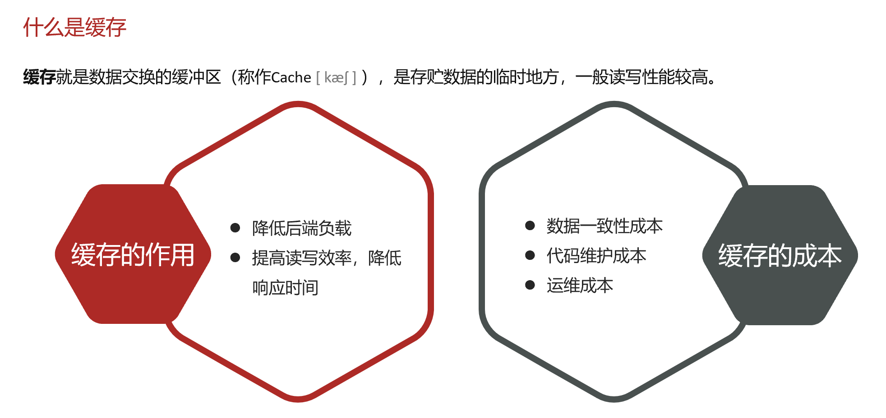

## 搜索商户

http://shop/id和http://shop?id=xx。一个属于路径参数，一个属于查询参数.

后端分别用

@PathVariable和@RequestParam来接收

## 修改笔记

@RequestBody 用来接收前端传过来的JSON字符串，并且转化为Java对象

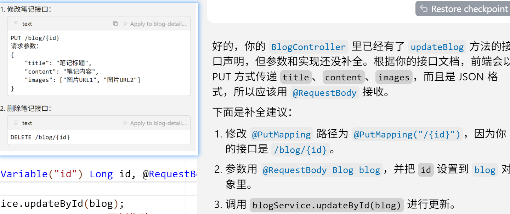

## 缓存商户信息

把店铺信息、店铺类型添加到缓存，提升读写效率，减低响应时间（具体测试数据有问题）

## 测试查询店铺信息

Jmeter设置线程数1000个

1.MySQL查询，响应时间420ms，QPS 50

2.Redis查询，

把店铺信息缓存，分别测试缓存击穿中，分布式锁和逻辑过期的QPS和响应时间，测试结果居然没变？？

## 缓存更新策略

三种更新策略：内存淘汰、超时剔除、主动更新

我们主动更新的时候要先更新数据库，再删除缓存，因为更新数据库比较慢，所以不容易在缓存中穿插一个数据库操作

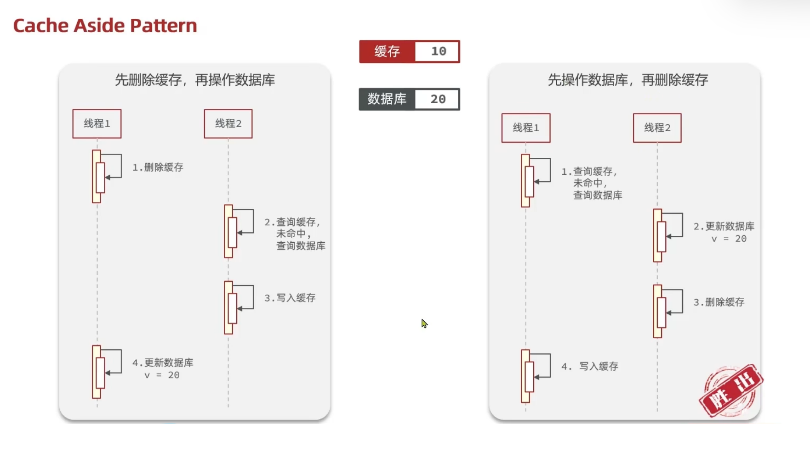

## 缓存穿透、缓存雪崩、缓存击穿

### 缓存穿透

缓存穿透：查询一个缓存和数据库都不存在的数据，这样的请求一直会打到DB。

解决方法：缓存空数据、使用布隆过滤器。

解决方法的流程图：

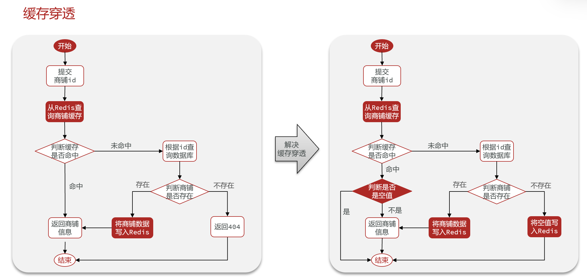

黑马点评，线程数1000.

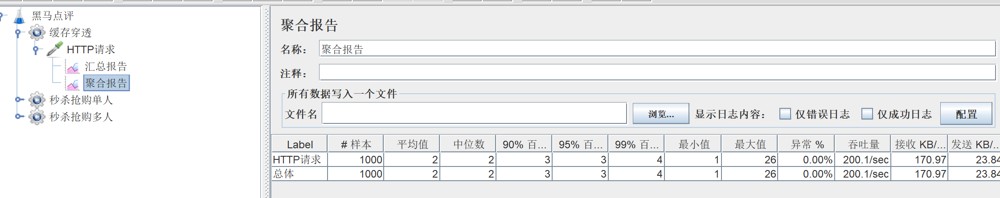

缓存的响应时间2ms

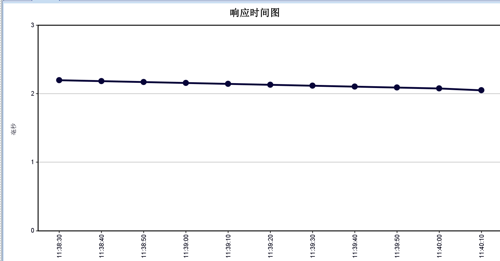

数据库响应时间：线性增长，从几ms->800ms

### 缓存雪崩

缓存雪崩：大量key同时失效或者Redis宕机导致大量请求到达数据库

解决方法：

1.为了防止大量key同时失效：

添加TTL过期时间

2.为了提高Redis的可用性：

利用Redis的集群提高服务的可用性，比如哨兵模式检查Redis是否宕机，搭建Redis主从，如果宕机了就选择一个从节点作为主节点

给缓存业务添加降级限流策略（微服务？）

给业务添加多级缓存

## 缓存击穿

热点key问题，是指被高并发访问并且缓存重构比较复杂的key突然失效了，导致大量的请求到达数据库。

解决方法：

互斥锁，逻辑过期

互斥锁：避免大量的请求到达数据库，我们查询缓存未命中的时候，首先获取互斥锁，然后在重构缓存，其他没有获得到互斥锁的请求则休眠一会重试

逻辑过期：不设置过期时间，发现逻辑时间已经过期以后，获取一把互斥锁，开启一个新线程来重构数据库，原先的线程和其他没有获取互斥锁的线程就返回过期的数据，性能比较好

业务流程（没命中直接返回空？）

**bug：解决逻辑过期的时候，我们缓存未命中直接返回空值，会导致查询不到商品的问题**

bug：查不到2号店铺的信息，是为什么呢？

# 优惠券秒杀

我们生成订单表的时候的ID可以采用Redis来存储，

## 分布式锁防止超卖

postman添加优惠券，记得设置优惠券的时间为现在的

业务流程：

事物失效
当我们调用一个加了@Transactional的方法等时候，我们假设使用this调用，那么使用的就是非代理方法，没办法被spring的事物管理。因此我们要自己创建代理服务对象，来调用方法。非代理方法会让事物失效
Spring的事务管理确实是通过代理方式实现的。具体来说：
Spring事务的代理机制：
当你在方法上添加@Transactional注解时，Spring会为该类创建一个代理对象。
代理对象会在方法调用前后插入事务管理的逻辑（如开启事务、提交事务或回滚事务）。
只有通过代理对象调用方法时，事务才会生效。如果直接通过this调用方法，事务会失效。
this的含义：
this指的是当前类的实例对象，而不是代理对象。
在方法内部通过this调用其他方法时，会绕过代理对象，直接调用目标方法，导致事务失效。
代理的作用：
代理模式是一种设计模式，用于在不修改原始类代码的情况下，增强其功能。
在Spring中，代理对象负责管理事务、AOP（面向切面编程）等功能。

代理的基础知识
代理是为了把和业务无关的代码交给代理对象来做，让代码变得更清爽
主要是写一个创建代理的类，并在类里面的invoke方法写好需要代理做的事情
问题一：误删别人的锁
我们使用分布式锁，遇到的第一个问题是锁的误删问题，如果我们直接删除，假设我们的锁过期了，然后删除锁的时候就会删除别人的锁，所以我们要加一个判断，判断当前的锁是否是当前线程的
问题二：判断和删除的原子性

## 秒杀性能提升

测试工具Jmeter

D:\IdeaProjects\apache-jmeter-5.6.3\bin,点击jmeter.bat启动

线程数：模拟的用户数。

每分钟请求数（每分钟发多少个请求),也就是TPS。

定时同步器：会等待到1000个请求瞬间发送。

线程数1000，每分钟请求数3万，基于计算吞吐量：所有活动线程。

同步定时器，模拟用户组1000，超时时间200ms。

吞吐量（TPS）243/sec，库存500（太少了？）.

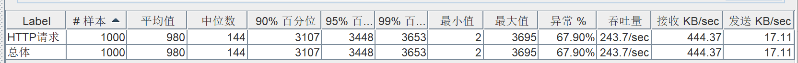

设置为库存1000，其他的不变，

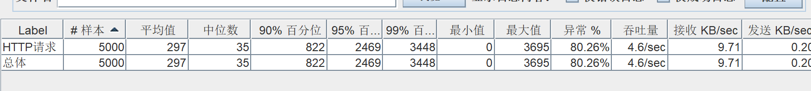

清除报告，设为1000之后的结果

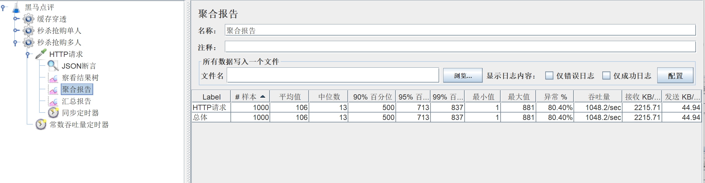

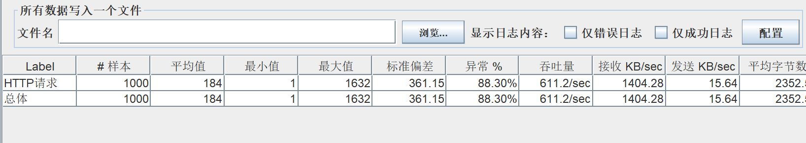

1.减低锁的粒度，其他条件不变，从110提升到了200多。

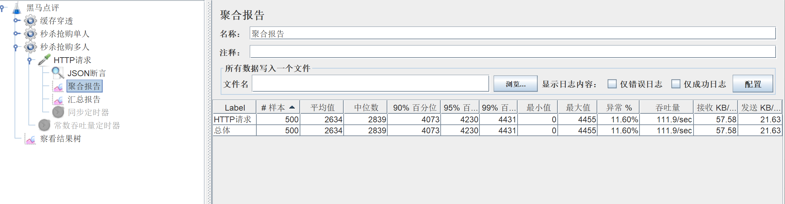

### 异常率80.4%高

异常率 = (失败请求数 / 总请求数) × 100%

服务器资源耗尽

# 达人探店

发布探店笔记、点赞、点赞排行榜

## 点赞排行榜

### 前置知识补充stream流

stream流是对集合进行中间操作和最后操作的方法.类似于把一堆物品放上流水线，stream流是这个流水线

操作对象：单列集合、双列集合、数组、零碎数据。

三个步骤

1.获取stream流,单列集合Collection、双列集合、数组Array.stream()、零碎数据,stream.of()

2.进行中间操作,filter过滤

3.进行最终操作,forEarch打印、Collection收集为链表

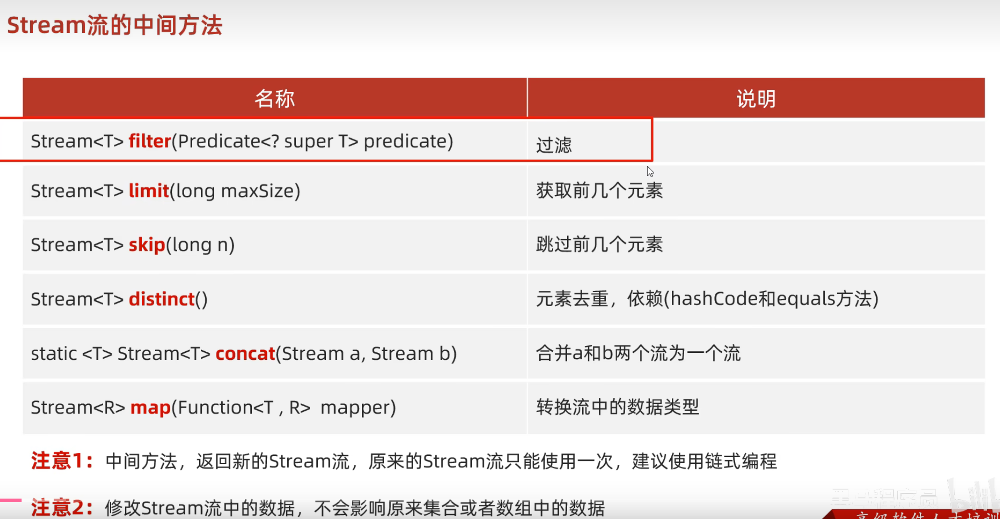

map是转换刘中的数据，里面是一个匿名类

匿名类两个参数

1.是原来的类型

2.是想要转换的类型

匿名类有的参数是原来流中的列别，返回参数是需要转换的值

省略写法Long:valueOf

# 好友关注

set来实现关注功能，intersect求交集

## 关注推送

Feed流·：Timeline,智能模式

Timeline：按时间排序。

拉模式：读扩散，只有读的时候再拉取，比较慢

推模式：写扩展，发了消息直接推送到粉丝的收件箱

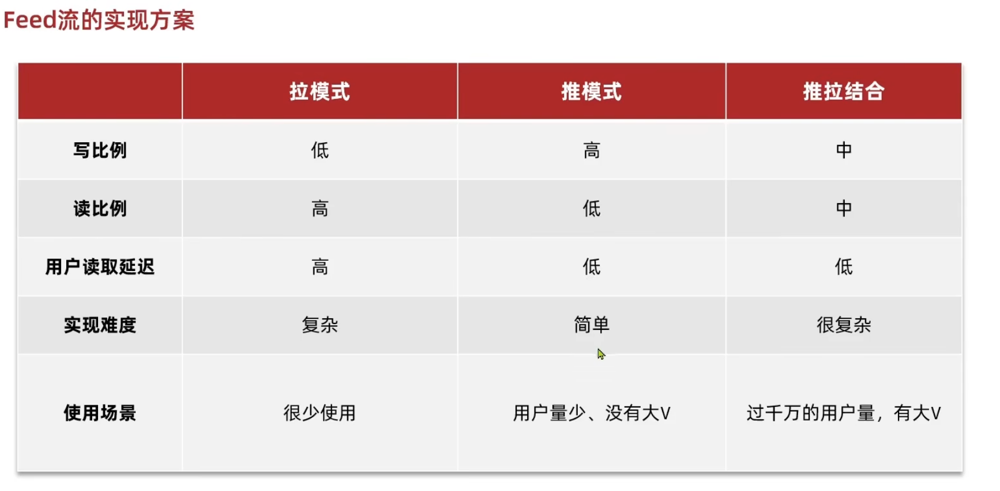

list是链表，有

zset没有链表，但是有排名。

Feed流的滚动分页。

