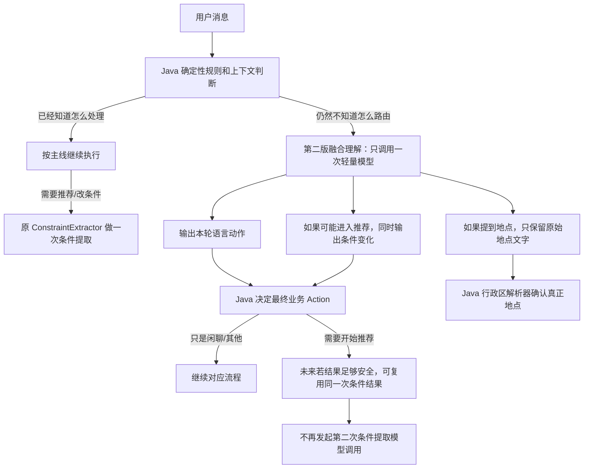

# 实验复盘：对话处理链路重复理解与模型调用优化

> 这是一份**实验复盘资料**，不是当前 `main` 主线实现说明。
>
> 实验代码位于 `feat/structured-understanding-experiment` 分支，最终结论是**不进入接管模式、不合并这套实验实现到 main**。这份文档保存在 `docs/interview-prep` 分支，只用于学习、复习和面试准备。
>
> 这条线最值得记住的不是某个类名，而是一次完整的工程判断过程：**先怀疑 Pipeline 前半段存在重复理解 → 做旁路实验收集数据 → 发现最初问题范围想大了 → 缩小改造范围 → 再做实验 → 性能虽然明显变好，但语义可靠性仍不够 → 主动停止上线。**

---

## 一、这条实验为什么会出现：同一句用户话，前面几个阶段可能都在“重新理解”

先回到实验开始前的主线。一次用户消息进入系统后，大体会经过：

```text
加载上下文
→ 补全上下文
→ 判断本轮要做什么
→ 提取预算、菜系、位置、偏好等条件
→ 检查业务规则
→ 真正执行
```

源码里的 Pipeline 节点叫：

```text
Bootstrap
→ ContextRewrite
→ IntentRouting
→ CriteriaReduction
→ PolicyGuard
→ Execution
```

这些节点本身不是问题。真正让我们起疑的是：**Pipeline 前半段有几个地方都会重新理解用户这句话。**

例如用户说：

```text
“有没有评分高一点的？”
```

系统可能先判断“这是不是承接上一轮”；接着路由阶段又判断“这是继续问某家店，还是想重新筛选”；如果最后决定重新推荐，条件提取阶段还要再理解一次“评分高一点”到底是什么条件。

更复杂的例子是：

```text
“第一家太贵了，第二家有插座吗？”
```

这里至少包含四层意思：

```text
“第一家”
→ 指向上一批推荐里的第 1 家

“太贵了”
→ 对第一家作评价，同时表达想降低预算

“第二家”
→ 指向上一批推荐里的第 2 家

“有插座吗”
→ 查询第二家的商户事实
```

如果补上下文、判断路由、提取条件分别让模型理解一次，就会产生两个担忧。

第一，**同一句话可能被不同模型调用理解成不同意思**。前一个阶段认为这是“修改条件”，后一个阶段可能又认为只是“商户追问”。

第二，**复杂 Turn 可能连续调用多个模型**。如果路由先调用一次模型，确定要重新推荐，然后条件提取又调用一次模型，那么一次用户请求里就存在重复理解和额外延迟。

所以当时提出了一个看起来很自然的假设：

> 与其让补上下文、路由、条件提取各理解一次，不如让模型只做一次统一的语言理解，然后 Java 根据这份结构化结果决定后面的业务动作。

这也是整条实验最初的出发点。

> 【核心提炼】这次实验不是因为 Pipeline 的 6 个节点太多，而是怀疑**多个节点可能重复理解同一句自然语言，造成语义冲突和多次模型调用。**

---

## 二、最开始想得比较大：把一轮话先统一理解成一份“本轮语义结果”

第一版方案比较激进。我们希望模型一次把本轮真正表达的语言事实都提出来，例如：

```text
用户有没有发起推荐
有没有修改条件
修改了什么条件
有没有提到位置
有没有指代第一家/第二家
有没有查询商户事实
有没有问“为什么推荐它”之类的决策上下文
```

然后 Java 再负责业务世界里的确定性事情：

```text
模型：识别“第二家”是一种指代表达
Java：从候选列表中真正找到第 2 家 shopId

模型：识别“厦门”是用户提到的位置
Java：判断它是不是合法行政区、规范名称是什么

模型：识别“便宜一点”是在降低预算
Java：根据当前状态决定如何修改预算

模型：识别用户想继续推荐
Java：结合当前状态决定最终 Action、是否改 Working Memory、是否调用检索和 Tool
```

这套分工背后的原则其实一直没有变：

> **大模型负责听懂开放自然语言，Java 负责确定 ID、索引、行政区、状态修改和最终业务行为。**

第一版实验把这份统一结果做得比较完整，里面包含动作、引用、条件变化、位置表达、商户事实问题、决策上下文问题以及原文证据。源码里这套结构叫 `TurnSemanticIR`。平时复习不用背这个名字，只要记住它本质上是：**把“一句人话”先翻译成一份结构化的语言事实清单。**

但这里有一个非常重要的实验原则：我们没有一上来就让这份新结果改业务状态。

---

## 三、为什么先做“影子评测”，而不是直接切换线上逻辑

如果新语义理解一接入就直接修改 Working Memory，出现一次错误就可能把后续几轮状态一起带偏。比如模型把“那厦门呢”错误理解成别的地点，系统真的把当前搜索城市改掉以后，后面的候选池、检索条件、推荐结果都会一起变。

所以实验设计了三种模式：

```text
关闭模式
→ 完全走旧链路

影子模式
→ 新理解链路也跑
→ 记录它输出了什么、花了多少时间和 Token
→ 但业务仍然完全按旧链路执行

接管模式
→ 只有结果通过严格安全检查时，新链路才有资格真正决定部分业务
→ 不安全就退回旧链路
```

这里的“影子模式”就是常说的 Shadow。以后看到这个词，只要记成一句中文：

> **让新方案在旁边跟着跑，只观察，不掌权。**

这样同一个 Turn 里可以同时拿到旧链路和新链路的数据，却不会因为新方案还不成熟就污染业务状态。

实验期间还专门补了几个保护边界。

首先，新理解不能在请求一进来就无条件调用。按钮事件、明确的非餐饮问题、位置澄清、已经能够确定的路由，都应该先让 Java 处理。只有规则和上下文仍然无法确定时，才考虑模型。

其次，同一个 Turn 的新理解最多调用一次，第一次失败也缓存失败结果，不能为了“修复模型输出”偷偷再调一次模型。

再次，专门区分了两个指标：

```text
structuredInvoked
→ 新模型有没有被调用

structuredApplied
→ 新模型的结果有没有真的被业务消费
```

因为“模型跑过了”和“模型掌权了”完全不是一回事。影子模式下应该大量出现前者，但后者必须是 0。

最后，我们把每次评测的逐 Turn 数据持久化归档。以后分析调用次数、延迟、Token、失败原因时直接读归档 JSON，不需要为了得到同一份基线结果重复跑模型。

> 【核心提炼】这一阶段最重要的不是写了多少新类，而是先把**旁路观测、失败回退、单轮最多一次调用、调用与接管分开统计、评测结果可归档**这些实验基础设施建起来。

---

## 四、第一版完整语义理解跑出来以后，先暴露了两个问题

第一版完整方案最终用 Run153 和 Run154 做了正式影子评测：

| Run | 数据集 | Case 数 | Turn 数 |
|---:|---|---:|---:|
| 153 | conversation-v1 | 40 | 78 |
| 154 | conversation-robustness-v1 | 48 | 99 |
| 合计 | - | 88 | 177 |

先说明这些数字测的是什么：这两个 Run 不是为了证明“新方案业务准确率更高”，因为新方案在影子模式下根本没有修改业务。它们主要用于回答三个问题：

1. 旧链路真实存在多少次重复模型调用？
2. 新的一次完整理解能不能稳定输出合法结构？
3. 同一个 Turn 上，新方案和旧方案相比到底更快还是更慢、Token 更多还是更少？

### 4.1 第一版有效率只有约一半

177 个 Turn 中，新方案实际被调用 143 个 Turn；其中只有 75 个通过完整校验：

```text
75 / 143 = 52.45%
```

这个数字第一眼看起来很差。如果只看到这里，很容易下结论：“大模型做统一结构化理解不行。”

但我们没有立刻停，而是继续追失败原因。后面证明，这个 52.45% 里面混入了一个很大的**协议设计问题**。

### 4.2 完整方案也比旧链路慢

第一版为了“一次把所有语义都拿回来”，要求模型输出很多字段：动作、引用、条件、位置、查询以及每个事实的原文证据。这使输出很重。

在 Run153 中，所有新方案被调用的 Turn 上：

```text
旧语义链平均延迟：约 6.92 秒
完整新方案：约 9.84 秒
```

Run154 中：

```text
旧语义链平均延迟：约 8.49 秒
完整新方案：约 12.85 秒
```

也就是说，虽然我们原本希望“合成一次调用更快”，但第一版实际上**为了得到一份过于完整的语义结果，单次调用本身变重了。**

这就是第一次重要的反例：减少“调用次数”并不自动等于减少“总耗时”。如果一次调用要求模型做更多工作、输出更多字段，它完全可能比两个小调用还慢。

---

## 五、第一次真正改变实验方向的数据：177 个 Turn 里，重复调用其实只有 15 个

接下来我们不再只看“0 次 / 1 次 / 2 次”，而是把旧链路每个 Turn 到底调用了什么精确拆开。

Run153/154 合计 177 个 Turn 的结果是：

| 旧链路模型调用形状 | Turn 数 | 占全部 Turn |
|---|---:|---:|
| 只做条件提取 | 120 | 67.80% |
| 完全没有语义模型调用 | 34 | 19.21% |
| 只做路由判断 | 8 | 4.52% |
| 先路由判断，再做条件提取 | 15 | 8.47% |

最关键的是：**15 个多调用 Turn，15/15 全都是“路由判断 + 条件提取”。**

没有观察到：

```text
补上下文 + 条件提取
补上下文 + 路由判断
补上下文 + 路由判断 + 条件提取
```

这直接推翻了最初那个“大问题假设”。我们一开始担心的是：

```text
补上下文
路由
条件提取

三个模块普遍重复理解同一句话
```

真实数据却告诉我们：

```text
大部分 Turn 根本没有重复调用

真正的重复点只有：
路由模型判断一次
→ 结果发现要重新推荐/修改条件
→ 条件提取模型再理解一次
```

也就是说，如果继续用一个“大一统语义模块”替换全部 143 个有模型调用的 Turn，实际上会误伤大量本来就只有一次条件提取的正常请求。

这里是整条实验最重要的工程转折之一：**不再为了架构看起来统一而继续大改，而是根据调用数据把改造范围缩到真实重复点。**

> 【核心提炼】最初的“多个模块普遍重复理解”假设只成立了一小部分。真正需要优化的是 15/177 的“路由后又条件提取”，而不是整个 Pipeline 前半段。

---

## 六、第二个关键发现：很多“语义失败”，其实只是模型把字符串位置数错了

第一版为了保证每个结构化事实都能追溯到用户原话，要求模型不仅输出原文证据，例如：

```text
“烤肉”
```

还要求它输出这两个数字：

```text
start = 从第几个字符开始
end = 到第几个字符结束
```

Java 再用 `substring(start, end)` 检查模型有没有乱编。

安全思路本身没有问题，但职责分错了。**模型擅长判断“烤肉”是不是菜系证据，却不应该承担确定性的字符串索引计算。**

离线失败归因把 Run153/154 的所有证据拆开后得到：

| 证据情况 | 数量 | 含义 |
|---|---:|---|
| 文本和位置都正确 | 312 | 完全正确 |
| 证据文字正确，但 start/end 算错 | 83 | 模型理解到了原文，但位置数字错了 |
| 同一证据文字在原文出现多次 | 0 | 本批数据没有 |
| 证据文字根本不在原文 | 0 | 本批数据没有 |
| 应该有证据但没给 | 6 | 真正的缺失问题 |

其中有 39 个 Turn **仅仅因为 start/end 错了**被整轮判成 invalid。

于是做了一个纯离线反事实：如果模型只负责输出 `evidenceText`，Java 自己在原字符串中查找唯一位置，会发生什么？

结果从：

```text
真实第一版 Valid：75 / 143 = 52.45%
```

变成：

```text
离线反事实：114 / 143 = 79.72%
```

其中 Run153 甚至能从 51.67% 恢复到 90%；Run154 从 53.01% 恢复到 72.29%。

注意，这个 79.72% **不是线上真实指标**，因为它只是对旧归档做离线模拟。但它足够证明一个设计判断：

> **“理解这几个字表达什么”适合交给模型；“这几个字在 Java String 的第几个下标”应该由程序计算。**

所以第二版把协议改成：

```text
模型：
evidenceText = “太贵”

Java：
在 originalMessage 中查找“太贵”
→ 唯一找到：RESOLVED，程序生成 start/end
→ 出现多次：AMBIGUOUS，不猜
→ 找不到：NOT_FOUND
→ 模型没给：MISSING
```

代码里这个确定性组件叫 `EvidenceGrounder`。类名不重要，记住它的职责就是：**模型只指出证据文字，字符串位置由 Java 说了算。**

---

## 七、第二版为什么不再“大一统”：只融合真正重复的“路由 + 条件提取”

前面两组数据把下一步方案基本限定死了：

1. 120 个 Turn 原本就只有一次条件提取，没必要替换。
2. 只有 15 个 Turn 真的发生“路由 + 条件提取”两次调用。
3. 模型不应该再负责 start/end 这种确定性索引。
4. 第一版完整输出太重，尤其不值得拿一个大语义调用替换原来几百毫秒的轻量路由。

所以第二版不再追求“统一整个语义层”，而是改成一个非常窄的目标：

> **只有当 Java 的确定性规则无法决定路由、原本马上要调用路由模型时，才运行一次新的融合理解；如果这句话最后还需要进入推荐，就顺便把后续条件提取所需的信息也一次带回来。**

完整链路可以用下面这张图理解：



这就是第二版所谓的 Routing Fusion。平时不用背英文，直接记成：**“只在路由实在判断不出来时，让一次模型调用把路由和可能需要的条件一起理解。”**

第二版还有两个很重要的收缩。

第一，它直接复用原来的轻量路由模型配置，不再拿大模型做一份很重的完整语义报告。

第二，它不再输出引用、商户事实问题、决策上下文问题等无关字段，只保留：

```text
用户语言上想做什么
条件有没有变化
原话里有没有地点
有没有还没搞清的歧义
对应原文证据文字
```

而 shopId、候选 ID、会话 ID、最终 Action、Policy、Tool、Working Memory 修改权，仍然全部掌握在 Java 手里。

> 【核心提炼】第二版不是“把第一版继续优化得更复杂”，恰恰相反，它是**根据真实数据主动删能力，只打 15 个真实重复调用点。**

---

## 八、最终一轮影子评测到底验证了什么

第二版固定代码以后，重新做了最后一轮影子评测：Run155 和 Run156。

| Run | 数据集 | Case | Turn | Complete | Route | Tool | Final | Locality |
|---:|---|---:|---:|---:|---:|---:|---:|---:|
| 155 | conversation-v1 | 40 | 78 | 28 | 37 | 32 | 40 | 40 |
| 156 | conversation-robustness-v1 | 48 | 99 | 21 | 44 | 47 | 38 | 48 |

这轮仍然是旁路模式，所以这些业务指标只用于观察有没有结构性异常，**不能把 Complete、Route 的变化归功于第二版。** Run155 和上一轮同数据集完全一致；Run156 相比上一轮只有 Final 少 1，属于运行波动候选，没有证据表明是旁路实验造成的。

真正需要看的是下面四类指标。

### 8.1 调用范围终于控制对了

177 个 Turn 中，第二版只调用了 23 次，占约 13%。

同时三个关键不变量全部满足：

```text
条件提取阶段误触发第二版：0
只有条件提取的 Turn 被第二版误调用：0
同一个 Turn 第二版调用超过一次：0
```

这说明第二版确实做到了：**不再干扰那 120+ 个原本没有重复问题的正常条件提取，只关注真正需要路由兜底的少量 Turn。**

### 8.2 字符串位置问题基本被拿掉了

第二版已经不允许模型提交 start/end，因此最后一轮没有再出现第一版那种“证据文字明明正确，只是字符下标算错就整轮失败”的问题。

离线诊断统计到：

```text
RESOLVED：43
MISSING：15
NOT_FOUND：1
```

这里 `MISSING` 并不等于 15 个 Turn 全部失败，因为有些字段本身允许没有业务证据；真正重要的是：**原来那 83 个 offset 错误这一类问题已经不再存在。**

### 8.3 真正的双调用场景，性能收益非常大

最终 Run155/156 仍然观察到 15 个旧链路会发生：

```text
路由模型
+
条件提取模型
```

把两个 Run 加权合并后，大致是：

| 15 个双调用 Turn | 旧链路 | 第二版单次融合 | 变化 |
|---|---:|---:|---:|
| 平均模型耗时 | 约 9.22 秒 | 约 1.39 秒 | **约 -84.9%** |
| 平均 Token | 约 3519 | 约 1155 | **约 -67.2%** |

这说明一件非常重要的事：**“把真实重复的路由 + 条件提取合成一次”这个性能方向是成立的。**

所以最终停止实验，绝对不能说成“因为新方案性能不好”。恰恰相反，在真正想优化的双调用 Bucket 上，性能收益非常明显。

### 8.4 但只需要路由一次的场景，还是变贵了

另外 8 个 Turn 旧链路本来只需要一次轻量路由。加权后大致是：

| 8 个纯路由 Turn | 旧路由 | 第二版 | 变化 |
|---|---:|---:|---:|
| 平均模型耗时 | 约 0.66 秒 | 约 1.12 秒 | **约 +71%** |
| 平均 Token | 约 840 | 约 983 | **约 +17%** |

虽然比第一版“0.44 秒变 4.42 秒”已经好得多，但它仍然说明：**融合调用只有在后面真的还会继续条件提取时才划算。** 如果本轮最后只是做一次路由判断，那让模型顺便考虑条件依然有额外成本。

---

## 九、为什么性能已经这么好了，最后还是决定不上线

这是整条实验最值得面试时讲清楚的 Trade-off。

如果只看那 15 个双调用 Turn：

```text
耗时 -84.9%
Token -67.2%
```

很容易觉得“这不就成功了吗？”

但 Agent 系统里不能只看性能。**一个错误的条件理解如果真的写进 Working Memory，后面几轮都会基于错误状态继续执行。** 所以接管业务之前，可靠性门槛必须比旁路观察高得多。

最终 23 个第二版调用里：

```text
协议校验通过：17 / 23 ≈ 73.9%
失败/回退：6

模型结果具备可复用条件信息：9
按当前最保守安全规则真正有资格接管：4 / 23
```

分数据集看差异更明显：

```text
conversation-v1：7/7 valid
conversation-robustness-v1：10/16 valid = 62.5%
```

鲁棒性场景只有 62.5% 通过，说明它在更复杂、更接近边界情况的表达上还不稳定。

而且人工复核还能看到一些比“格式校验失败”更值得警惕的语义问题。

### 例 1：“有没有近一点的”

第二版识别到了用户想看其他方案，但条件里给出了：

```text
RADIUS_KM + INCREASE + 5.0
```

这并不是“更近一点”的可靠表达。好在当前安全适配层认为这个相对幅度无法无损映射，所以没有给它接管资格。

这说明 fail-closed 的意义：**模型看起来返回了结构化 JSON，不代表它真的理解对了。**

### 例 2：“改成福州鼓楼附近”

模型知道这是一轮条件修改，也知道用户说了地点，但条件数组里产生了缺少合法 field 的行政区值，最终被 Schema/枚举校验挡住。

正确的职责边界应该是：

```text
模型：只说“用户提到了 福州鼓楼附近”
Java：行政区解析器判断 福州市 / 鼓楼区
```

而不是让模型把省、市、区直接当成业务字段自由生成。

### 例 3：“不用管我的具体位置了，直接推荐全城最热门的”

第二版能够提取“清除附近限制”，但还出现过与原话无可靠依据的菜系内容。即使某轮整体 JSON 形式合法，也不能因此把全部条件都当成可信业务事实。

这些 Case 最终共同说明：**第二版已经证明性能方向正确，但还没有证明语义结果稳定到可以安全替代旧链路。**

所以最终决策是：

```text
STOP_ROUTING_FUSION
```

翻成正常中文就是：

> **这条路不继续进入接管实验了。保留实验数据和结论，但不把实验实现合并进 main。**

> 【核心提炼】最终停止不是因为“优化没收益”，而是因为**性能通过了，可靠性和可接管覆盖率没有通过。** 在会写业务状态的 Agent 里，正确性门槛高于省几秒延迟。

---

## 十、这次实验到底验证了什么，又没有验证什么

这一节非常重要，面试时最容易吹过头。

### 已经能够证明的

第一，**旧 Pipeline 并不存在大范围的重复语义调用。** 在第一轮 177 Turn 观测中，多调用只有 15 个，占 8.47%，而且全部集中在“路由判断后又做条件提取”。因此没有证据支持“大规模重构整个语义前半段”。

第二，**真正重复的“路由 + 条件提取”确实可以被一次更紧凑的调用显著压缩成本。** 最终 15 个双调用 Turn 上，第二版相对旧链路观测到约 85% 的模型耗时下降和约 67% 的 Token 下降。

第三，**让模型计算原文字符下标是错误职责。** 第一版 83 个 evidence 出现“文字正确、offset 错误”；改成模型只给文字、Java 确定位置以后，这一类错误被从协议中消掉。

第四，**确定性规则优先 + 模型只在真正不确定时兜底是有效的成本控制方式。** 第二版只在 23/177 Turn 上触发，没有污染 extraction-only 路径。

第五，**旁路评测能够在不改业务结果的情况下验证新架构假设。** 这次如果直接上接管模式，很多语义错误可能先污染状态，再从 E2E 指标里慢慢暴露，定位会困难得多。

### 不能证明的

第一，不能说“第二版把整个 Agent 延迟降低了 85%”。85% 只属于**15 个旧链路会发生双模型调用的 Turn**，不是整个系统，更不是端到端用户响应。

第二，不能说“新语义架构已经上线”或者“已经替换旧 Pipeline”。它始终停留在实验分支，最终没有进入 Active，也没有合并 main。

第三，不能说“结构化语义理解准确率 74%”。这里的 17/23 是协议校验通过率，不是人工标注后的完整语义正确率。某些 JSON 即使合法，业务语义仍可能需要人工复核。

第四，不能把 Run155/156 的 Complete、Route、Tool 等业务指标变化归因于第二版，因为它们是影子模式，新链路没有业务权限。

第五，最终第二版没有跑接管模式和最终 holdout 验收，所以它从未达到“可以发布”的证据标准。

---

## 十一、实验结束以后，main 和实验分支分别是什么状态

这部分一定要分清，否则以后复习时很容易把实验代码误认为当前主线。

### 当前 main 应该怎么理解

`main` 仍然以原有 Pipeline 为当前事实：确定性规则优先，复杂路由由原模型兜底，推荐条件继续由现有 `ConstraintExtractor` 提取，Java 负责状态合并、行政区确认、Policy、Working Memory、检索和 Tool。

**不能因为实验分支写过 `RoutingSemanticIRV2`、`EvidenceGrounder` 等类，就在讲 main 时说“当前系统已经使用第二版融合理解”。**

### 实验分支保留什么

`feat/structured-understanding-experiment` 保留的是完整实验资产，包括：

- 第一版完整语义理解实现；
- 第二版收缩后的路由+条件融合实现；
- 影子/接管安全边界；
- 评测归档工具；
- Run147～156 等历史评测快照；
- 第一版影子报告、失败归因报告、第二版最终影子报告；
- 完整开发记录。

最终实验提交为：

```text
f4cd53b9b2a25856525dab1d82b8a6a8676ccf89
```

第二版核心实现提交为：

```text
99dd6ca83fcd20077b10abf764fd34c9ddc4bcbb
```

所以这条线最准确的状态是：**实验完成、证据归档、结论冻结、不进入 main。**

---

## 十二、如果以后重新做，这次实验留下了哪些可复用结论

虽然最后没有上线，但这次实验并不是“白做”。真正可复用的是下面几条工程经验。

### 1. 架构重构前先证明问题规模

一开始我们觉得“多个模块都可能重复理解同一句话”，听起来很合理。但真正统计以后才发现，多调用只有 8.47%。

以后遇到类似问题，应该先问：

```text
重复到底发生多少次？
发生在哪些路径？
成本主要花在哪？
```

再决定是重构整个链路，还是只优化一个小分支。

### 2. 不要让 LLM 做程序可以百分之百确定的事情

字符串下标、实体 ID、候选序号映射、行政区规范名称、状态转移，这些都属于程序更擅长的确定性事实。

模型更适合回答：

```text
用户说“太贵”是在表达什么？
“还有吗”是在继续要推荐吗？
“安静一点”是不是新增偏好？
```

程序再负责：

```text
“太贵”到底在字符串哪个位置？
当前预算具体是多少？
第二家到底是哪个 shopId？
厦门到底规范成哪个行政区？
这次修改能不能写入 Working Memory？
```

### 3. “结构合法”与“业务可信”必须分开

模型能返回合法 JSON，只能证明协议格式没坏，不能证明业务语义正确。

这次专门把漏斗拆成：

```text
被调用
→ 协议有效
→ 条件可以复用
→ 当前安全规则允许真正接管
```

最后 23 个调用只有 4 个进入“当前可安全接管”。这比只看 Valid Rate 更能反映真实工程风险。

### 4. 性能收益不能盖过状态正确性

一次错误的普通问答可能只影响一句回复；一次错误的状态修改可能污染后续整段对话。因此 Agent 的状态写入权限必须更保守。

这也是为什么即使双调用 Turn 已经做到约 85% 延迟下降，我们仍然选择停止接管实验。

### 5. 实验失败也应该形成可复用资产

这次专门把每个 Run 固化成 JSON，把逐 Turn 模型调用、延迟、Token、结构化结果和失败原因保留下来。这样“没有上线”不等于“什么都没留下”。以后换模型或重新评估这条路线，可以直接复用历史基线，而不是从零开始。

---

## 十三、面试时怎么讲这段实验

这段经历很适合回答“你有没有做过架构优化”“怎么评估一个 Agent 改造值不值得上线”“有没有做过失败的实验”这类问题，但不要把它包装成已经进入 main 的核心功能。

### 问题 1：为什么当时想改 Pipeline？

**面试官其实在看什么：**你是不是因为“感觉代码乱”就重构，还是能指出真实风险。

核心回答可以这样讲：

> 我们当时发现对话链路前半段的上下文补全、路由判断、条件提取都可能理解同一句用户输入，所以怀疑存在重复模型调用和语义不一致。我没有直接重构主线，而是在独立分支做了一套旁路结构化理解，把每个 Turn 的真实模型调用目的、耗时和 Token 记录下来。后来数据证明最初问题范围想大了：177 个 Turn 里只有 15 个存在两次语义调用，而且全部是“路由 + 条件提取”，所以后续把改造从全链路统一收缩成只优化这个重复点。

追问陷阱：不要说“原系统每轮会调用三次模型”。真实数据不支持这个说法。

### 问题 2：为什么不直接把几个模型调用合成一次？

**面试官其实在看什么：**你是否理解调用次数、单次复杂度和总体成本之间的关系。

核心回答：

> 第一版确实这么做了，但影子评测发现一次“大而全”的调用虽然少了步骤，本身却要求输出很多不必要字段，平均延迟反而高于旧链路。于是我们统计真实调用形状，发现绝大多数 Turn 原本只有一次条件提取，没必要替换，最终只保留“路由后还要条件提取”的融合实验。

### 问题 3：为什么后来把 start/end 从模型输出里删掉？

**面试官其实在看什么：**你能不能区分语义理解和确定性计算。

核心回答：

> 第一版要求模型为每个语义事实输出原文证据和字符区间，Java 再做 substring 校验。失败归因发现 83 个 evidence 是文字本身完全存在，只是模型把下标数错了；39 个 Turn 仅因为 offset 错误被判 invalid。后来改成模型只输出 evidenceText，由 Java 唯一匹配并生成权威 start/end。这样保留了“必须有原文证据”的安全性，又不让模型做确定性索引计算。

### 问题 4：第二版性能提升那么大，为什么最后不上？

**面试官其实在看什么：**你是否只追性能数字，还是会做正确性与收益的 Trade-off。

核心回答：

> 在 15 个真正的“路由 + 条件提取”双调用 Turn 上，第二版单调用把平均模型耗时从约 9.22 秒降到 1.39 秒，Token 从约 3519 降到 1155，收益是成立的。但复杂鲁棒性数据集里协议有效率只有 62.5%，最终 23 个调用按安全规则只有 4 个有资格真正接管。这个模块一旦理解错会写坏多轮状态，所以我们把正确性门槛放在性能前面，最终停止进入 Active，也没有合并 main。

追问陷阱：不能回答成“因为新方案变慢了”。双调用场景实际上明显变快；停止的主要原因是稳定性和可安全接管覆盖率不够。

### 问题 5：这次实验最后最大的收获是什么？

核心回答：

> 最大收获不是实现了某个新模块，而是把一个最初很大的架构假设通过数据缩小了。开始以为多个阶段普遍重复理解，后来发现真正重复的只有 8.47% Turn；开始以为 Valid Rate 低代表模型语义能力差，失败归因后发现大量只是把字符串 offset 交给模型导致的协议问题；最后虽然局部性能优化成功，但语义稳定性不够，我们主动没有上线。它让我形成了一个习惯：Agent 架构优化先做可观测和旁路验证，再决定改造范围，而不是为了“统一”去重构。

---

## 十四、这段实验适不适合写进简历

**不建议把它写成项目的主简历亮点。** 原因很简单：它最终没有进入 main，也没有完成 Active / holdout 后的上线验收。如果简历写成“重构语义 Pipeline，将模型调用降低 XX%”，很容易给人造成“当前生产主链路已经使用这套方案”的误解。

更适合的使用方式有两个。

第一，在面试里作为“架构优化实验 / 失败实验 / 如何做技术决策”的深入故事。这个故事的价值在于数据驱动地否定和收缩自己的方案，而不是某个最终功能。

第二，如果以后确实需要在项目材料里提一句，可以只写成事实：

> 针对对话前置链路可能存在的重复语义调用，建设逐 Turn 模型调用观测与旁路评测；通过 177 Turn 实测将问题收敛到少量“路由 + 条件提取”场景，并基于延迟、Token 与语义稳定性评估后放弃直接切流。

这句话没有声称已经上线，也没有拿局部 -85% 冒充整个 Agent 的性能提升。

---

## 十五、时间线：这条实验是怎么一步步收口的

不用背所有 SHA，但以后需要回仓库核实时，可以按下面几个关键节点找。

| 阶段 | 关键提交/结果 | 真正发生了什么 |
|---|---|---|
| 第一版实验接入 | `1b8619f...` | 增加完整结构化语义理解实验链路 |
| 调用边界与 Schema 修正 | `8129a837...` | 从请求入口无条件调用改成真正需要时才调用，确定性规则优先 |
| Active 安全边界加固 | `3078d056...` | 修数值语义、附近清除、动作组合、引用锚点和接管归因 |
| 第一版收口修正 | `9f7c9dbf...` | 修真实条件处理链路的接管标记、空 mutation 等 |
| 第一轮正式 Shadow | Run153/154，`fec386ad...` | 得到 52.45% Valid、完整成本和调用分布 |
| 失败归因 | `73903998...` | 发现只有 15 个多调用 Turn；发现 83 个 evidence 是 offset 错误 |
| 第二版收缩实现 | `99dd6ca8...` | 只融合路由+条件提取，并改成 Java 生成 evidence span |
| 最终 Shadow | Run155/156，`f4cd53b9...` | 双调用性能大幅下降，但语义稳定性/接管覆盖率不足，正式 STOP |

最终实验结论已经冻结，不再继续为了“把实验做成功”追加第三轮大重构。

---

## 十六、最后只需要记住这 8 句话

1. 这条实验起因不是 Pipeline 节点太多，而是怀疑**多个阶段重复理解同一句用户话**。
2. 第一版想一次生成完整语义结果，但影子评测证明它**太重、太慢，而且问题范围想大了**。
3. 177 个 Turn 中真正的多语义调用只有 **15 个，占 8.47%**，并且全是“路由 + 条件提取”。
4. 第一版 Valid 只有 **52.45%**，但失败归因发现大量不是语义错，而是让模型计算 start/end 这种确定性字符串位置导致的。
5. 后来改成**模型给 evidenceText，Java 负责唯一匹配并生成位置**，把确定性工作收回程序。
6. 第二版只打真实重复点，不碰普通 extraction-only Turn；最终 177 Turn 只调用 23 次，没有越权触发和重复调用。
7. 15 个双调用 Turn 上，第二版观测到约 **-84.9% 模型耗时、-67.2% Token**，说明性能方向成立。
8. 但复杂数据集 Valid 只有 **62.5%**，23 个调用里按当前安全规则只有 **4 个**真正有资格接管，所以最终**不进入 Active、不合并 main**。

> 【最终核心提炼】这次实验真正有价值的不是“我们做出了一个新语义模块”，而是：**用可观测数据证明最初的架构假设过大，把重构范围一步步缩到真实问题；即使局部性能收益很漂亮，也因为语义可靠性不足主动停止上线。** 这比为了得到一个漂亮结果硬把实验推成“成功”更符合真实工程决策。