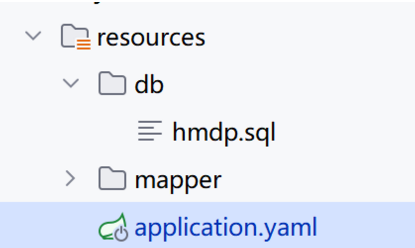
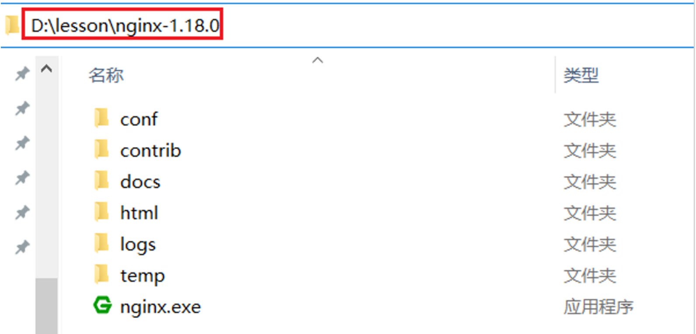
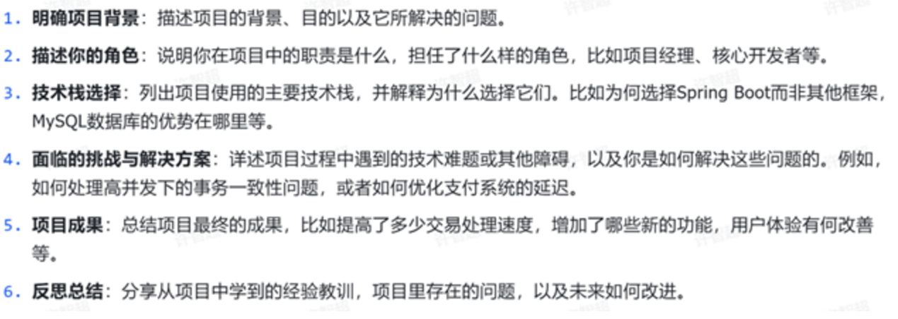
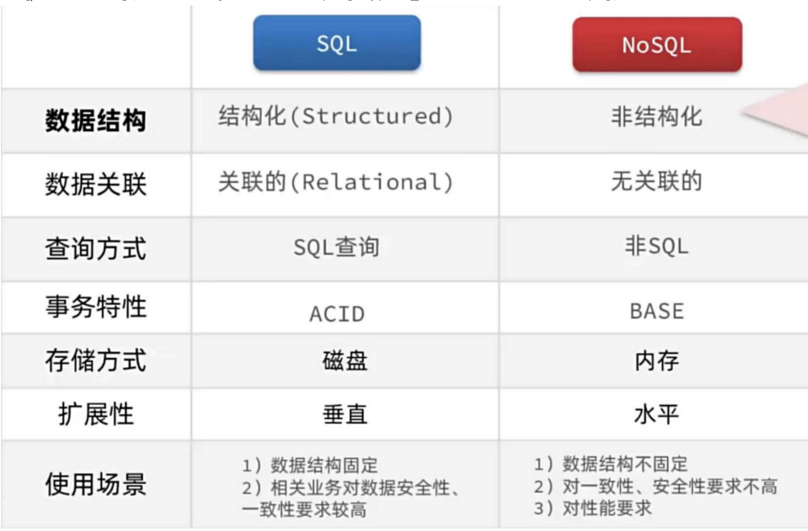
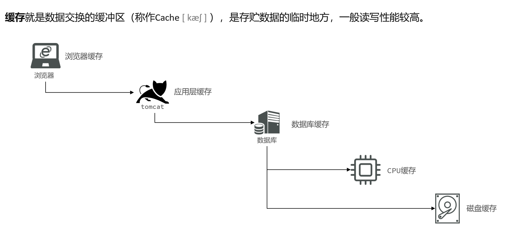
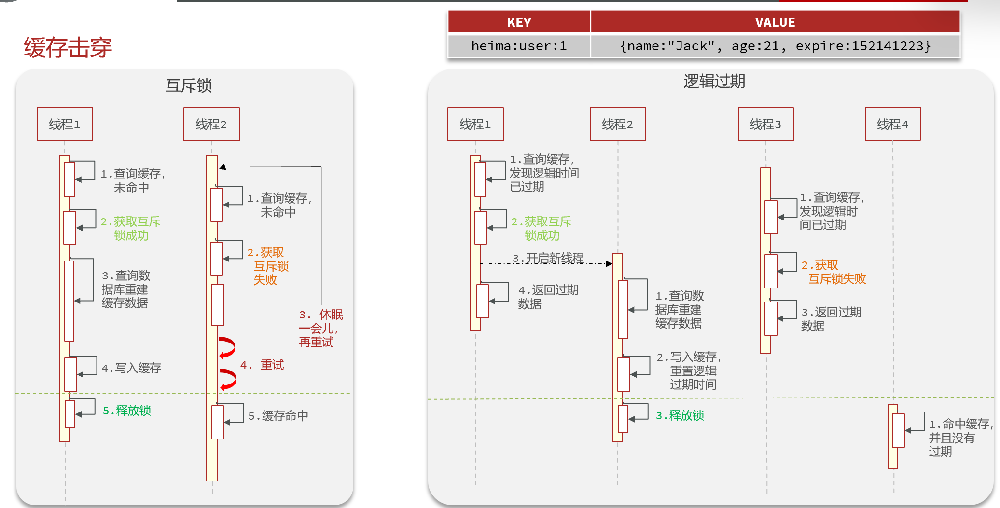
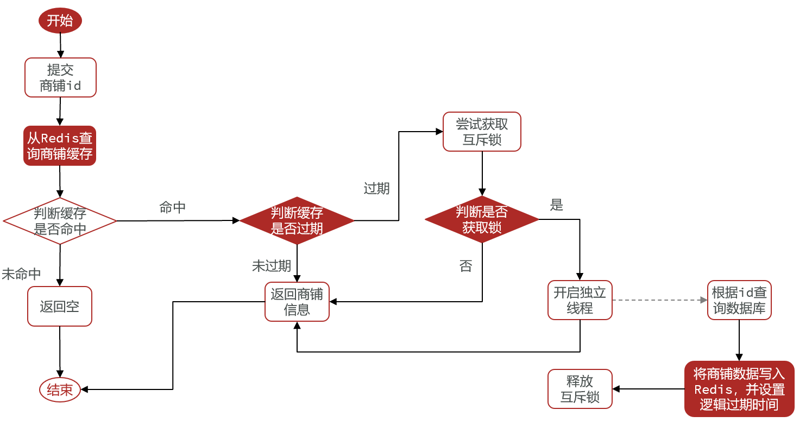
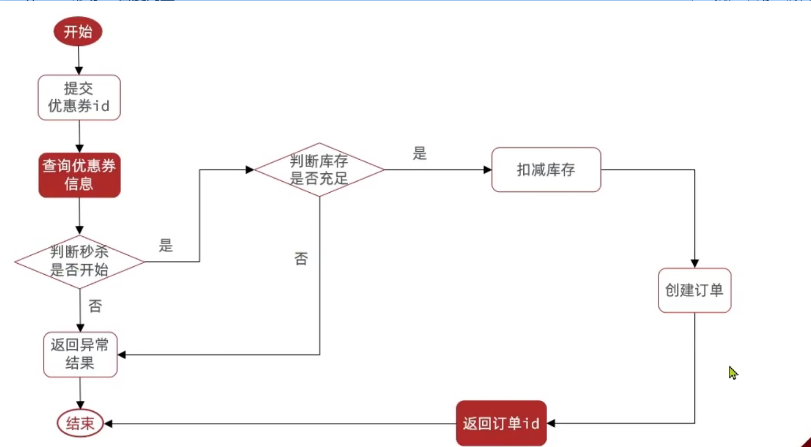

---

---

# 大众点评

本项目是仿照大众点评的一个项目，项目运行方法

1.克隆代码

2.修改数据库的配置为自己的

3.执行sql文件

4.启动redis

5.启动nginx,命令行输入start nginx.exe

6.运行成功

# 项目亮点和学习方法

## 项目亮点和我的职责（简历写法）

**亮点**

Caffine

缓存、秒杀、分布式锁、多级缓存。

Lambda，高并发，Jmeter

**我的职责**

1.基于Redis解决session共享的问题，实现登录功能（JTW？单点登录？）

2.把店铺信息、店铺类型添加到缓存，提升读写效率，减低响应时间，并解决了缓存穿透、缓存击穿、缓存雪崩的问题（具体测试数据有问题）

3.

## 学习方法（不断补充）

拒绝听一点敲一点，随堂笔记

听一遍，自己能讲出来

总结笔记

高效利用官方笔记

描述方法：

学习目标

# 项目背景和我的角色

## 项目背景

大众点评的项目，可以实现**商品查询缓存，优惠券秒杀，**短信登录、达人探店，好友关注，用户签到，商品查询缓存，优惠券秒杀，附近的商户，UV统计的功能。

## 我的角色

后端开发，文档攥写

# 技术栈选择

## Redis

Redis是基于内存存储的，相对于MySQL数据库会更快

# 登录功能

## cookie,session,JWT的区别

cookie存在浏览器，session存在服务器（tomcat),JWT也是存在浏览器的。

cookie是浏览器存储数据的，用户每次发起请求就会带着自己的cookie。

session是存在服务器的，和cookie不同的是还生成了自己的sessionID，但是当用户量上升的时候服务器需要存储大量的session，而且集群之间的session还需要共享

JWT是JSON Web Token，通过数字签名的方式，以JSON对象为载体，在不同的服务器终端之间安全的传输信息，可以解决集群部署的登录校验的问题。

session共享的问题：并发量上升之后的用户的请求可以发送到多台tomcat，这是session被保存在不同的tomcat，找不到用户的登录信息。

基于Redis解决session共享的问题，并保存用户信息到threadLocal(这里是用随机生成的Token来校验的，我们可以用JWT来校验)，验证码用String存储，用户信息用Hash存储。

实现逻辑

# 商户查询缓存

缓存就是临时存储信息的地方，一般读写性能较高

应用的各个层面都会用到缓存

缓存的优点

## 缓存商户信息

把店铺信息、店铺类型添加到缓存，提升读写效率，减低响应时间（具体测试数据有问题）

## 测试查询店铺信息

Jmeter设置线程数1000个

1.MySQL查询，响应时间420ms，QPS 50

2.Redis查询，

把店铺信息缓存，分别测试缓存击穿中，分布式锁和逻辑过期的QPS和响应时间，测试结果居然没变？？

## 缓存更新策略

三种更新策略：内存淘汰、超时剔除、主动更新

我们主动更新的时候要先更新数据库，再删除缓存，因为更新数据库比较慢，所以不容易在缓存中穿插一个数据库操作

## 缓存穿透、缓存雪崩、缓存击穿

### 缓存穿透

缓存穿透：查询一个缓存和数据库都不存在的数据，这样的请求一直会打到DB。

解决方法：缓存空数据、使用布隆过滤器。

解决方法的流程图：

### 缓存雪崩

缓存雪崩：大量key同时失效或者Redis宕机导致大量请求到达数据库

解决方法：

1.为了防止大量key同时失效：

添加TTL过期时间

2.为了提高Redis的可用性：

利用Redis的集群提高服务的可用性，比如哨兵模式检查Redis是否宕机，搭建Redis主从，如果宕机了就选择一个从节点作为主节点

给缓存业务添加降级限流策略（微服务？）

给业务添加多级缓存

## 缓存击穿

热点key问题，是指被高并发访问并且缓存重构比较复杂的key突然失效了，导致大量的请求到达数据库。

解决方法：

互斥锁，逻辑过期

互斥锁：避免大量的请求到达数据库，我们查询缓存未命中的时候，首先获取互斥锁，然后在重构缓存，其他没有获得到互斥锁的请求则休眠一会重试

逻辑过期：不设置过期时间，发现逻辑时间已经过期以后，获取一把互斥锁，开启一个新线程来重构数据库，原先的线程和其他没有获取互斥锁的线程就返回过期的数据，性能比较好

业务流程（没命中直接返回空？）

**bug：解决逻辑过期的时候，我们缓存未命中直接返回空值，会导致查询不到商品的问题**

bug：查不到2号店铺的信息，是为什么呢？

# 优惠券秒杀

postman添加优惠券，记得设置优惠券的时间为现在的

业务流程：

